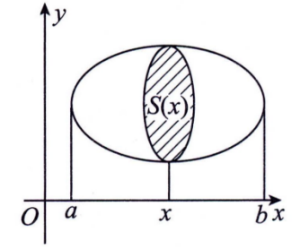
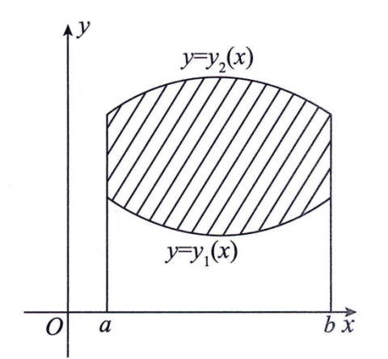
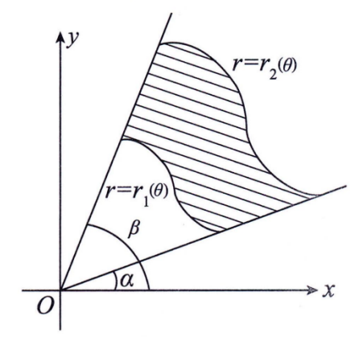

# 高等数学

## 第一章 函数 极限 连续

### 第一节 函数

#### （一）函数的概念及常见函数

**1.函数概念**

函数的定义： 如果对于每个数 $x∈D$ ，变量 $y$ 按照一定的规则总有一个确定的 $y$ 与它对应，则称 $x$ 是 $y$ 的**函数**，记为$y=f(x)$。常称 $x$ 为**自变量**，$y$ 为**因变量**，$D$ 为**定义域**。

​	**定义域** $D_f=D$

​	**值域** $Rf=f(D)=\{y|y=f(x),x∈D\}$

函数概念的两个基本要素：定义域、对应规则，基本要素完全相同的函数就是同一函数

【典例1】符号函数：
$$
y = sgn(x) =\left\{\begin{matrix}   -1 & x<0 \\    0 & x=0 \\1 & x>0\end{matrix}\right.
$$
【典例2】设 $x$ 为任意实数，不超过 $x$ 的最大整数称为  $x$ 的整数部分，记为 $[x]$.函数 $y=[x]$ 称为**取整函数**.

- [x] 取整函数的**基本不等式**：$x-1<[x]≤x$

**2.复合函数**

复合函数的定义：设$y=f(u)$的定义域为$D_f$，$u=g(x)$的定义域为$D_g$，值域为$R_g$，若$D_f∩R_g≠∅$，则称函数$y=f[g(x)]$为函数$y=f(u)$与$u=g(x)$的**复合函数**。（若$D_f∩R_g=∅$则不能复合）

它的定义域为$\{x|x∈D_g，g(x)∈D_f\}$

**3.反函数**

反函数的定义：设函数$y=f(x)$的定义域为$D$，值域为$R_y$。若对任意$y∈R_y$，有**唯一**确定的x∈D，使得$y=f(x)$，则记为$x=f^{-1}(y)$。称其为函数$y=f(x)$的**反函数**。

- [x] 注1：有时也将$y=f(x)$的反函数$x=f^{-1}(y)$写成$y=f^{-1}(x)$

* 在同一直角坐标系中，$y=f(x)$和$x=f^{-1}(y)$图形**重合**，但$y=f(x)$和$y=f^{-1}(x)$关于$y=x$对称

- [x] 注2:$f^{-1}(f(x))=x$、$f(f^{-1}(x))=x$

**4.初等函数**

举例：将反三角函数、对数函数、幂函数、指数函数、三角函数统称为**基本初等函数**。

要了解它们的定义域、性质和图形。

**幂函数** $y=x^a$（a为实数）

**指数函数** $y=a^x$（a>0，a≠1）

**对数函数** $y=log_ax$（a>0，a≠1）

**三角函数** $y=sinx \quad y=cosx \quad y=tanx$

**反三角函数** $y=arcsinx \quad y=arccosx \quad y=arctanx$

初等函数的定义：由**常数**和**基本初等函数**经过**有限次加、减、乘、除和复合**所得到**且能用一个解析式表示**的函数，称为**初等函数**。

#### （二）函数的性态

**1.单调性**

1. 定义

单调递增：$x_1<x_2 \Rightarrow f(x_1)<f(x_2)$

单调不减：$x_1<x_2 \Rightarrow f(x_1)≤f(x_2)$

应用：①根的个数 ②不等式

2. 判定

(1) 利用**定义**判断

(2) **导数**：设$f(x)$在区间$[a,b]$上连续，在$(a,b)$上可导，则

* $f'(x)>0 \Rightarrow f(x)单调递增$（$f'(x)≥0 \Leftarrow f(x)单调递增$）
* $f'(x)≥0 \Leftrightarrow f(x)单调不减$

**2.奇偶性**

1. 定义：设函数$y=f(x)$的定义域D关于原点对称，偶函数$f(-x)=f(x)$，奇函数$f(-x)=f(x)$

奇函数有哪些：
$$
sinx \quad tanx \quad arcsinx \quad arctanx \\★ln\frac{1-x}{1+x} \quad ★ln(x+\sqrt{1+x^2}) \quad ★\frac{e^x-1}{e^x+1} \quad ★f(x)-f(-x))
$$
偶函数有哪些：
$$
x^2 \quad |x| \quad cosx \quad  \quad ★f(x)+f(-x))
$$
重要性质：

**奇函数**的图形关于**原点**对称，且若$f(x)$在$x=0$处有定义，则$f(0)=0$；

**偶函数**的图形关于**y轴**对称。

2. 判定

(1) 利用**定义**判断

(2) 设$f(x)$可导，则：

* $f(x)$是奇函数$ \Rightarrow f'(x)$是偶函数
* $f(x)$是偶函数$ \Leftrightarrow f'(x)$是奇函数

(3) 设函数存在原函数，则：

连续的奇函数其原函数**都是**偶函数；

连续的偶函数其原函数**有且仅有一个**是奇函数。

(4) 设$f(x)$连续，则：

* $f(x)$是奇函数$ \Rightarrow \int^{x}_{a}f(t)dt$是偶函数
* $f(x)$是偶函数$ \Rightarrow \int^{x}_{0}f(t)dt$是奇函数

【例】（24年1，3）已知函数$f(x)=\int^x_0e^{cost}dt,g(x)=\int^{sinx}_0e^{t^2}dt$，则

(A) $f(x)$是奇函数，$g(x)$是偶函数

(B) $f(x)$是偶函数，$g(x)$是奇函数

(C) $f(x)$与$g(x)$均为奇函数

(C) $f(x)$与$g(x)$均为偶函数

解答：

由性质(3)可知，$e^{cost}$是偶函数，所以$f(x)=\int^x_0e^{cost}dt$为奇函数

由性质(2)，$g'(x)=cosxe^{{sinx}^2}$为偶函数，所以$g(x)$为奇函数，故选项C正确

**3.周期性**

1. 定义：$f(x+T) = f(x)$（其中T>0）

周期为2π的函数：$sinx \quad cosx$

周期为π的函数：$sin2x \quad |sinx|$

周期为T的函数：假设$f(x)$以T为周期，则$f(ax+b)$以$\displaystyle{\frac{T}{|a|}}$为周期

2. 判定

(1) 定义

(2) 可导的周期函数其导函数为周期函数，反过来则不对

(3) 周期函数的原函数**不一定**是周期函数，比如：$f'(x) = cosx + 1$ 

【拓展1】设$f(x)$连续且以T为周期，则

$\displaystyle{F(x)=\int^x_0f(t)dt}$是以T为周期的周期函数$\displaystyle{\Leftrightarrow \int^T_0f(t)dt}$

【拓展2】周期函数的原函数是周期函数的**充要条件**是其在一个周期上的积分为零。

下列函数其原函数必为周期函数的是：（D）

(A).$|sinx|$        (B).$sin^4x$         (C).$\frac{1}{1+sin^2x}$     (D).$\frac{sinx}{1+sin^4x}$

解析：A、B、C选项周期均为π，且在0到π上积分函数不为0，排除；

D选项周期为2π，在-π到π上积分，因为函数为奇函数，对称区间函数积分等于0。

**4.有界性**

1. 定义：若$\exists M>0，\forall x∈I，|f(x)|≤M$，则称f（x）在$I$上**有界**.

- [x] $|sin x|≤1,| cos x|≤1,|arcsin x|≤\frac{\pi}{2},|arctan x|<\frac{\pi}{2},|arccos x|≤π. $

2. 判定：

（1）利用定义

（2）f(x)在[a，b]上连续 ⇒ f(x)在[a，b]上有界

（3）f(x)在(a，b)上连续，且$f(a^+)$和$f(b^-)$存在 ⇒ f(x)在(a，b)上有界

- [x] 区间（a，b）改为无穷区间（—∞，b），（a，+∞），（—∞，+∞）结论仍成立.

（4）f(x)在区间I（有限）上有界 ⇒ f（x）在I上有界

#### （★）常考题型的方法与技巧

##### 题型一 复合函数

【例1】已知$f(x+1)$的定义域为[0，a] (a>0)，则f(x)的定义域为

(A)[-1,а-1].	(B)[1,a+1]. 	(C)[a,a+1].	(D)[a-1,a]. 

解：

​	应选(B).注意，函数$f(x+1)$的定义域是**自变量x的取值范围**，而不是整个表达式$x+1$的取值范围。

​	由f(x+1)的定义域为[0，a]知0≤x≤a，则

​	1≤x+1≤a+1 故f(x)的定义域为[1，a+1].

【例2】设$f(x) =\left\{\begin{matrix}   0 ,& x<0  \\1, & x≥0\end{matrix}\right.$   $g(x) =\left\{\begin{matrix}   2-x^2 ,& |x|<1  \\|x|-2, & |x|≥1\end{matrix}\right.$

试求f(g(x)),g(f(x))

解：直接**从内部往外部分类讨论**，如果有值发生变化的特殊点再单独拿出来讨论。

​	当|x|<1时，$g(x)=2-x^2>0$,则f(g(x))=1; 

​	当1≤|x|<2时，$g(x)=|x|-2<0$,则f(g(x))=0; 

​	当|x|≥2时，$g(x)=|x|-2>0$,则f(g(x))=1. 

故$f(g(x)) =\left\{\begin{matrix}   0 ,& 1≤|x|<2  \\1, & |x|<1或|x|≥2\end{matrix}\right.$

​	当x<0时，f(x)=0,|0|<1,则$g(f(x))=2-0^2=2$; 

​	当x≥0时，f(x)=1,|1|=1,则$g(f(x))=|1|-2=-1$. 

故$g(f(x)) =\left\{\begin{matrix}   2 ,& x<0  \\-1, & x≥0\end{matrix}\right.$

##### 题型二 函数性态

【例2】以下四个命题中正确的是

(A)若$f'(x)$在(0,1)内连续，则$f(x)$在(0,1)内有界.

(B)若$f(x$)在(0,1)内连续，则$f(x)$在(0,1)内有界.

(C)若$f'(x)$在(0,1)内有界，则$f(x)$在(0,1)内有界.

(D)若$f(x)$在(0,1)内有界，则$f'(x)$在(0,1)内有界.

解：

(方法一)直接法

​	由于$f'(x)$在有限区间(0,1)内有界，则$f(x)$在(0,1)内有界，故选(C).

(方法二)排除法

​	令$f(x)=\frac{1}x$，则$f'(x)=-\frac{1}{x^2}$，显然f'(x)和f(x)都在(0，1)内连续，但f(x)在(0，1)内无界，则(A)(B)都不正确.

​	令$f(x)=\sqrt{x}$，显然f(x)在(0，1)内有界，但$f'(x)=\frac{1}{2\sqrt{x}}$在(0，1)内无界，则(D)不正确.（或者可以构造一个在(0, 1)上有界但存在垂直于x轴切线的函数，这种函数是很容易构造的）

故应选(C). 

【例3】设函数*f*(*x*)连续,且*f*′(0)>0,则存在*δ*>0,使得

(A)f(x)在(0,δ)内单调增加.

(B)f(x)在(0,δ)内单调减少.

(C)对任意的x∈(0,δ)有f(x)>f(0).

(D)对任意的x∈(−δ,0)有f(x)>f(0).

解：本题要用到一个常用的结论:

​	若f′(x~0~)>0,则存在δ>0,当x∈(x~0~−δ,x~0~)时,f(x)<f(x~0~);当x∈(x~0~,x~0~+δ)时,f(x)>f(x~0~).

​	若f′(x0)<0有相应的结论.若*f*′(x~0~)<0有相应的结论.

​	以上结论可利用**导数定义和极限的保号性**证明

​	由以上结论知(C)正确.

- [x] 本题选(A)是一种典型的错误,原因是由f′(x~0~)>0,得不到一定存在x~0~的某邻域,在此邻域内f(x)单调增.反例如下:

​	令$f(x) =\left\{\begin{matrix}   x+2x^2sin\frac{1}x ,& x≠0  \\0, & x=0\end{matrix}\right.$

​	显然$\displaystyle{f'(0)= \lim_{x \to 0}  \frac{f(x)-f(0)}{x-0}=\lim_{x \to 0}  \frac{x+2x^2sin\frac{1}x}{x}=1>0}$,但$f(x)$在x=0的任何邻域内不单调增.

​	事实上,当x≠0时,$\displaystyle{f'(x)=1+4xsin⁡\frac{1}x−2cos⁡\frac{1}x}$

​	取$\displaystyle{x_n=\frac{1}{2nπ}}$,则$f'(x_n)=1−2=−1<0.$

​	由于$\displaystyle{\lim_{x \to \infty} x_n=0}$,故以上的点x~n~在x=0的任何邻域内都存在，即在x=0的任何邻域内都存在导数为负的点，从而f(x)在x=0的任何邻域内都不单调增。

【例 4】 设函数$f(x)$在$(-\infty,+\infty)$内连续，且$F(x)=\int_0^x(x-2t)f(t)$d$t.$试证：
(1)若$f(x)$为偶函数，则$F(x)$也是偶函数； 

(2)若 $f(x)$ 单调不增，则 $F(x)$ 单调不减. 

证明：

​	(1)(方法一) 由题设知$F(-x)=\int_0^{-x}(-x-2t)f(t)$d$t.$
​	令 $t=-u$（换元记得换限）,并由于 $f(-x)=f(x)$,所以
​	$F(-x)=-\int_0^x(-x+2u)f(-u)$d$u=\int_0^x(x-2u)f(u)$d$u=F(x)$,
​	即 $F(x)$ 为偶函数.
(方法二) $F( x) = \int _0^x( x- 2t) f( t)$d$t=x\int_0^xf(t)$d$t-2\int_0^xtf(t)$d$t$,
​	由于$f(x)$为偶函数，则$x\int_0^xf(t)$d$t,\int_0^xtf(t)$d$t$都是偶函数，故$F(x)$为偶函数.
$( 2) F^{\prime }( x) = \left [ x\int _{0}^{x}f( t) \:\mathrm{d} t- 2\int _{0}^{x}tf( t) \:\mathrm{d} t\right ] ^{\prime }= \int _{0}^{x}f( t)$ d$t+ xf( x) - 2xf( x)$
​	$=\int_{0}^{x}f(t)$d$t-xf(x)=x[f(\xi)-f(x)],\xi$在0与$x$之间(积分中值定理).
​	因$f(x)$单调不增，故当$x>0$时 ,$0\leqslant\xi\leqslant x$,于是$f(\boldsymbol{\xi})-f(x)\geqslant0$,从而$F^\prime(x)\geqslant0.$当$x<0$ 时，$x\leqslant\xi\leqslant0$,于是 $f(\xi)-f(x)\leqslant0$,从而$F^\prime(x)\geqslant0.$又$F^{\prime}(0)=0$,综上可知 $F(x)$ 单调不减.

### 第二节 极限

#### （一）极限的概念

**1.数列极限**

$\lim_{n\to\infty}x_n=a:\forall\varepsilon>0,\exists N(\varepsilon)>0$,当$n>N$时，有$\mid x_n-a\mid<\varepsilon.$

- [x] 注：(1)$\lim_{n\to\infty}x_n=a$ 的几何意义：对于 $a$ 点的任何$\varepsilon$ 邻域即开区间$(a-\varepsilon,a+\varepsilon)$,一定存在 N,当$n>N$即第$N$项以后的点$x_n$都落在开区间$(a-\varepsilon,a+\varepsilon)$内，而只有**有限个**(最多有 N 个)在这区间之外.

​	(2)数列$\left\{x_n\right\}$的极限是否存在，如果存在极限值等于多少，**与数列的前有限项无关**.

​	(3)$\displaystyle{\operatorname*{lim}_{n\to\infty}x_n=a\Leftrightarrow\operatorname*{lim}_{k\to\infty}x_{2k-1}=\operatorname*{lim}_{k\to\infty}x_{2k}=a.}$

**2.函数极限**

(1)自变量趋于无穷大时函数的极限
$\lim_{x\to+\infty}f(x)=A\colon\forall\varepsilon>0,\exists X(\varepsilon)>0$,当$x>X$时，有$\mid f(x)-A\mid<\varepsilon.$ 

$\lim_{x\to-\infty}f(x)=A\colon\forall\varepsilon>0,\exists X(\varepsilon)>0$,当$x<-X$时，有$\mid f(x)-A\mid<\varepsilon.$

$\lim_{x\to\infty}f(x)=A:\forall\varepsilon>0,\exists X(\varepsilon)>0$,当$\mid x\mid>X$时，有$\mid f(x)-A\mid<\varepsilon.$ 

- [x] ：在 函 数 极 限 中 $x\to \infty$是指$\mid x\mid\to+\infty$,而在数列极限中$,n\to\infty$是指$n\to+\infty.$

**定理**
$$
\lim_{x\to\infty} f(x)=A\Leftrightarrow\lim_{x\to+\infty}f(x)=\lim_{x\to-\infty}f(x)=A
$$
(2)自变量趋于有限值时函数的极限

① 极限$\displaystyle{\lim_{x\to x_0}f(x)=A:\forall\varepsilon>0,\exists\delta(\varepsilon)>0,当0<\mid x-x_0\mid<\delta时，有\mid f(x)-A\mid<\varepsilon.}$

- [x] ：函数$f(x)$在点$x_0$处的极限是否存在，如果存在极限值等于多少仅与$f(x)$在$x_0$点的去心邻域$\mathring{U}(x_0,\delta)$内的函数值有关，而与$f(x)$在$x_0$**是否有定义 ,如果有定义函数值等于多少无关**。

②左极限$\displaystyle{:\lim_{x\to x_0^-}f(x)=f(x_0^-);}$ 

③右极限$\displaystyle{:\lim_{x\to x_0^+}f(x)=f(x_0^+)}$

**定理**
$$
\lim_{x\to x_0}f(x)=A\Leftrightarrow\lim_{x\to x_0^+}f(x)=\lim_{x\to x_0^-}f(x)=A.
$$
注：需要分左、右极限求极限的问题主要有三种：
(1)**分段函数在分界点处**的极限，而在该分界点两侧函数表达式不同
(这里也包括带有绝对值的函数，如$\displaystyle{\lim_{x\to 0}\frac{|x|}x)}$；
$(2)\mathrm{e}^{\infty}$ 型极限(如$\displaystyle{\lim_{x \to 0}e^\frac1x,\lim_{x \to \infin}e^x,\lim_{x \to \infin}e^\frac1x}$)
	$\displaystyle{\lim_{x\to0^-}\mathrm{e}^{\frac1x}=0,\lim_{x\to0^+}\mathrm{e}^{\frac1x}=+\infty}$,则$\displaystyle{\lim_{x \to 0}e^\frac1x}$不存在；

​	$\displaystyle{\lim_{x\to-\infin}\mathrm{e}^{x}=0,\lim_{x\to+\infin}\mathrm{e}^{x}=+\infty}$,则$\displaystyle{\lim_{x \to \infin}e^x}$不存在；

​	简而言之： $\mathrm{e}^{\infty}\neq\infty,\mathrm{e}^{+\infty}=+\infty,\mathrm{e}^{-\infty}=0.$
$(3)\arctan\infty$ 型极限(如$\displaystyle{\lim_{x\to0}\arctan\frac1x,\lim_{x\to\infty}\arctan x)}$

​	$\displaystyle{\lim_{x\to0^{-}}\arctan\frac{1}{x}=-\frac{\pi}{2},\lim_{x\to0^{+}}\arctan\frac{1}{x}=\frac{\pi}{2}}$,则$\displaystyle{\lim_{x\to0}\arctan\frac{1}{x}}$不存在

​	$\displaystyle{\lim_{x\to-\infty}\arctan x=-\frac\pi2,\lim_{x\to+\infty}\arctan x=\frac\pi2}$,则$\displaystyle{\lim_{x\to\infty}\arctan x}$不存在

​	简而言之：$\arctan\infty\neq\frac\pi2,\arctan(+\infty)=\frac\pi2,\arctan(-\infty)=-\frac\pi2$

#### （二）极限的性质

**1.局部有界性**

若极限$\displaystyle{\lim_{x\to x_0}f(x)}$存在，则 $f(x)$ 在点 $x_0$ 某去心邻域内有界

**2.保号性**

设$\displaystyle{\lim_{x\to x_0}f(x)=A}$,则
(1)若$A>0$(或$A<0)\Rightarrow\exists\delta>0$,当$x\in\mathring{U}(x_0,\delta)$时$,f(x)>0($或$f(x)<0).$ 

(2)若 $\exists\delta>0$,当$x\in\mathring{U}(x_0,\delta)$ 时$,f(x)\geqslant0($或 $f(x)\leqslant0)\Rightarrow A\geqslant0($或 $A\leqslant0).$ 

- 由保号性不难得到保序性：设$\displaystyle{\lim_{x\to x_0}f(x)=A,\lim_{x\to x_0}g(x)=B}$,则

(1) 若 $A>B\Rightarrow\exists\delta>0$,当 $x\in\mathring{U}(x_0,\delta)$ 时$,f(x)>g(x).$ 

(2) 若 $\exists\delta>0$,当 $x\in\mathring{U}(x_0,\delta)$ 时$,f(x)\geqslant g(x)\Rightarrow A\geqslant B.$ 

**3.极限值与无穷小之间的关系**
$\lim f(x)=A\Leftrightarrow f(x)=A+\alpha(x)$,其中$\lim_\alpha(x)=0.$

* 数列极限有对应的以上三条性质

#### （三）极限存在准则

**1.夹逼准则**

若存在 $N$,当 $n>N$ 时 ,$x_n\leqslant y_n\leqslant z_n$,且$\lim x_n=\lim z_n=a$,则$\lim y_n=a.$

**2.单调有界准则**

单调有界数列必有极限.即单调增、有上界的数列必有极限，单调减、有下界的数列必有极限

* 函数极限也有对应的以上两条准则.

#### （四）无穷小

**1.无穷小的概念**

若$f(x)$当$x\to x_0($或$x\to\infty)$时的极限为零，则称$f(x)$为$x\to x_0($或$x\to\infty)$时的无穷小

**2.无穷小的比较**
设$\lim\alpha(x)=0,\lim\beta(x)=0.$
(1)高阶：若 $\lim\frac{\beta(x)}{\alpha(x)}=0$,记为 $\beta(x)=o(\alpha(x))$

(2)同阶：若$\lim\frac{\beta(x)}{\alpha(x)}=C\neq0;$

(3)等价：若$\lim\frac{\beta(x)}{\alpha(x)}=1$,记为 $\alpha(x)\sim\beta(x);$
(4)无穷小的阶：若$\displaystyle \lim\frac{\beta(x)}{[\alpha(x)]^k}=C\neq0$,称$\beta(x)$是$\alpha(x)$的$k$阶无穷小
**3.无穷小的性质**
(1)有限个无穷小的和仍是无穷小；

(2)有限个无穷小的积仍是无穷小； 

(3)无穷小量与有界量的积仍是无穷小.

* 以上前两条中的“**有限**”二字不可少.

#### （五）无穷大

**1.无穷大的概念**

若$\displaystyle \lim_{x\to x_{0}}f(x)=\infty($或$\displaystyle \lim_{x\to\infty} f(x)=\infty)$,则称 $f(x)$ 为 $x\to x_0($或 $x\to\infty)$ 时的**无穷大**

**2.常用的一些无穷大的比较**

(1)当$x\to+\infty 时，\ln^{a}x\ll x^{\beta}\ll a^{x}($其中$\alpha>0,\beta>0,a>1).$
(2)当$n\to\infty$时，$\ln^an\ll n^\beta\ll a^n\ll n!\ll n^n($其中$\alpha>0,\beta>0,a>1).$
**3.无穷大与无界变量的关系   无穷大$\Rightarrow$无界变量**
数列$\left\{x_n\right\}$是无穷大量$:\forall M>0,\exists N$,当 $n>N$ 时，恒有$\left|x_n\right|>M.$
数列$\left\{x_n\right\}$是无界变量$:\forall M>0,\exists N$,使$\left|x_{N}\right|>M.$
无穷大量一定是无界变量；

但无界变量不一定是无穷大量.

比如：数列 $x_n =\left\{\begin{matrix}   n ,& n为奇数  \\0, & n为偶数\end{matrix}\right.$ 是无界变量，但不是无穷大。

**4.无穷大与无穷小的关系**

在自变量的同一变化过程中：

* 若  f(x)  是无穷大,则 $ \frac{1}{f(x)}$  是无穷小; 

* 若  f(x)  是无穷小,且 $ f(x)   \neq 0 , 则  \frac{1}{f(x)}$  是无穷大.

#### （★）常考题型的方法与技巧

##### 题型一 极限的概念、性质及存在准则

【例 1】设$\displaystyle \lim_{n\to\infty} a_n=a$,且 $a\neq0$,则当 $n$ 充分大时有

(A)$| a_n| > \frac {| a| }2.$ (B)$| a_n| < \frac {| a| }2.$ (C$) a_n> a- \frac 1n.$ (D$)a_n<a+\frac1n.$

解：**直接法**

由$\displaystyle \lim_{n\to\infty}a_n=a$,且$a\neq0$ 知$\displaystyle \lim_{n\to\infty}|a_n|=|a|>\frac{|a|}2$,则当$n$充分大时有

$$
\mid a_n\mid>\frac{\mid a\mid}2
$$
故应选(A).

**排除法**（虽然很多时候看似很low，但是非常好用）

若取 $a_n=2+\frac2n$,显然 $a=2$,则(B)和(D)都不正确

若取 $a_n=2-\frac2n$,显然 $a=2$,则(C)不正确

本题直接法中用到一个**基本结论**：
(1) 若 $\displaystyle \lim _{n \rightarrow \infty} a_{n}=a $, 则  $\displaystyle \lim _{n \rightarrow \infty}\left|a_{n}\right|=|a| $, 但反之不成立;
(2) $\displaystyle \lim _{n \rightarrow \infty} a_{n}=0$  的**充分必要条件**是  $\displaystyle \lim _{n \rightarrow \infty}\left|a_{n}\right|=0$ .

【例 2】 设 $a_n>0(n=1,2,...),S_n=a_1+a_2+...+a_n$,则数列$\left\{S_n\right\}$有界是数列$\left\{a_n\right\}$收敛的
(A)充分必要条件.
(B)充分非必要条件.
(D)既非充分也非必要条件.
(C)必要非充分条件.
解：显然数列${S_n} $单调增（所以题给a~n~>0非常重要，否则可以创造摆动数列反例），若${S_n} $有界，则${S_n}$ 收敛，又
$$
a_n=S_n-S_{n-1}
$$
故数列${a_n}$ 收敛.（单调有界收敛准则）
	但当数列$\{{a_n}\}$收敛时，数列$\{S_n\}$未必有界，如 $a_n=1$,此时 $S_n=n$ 无界.
	故应选(B).
【例 3】证明：

$$\displaystyle \lim_{n\to\infty}\frac{2^nn!}{n^n}=0,\lim_{n\to\infty}\frac{3^nn!}{n^n}=+\infty.$$

证明：令$\displaystyle a_n=\frac{2^nn!}{n^n}$,则 

$$\displaystyle \lim\limits_{n\to\infty}\frac{a_{n+1}}{a_n}=\lim\limits_{n\to\infty}\frac{2n^n}{(n+1)^n}=\lim\limits_{n\to\infty}\frac{2}{(1+\frac{1}{n})^n}=\frac{2}{\text{e}},$$

由于$\displaystyle \left|\frac2{\mathrm{e}}\right|<1$,则$\displaystyle \lim_{n\to\infty}\frac{2^nn!}{n^n}=0.$

令 $\displaystyle a_n=\frac{3^nn!}{n^n}$,则

$$\displaystyle \lim_{n\to\infty}\frac{a_{n+1}}{a_n}=\lim_{n\to\infty}\frac{3n^n}{(n+1)^n}=\lim_{n\to\infty}\frac{3}{(1+\frac{1}{n})^n}=\frac{3}{\mathrm{e}},$$

$$\displaystyle \text{又}\lim_{n\to\infty}\frac{\frac{1}{a_{n+1}}}{\frac{1}{a_{n}}}=\lim_{n\to\infty}\frac{a_{n}}{a_{n+1}}=\frac{\mathrm{e}}{3},\left|\frac{\mathrm{e}}{3}\right|<1,\text{则}\lim_{n\to\infty}\frac{1}{a_{n}}=0,\text{即}\lim_{n\to\infty}\frac{3^{n}n!}{n^{n}}=+\infty.$$

【例4】证明：(1)对任意的正整数 $n$,都有$\frac1{n+1}<\ln\left(1+\frac1n\right)<\frac1n$ 成立.

(2)$$\text{设 }a_{n}=1+\frac{1}{2}+\cdots+\frac{1}{n}-\ln\:n(n=1,2,\cdots),\text{证明数列}\left\{a_{n}\right\}\text{收敛}.$$

证明：(1)根据拉格朗日中值定理，存在 $\xi\in(n,n+1)$,使得
$$
\ln\left(1+\frac1n\right)=\ln(n+1)-\ln n=\frac1\xi
$$
所以$\displaystyle \frac1{n+1}<\ln\left(1+\frac1n\right)=\frac1\xi<\frac1n.$

(2)当$n\geqslant1$时，由(1)知

$$
a_{n+1}-a_n=\frac{1}{n+1}-\ln\left(1+\frac{1}{n}\right)<0
$$
且$\displaystyle a_n=1+\frac12+\cdots+\frac1n-\ln n>\ln(1+1)+\ln\left(1+\frac12\right)+\cdots+\ln\left(1+\frac1n\right)-\ln n$（放缩法找下界）
$\displaystyle =\ln2+\ln\frac32+\cdots+\ln\frac{n+1}n-\ln n=\ln\left(2\times\frac32\times\frac43\times\cdots\times\frac{n+1}n\right)-\ln n$

$\displaystyle =\ln(1+n)-\ln n>0$,
所以数列$\left\{a_n\right\}$单调递减且有下界，故{$a_n$}收敛.

##### 题型二 求极限

**(一)求极限的常用方法**

**方法 1 利用有理运算法则求极限**

若$\lim f(x)=A,\lim g(x)=B$,则
$\lim[f(x)\pm g(x)]=\lim f(x)\pm\lim g(x)=A\pm B;$

$\lim[f(x)\cdot g(x)]=\lim f(x)\cdot\lim g(x)=A\cdot B;$ 

$\lim \frac {f( x) }{g( x) }= \frac {\lim f( x) }{\lim g( x) }= \frac AB$ $( B\neq 0) .$

**推论**(1)若$\lim f(x)=A\neq0$,则

​	$\lim f( x) g( x) = A$ $\lim g( x) ;$
​	$$\lim\frac{g(x)}{f(x)}=\frac{1}{A}\:\lim g(x).$$

( 即：极限**非零的因子的极限**可先求出来)

(2)若$$\text{}\operatorname*{lim}\frac{f(x)}{g(x)}\:\text{存在,且}\:\operatorname*{lim}g(x)=0\:,\text{则}\:\mathrm{lim}f(x)=0\:;$$

(3)若$\lim\frac{f(x)}{g(x)}=A\neq0$,且$\lim f(x)=0$,则$\lim g(x)=0.$

- [x] 若$\lim f( x)$ 存在$,\lim g(x)$ 不存在，则$\lim[f(x)\pm g(x)]$一定不存在；
- [x] 若$\lim f(x)$ 和$\lim g(x)$都不存在，则$\lim[f(x)\pm g(x)]$不一定存在.

**方法 2 利用基本极限求极限**

$$\begin{aligned}&\text{常用的基本极限}\\&\operatorname*{lim}_{x\to0}\frac{\sin x}{x}=1\:;\quad\operatorname*{lim}_{x\to0}(1+x)^{\frac{1}{x}}=\mathrm{e}\:;\quad\operatorname*{lim}_{x\to\infty}\biggl(1+\frac{1}{x}\biggr)^{x}=\mathrm{e}\:;\\&\operatorname*{lim}_{x\to0}\frac{a^x-1}{x}=\ln\:a\quad(a>0)\:;\quad\operatorname*{lim}_{n\to\infty}\sqrt[n]{n}=1\:;\\&\operatorname*{lim}_{x\to\infty}\frac{a_{x}x^{n}+a_{x-1}x^{n-1}+\cdots+a_{1}x+a_{0}}{b_{x}x^{m}+b_{m-1}x^{m-1}+\cdots+b_{1}x+b_{0}}=\begin{cases}\frac{a_n}{b_m},&n=m,\\0,&n<m(极限的值取决于主导项),\\\infty,&n>m;\end{cases}\\&\operatorname*{lim}_{x\to\infty}x^{n}=\begin{cases}\quad0,&\mid x\mid<1,\\\quad\infty,&\mid x\mid>1,\\\quad1,&x=1,\\\text{不存在,}&x=-1;\end{cases}\operatorname*{lim}_{x\to\infty}\mathrm{e}^{nx}=\begin{cases}\quad0,&x<0,\\+\infty,&x>0,\\\quad1,&x=0.\end{cases}\end{aligned}$$

**方法 3 利用等价无穷小代换求极限**

**1.常用等价无穷小**

当$x\to0$时，

(1)$x\sim\sin x\sim\tan x\sim\arcsin x\sim\arctan x\sim\ln(1+x)\sim\mathrm{e}^x-1$,

$(1+x) ^\alpha- 1\sim \alpha x$ , $1- \cos ^\alpha x\sim \frac \alpha 2x^2$ , $a^x- 1\sim x\ln a$

* $当x\to0时,(1+x)^\alpha-1\sim \alpha x,\text{这个结论推广可得},\text{若 }\alpha(x)\to0,\alpha(x)\beta(x)\to0,$

  $则(1+\alpha\left(x\right))^{\beta\left(x\right)}-1\sim\alpha\left(x\right)\beta\left(x\right) 
  由此可得\left(1+x\right)^{x}-1\sim x^{2}.$

(2)$ x- \sin x\sim \frac {x^3}6$, $\arcsin x- x\sim \frac {x^3}6$, $x- \ln ( 1+ x) \sim \frac {x^2}2$,

$\tan x- x\sim \frac {x^3}3$, $x- \arctan x\sim \frac {x^3}3.$

* ①这五个等价无穷小中前三个要记住，后两个可由前两个推得.

​	事实上由 $x-\sin x\sim\frac{x^{3}}6$ 得，$\arcsin(\sin x)-\sin x\sim\frac{x^{3}}6\sim\frac{\sin^{3}x}6$,从而有$\arcsin x-x\sim\frac{x^{3}}6$

​	同理可由$\tan x-x\sim\frac{x^3}3$推得$x-\arctan x\sim\frac{x^3}3.$

* ② 由这几个等价无穷小及等价无穷小的性质(若$\alpha \sim \beta$,则 $\alpha = \beta + o( \beta )$)可得到几个**泰勒公式**.

事实上由tan $x-x\sim\frac{x^3}3$ 得$,(\tan x-x)=\frac{x^3}3+o(x^3)$,即
$$
\tan x=x+\frac{x^{3}}{3}+o(x^{3})
$$
同理可得

$$
\arcsin x=x+\frac{x^{3}}{6}+o(x^{3})\\
\arctan x=x-\frac{x^3}3+o(x^3)
$$
(3)设$f(x)$和$g(x)$在$x=0$的某邻域内连续，且$\displaystyle \lim_{x\to0}\frac{f(x)}{g(x)}=1$,则
$$
\int_0^xf(t)\:\mathrm{d}t\sim\int_0^xg(t)\:\mathrm{d}t.
$$

* 例如 当 $x\to 0$ 时$,\ln(1+x^2)\sim x^2$,则$\displaystyle \int_0^x\ln(1+t^2)dt\sim\int_0^xt^2dt=\frac13x^3.$

**2.等价无穷小代换的原则**
(1)乘、除关系可以随便换

若 $\alpha\sim\alpha_{1},\beta\sim\beta_{1}$,则 $\displaystyle \lim\frac\alpha\beta=\lim\frac{\alpha_{1}}\beta=\lim\frac\alpha{\beta_{1}}=\lim\frac{\alpha_{1}}{\beta_{1}}.$

(2)加、减关系在**一定条件下**可以换（本质上是运算时不会将泰勒展开式决定阶数的同阶项抵消掉）

①若$\alpha\sim\alpha_1,\beta\sim\beta_1$ ,且$\displaystyle \lim\frac{\alpha_1}{\beta_1}=A\neq1$,则$\alpha-\beta\sim\alpha_1-\beta_1.$ 

②若 $\alpha\sim\alpha_{1},\beta\sim\beta_{1}$ ,且$\displaystyle \lim\frac{\alpha_{1}}{\beta_{1}}=A\neq-1$,则 $\alpha+\beta\sim\alpha_{1}+\beta_{1}.$

【例】 求极限$\displaystyle \lim_{x\to0}\frac{\tan x-\sin x}{x^3}.$
解(方法一)：(恒等变换化简)
$$
\begin{align*}\lim_{x\to0}\frac{\tan x-\sin x}{x^3}=&\lim_{x\to0}\frac{\tan x(1-\cos x)}{x^3} \\
=&\lim_{x\to0}\frac{x\cdot\frac12x^2}{x^3}(等价代换) \\
=&\frac12.
\end{align*}
$$
(方法二)（加项减项拆）
$$
\begin{align*}\lim\limits_{x\to0}\frac{\tan x-\sin x}{x^3}=&\lim\limits_{x\to0}\frac{(\tan x-x)-(\sin x-x)}{x^3}\\
=&\lim_{x\to0}\frac{(\frac13x^3)-(-\frac16x^3)}{x^3}(等价代换)\\
=&\frac{1}{2}.
\end{align*}
$$
**方法 4 利用洛必达法则求极限**

若    (1)$\displaystyle \lim_{x\to x_{0}}f( x) = \lim _{x\to x_{0}}g( x) = 0( \infty ) ;$
	(2)$f(x)$和$g(x)$在$x_0$的某去心邻域内可导，且$g^\prime(x)\neq0;$
	(3)$\displaystyle \operatorname*{lim}_{x\to x_{0}}\frac{f^{\prime}(x)}{g^{\prime}(x)}$存在(或$\infty).$

则	$\displaystyle \lim\limits_{x\to x_0}\frac{f(x)}{g(x)}=\lim\limits_{x\to x_0}\frac{f'(x)}{g'(x)}.$

- [x] 洛必达法则可用来求7 种类型不定式的极限，即$\displaystyle \frac00、\frac\infty\infty,\infty-\infty,0\cdot \infty,1^\infty,\infty^0,0^0$,其中前

两种$\displaystyle \frac00、\frac\infty\infty$直接用洛必达法则，后五种均可化为前两种。
$$
\frac{0}{0},\frac{\infty}{\infty}\Leftarrow\begin{cases}0\cdot\infty\Leftarrow\begin{cases}1^\infty\\\infty^0\\0^0&\end{cases}\\\\\infty-\infty&\end{cases}
$$
【例1】求极限$\displaystyle \lim_{x\to1}\frac{\ln\cos(x-1)}{1-\sin\frac{\pi}{2}x}.$

$\begin{align*}&\\解:原式&=\lim_{x\to1}\frac{-\tan(x-1)}{-\frac{\pi}{2}\cos\frac{\pi}{2}x}(洛必达法则)\\&=\frac{2}{\pi}\lim_{x\to1}\frac{x-1}{\cos\frac{\pi}{2}x}(等价无穷小代换)\\&=\frac{2}{\pi}\lim_{x\to1}\frac{1}{-\frac{\pi}{2}\sin\frac{\pi}{2}x}\\&=-\frac{4}{\pi^2}.\end{align*}$

【例2】求极限$\displaystyle \lim_{x \to \infty}(x+\sqrt{1+x^{2}})^{\frac{1}{x}}$

解：$\displaystyle \operatorname* { lim} _{x\to \infty }( x+ \sqrt {1+ x^{2}}) ^{\frac 1x}= \operatorname* { lim} _{x\to \infty }\mathrm{e} ^{\frac {\ln ( x+ \sqrt {1+ x^{2}}) }x}$ ,

$$\begin{aligned}\lim_{x\to\infty}\frac{\ln(x+\sqrt{1+x^2})}{x}&=\lim_{x\to\infty}\frac{\frac{1}{\sqrt{1+x^2}}}{1}\\&=0\:,\end{aligned}(常见求导结论)$$

$$∴\lim\limits_{x\to\infty}(x+\sqrt{1+x^2})^{\frac{1}{x}}=\mathrm{e}^0=1.$$

**方法 5 利用泰勒公式求极限**

**定理 (带 Peano 余项的泰勒公式)**设$f(x)$在$x=x_0$处$n$阶可导，则
$$
f(x)=f(x_0)+f'(x_0)(x-x_0)+\frac{f''(x_0)}{2!}(x-x_0)^2+\cdots+\frac{f^{(n)}(x_0)}{n!}(x-x_0)^n+o((x-x_0)^n)
$$
特别是当$x_0=0$时，
$$
f(x)=f(0)+f'(0)x+\frac{f''(0)}{2!}x^2+\cdots+\frac{f^{(n)}(0)}{n!}x^n+o(x^n)
$$
★几个**常用的泰勒公式**

(1)$\displaystyle  \mathrm{e} ^{x} = 1+ x+ \frac {x^{2}}{2! }+ \cdots + \frac {x^{n}}{n! }+ o( x^{n}) .$

(2)$\displaystyle\sin x=x-\frac{x^{3}}{3!}+\cdots+(-1)^{n-1}\frac{x^{2n-1}}{(2n-1)!}+o(x^{2n-1}).$

(3)$\displaystyle\cos x=1-\frac{x^{2}}{2!}+\cdots+(-1)^{n}\frac{x^{2n}}{(2n)!}+o(x^{2n}).$ 

(4)$\displaystyle \ln ( 1+ x) = x- \frac {x^{2}}2+ \cdots + ( - 1) ^{n- 1} \frac {x^{n}}n+ o( x^{n}) .$

(5) $\displaystyle( 1+ x) ^{\alpha}= 1+ \alpha x+ \frac {\alpha ( \alpha - 1) }{2! }x^{2}+ \cdotp \cdotp \cdotp + \frac {\alpha ( \alpha - 1) \cdotp \cdotp \cdotp ( \alpha - n+ 1) }{n! }x^{n}+ o( x^{n}) .$

【例】求极限$\displaystyle \lim_{x\to0}\frac{\frac{x^2}2+1-\sqrt{1+x^2}}{(\cos x-\mathrm{e}^{x^2})\sin^2x}.$

解： 由于$\sqrt{1+x^2}=1+\frac12x^2+\frac{\frac12\left(\frac12-1\right)}{2!}x^4+o(x^4)$,

​	$\cos$ $x= 1- \frac 12x^{2}+ o( x^{2})$ ,

​	$\mathrm{e}^{x^2}=1+x^2+o(x^2)$,

代人所求极限式得

原式$\displaystyle=\lim_{x\to 0}\frac{\frac18x^4+o(x^4)}{\left[-\frac32x^2+o(x^2)\right]x^2}=-\frac1{12}.$

**方法6 利用夹逼准则求极限**

**方法7 利用定积分的定义求极限**

★变化部分的最大值是主体的次量级用夹逼，变化部分的最大值和主体是同量级用定积分定义

★用定积分求极限，注意提出“**可爱因子**”

【例】求极限$\displaystyle{\lim_{n\to\infty}}\left(\frac1{n+1}+\frac1{n+2}+...+\frac1{n+n}\right).$
$\displaystyle\lim_{n\to\infty}\left(\frac1{n+1}+\frac1{n+2}+\cdots+\frac1{n+n}\right)=\lim_{n\to\infty}\frac1n\left[\frac1{1+\frac1n}+\frac1{1+\frac2n}+\cdots+\frac1{1+\frac nn}\right]$
$\displaystyle=\int_0^1\frac1{1+x}$d$x=\ln2.$

- [x] 由定积分定义可知，若将区间[0,1]n等分，第$k$个子区间上的$\xi_k$取该子区间右端点，此时

$\displaystyle \Delta x_k=\frac1n,\xi_k=\frac kn$,则

$$
\int_0^1f(x)\:\mathrm{d}x=\lim_{\lambda\to0}\sum_{k=1}^nf(\xi_k)\Delta x_k=\lim_{n\to\infty}\sum_{k=1}^nf\left(\frac kn\right)\cdot\frac1n=\lim_{n\to\infty}\frac1n\sum_{k=1}^nf\left(\frac kn\right)
$$
上式右端是一种常见的积分和式的极限。

所以，用定积分定义求极限的一般方法是：先提“可爱因子”$\frac1n$，然后再确定被积函数和积分区间。

**方法 8 利用单调有界准则求极限**

★单调递增有上界，必收敛；单调递减有下界，必收敛。

【例】设 $\displaystyle x_1>0,x_{n+1}=\frac12\left(x_n+\frac1{x_n}\right),n=1,2,\cdotp\cdotp\cdotp.$ 求极限$\displaystyle \lim_{n\to\infty} x_n.$

解：由题设知 $x_n>0$,且

$\displaystyle x_{n+1}=\frac{1}{2}\Big(x_{n}+\frac{1}{x_{n}}\Big)=\frac{1}{2}\Big[(\sqrt{x_{n}})^{2}+\Big(\frac{1}{\sqrt{x_{n}}}\Big)^{2}\Big]\geqslant\frac{1}{2}\times2\:\sqrt{x_{n}}\times\frac{1}{\sqrt{x_{n}}}=1\:,$

$\displaystyle \frac{x_{n+1}}{x_n}=\frac12\Big(1+\frac1{x_n^2}\Big)\leqslant\frac12\Big(1+\frac11\Big)=1\:,$

则数列$\left\{x_n\right\}$单调减且有下界，故极限$\lim_{n\to\infty} x_n$ 存在。设$\displaystyle\lim_{n\to\infty} x_n=a$,由极限保号性知 $a\geqslant1.$

对等式 $x_{n+1}=\frac12\left(x_n+\frac1{x_n}\right)$两端取极限，得 $a=\frac12\left(a+\frac1a\right)$,又 $a\geqslant1$,由此解得 $a=1$。

★**基本不等式**：
$$
\sqrt{\frac{a^2 + b^2}{2}} \geq \frac{a+b}{2} \geq \sqrt{ab} \geq \frac{2}{\frac{1}{a} + \frac{1}{b}}\\
a^2 + b^2 \geq 2ab\\
\frac{a+b}{2} \geq \sqrt{ab}\\
ab \leq \left(\frac{a+b}{2}\right)^2
$$
**（二）求极限常见题型**

求函数的极限，常见的是7 种类型不定式，即$\displaystyle \frac00、\frac\infty\infty,\infty-\infty,0\cdot \infty,1^\infty,\infty^0,0^0$，重点是$\displaystyle \frac00$型和$1^\infty$型

**1.$\displaystyle \frac00$型极限**

常用的方法有三种：

1. 洛必达法则；
2. 等价无穷小代换；
3. 泰勒公式.

​	以上三种方法使用的同时要注意将原式化简，常用的方法有**极限非零的因子极限先求出来、有理化及变量代换**等，此外，如果有两个形式相同函数还可以借助**拉格朗日中值定理**化简。

**2.“$\displaystyle \frac{\infty}{\infty}$”型极限**

常用的方法有两种：

1. 洛必达法则；

2. 分子分母同除以分子和分母各项中最高阶的无穷大。

**3.“$\infty-\infty$”型极限**

常用的方法有：

(1)通分化为$\displaystyle \frac00$(适用于分式差);

(2)根式有理化(适用于根式差);

(3)提无穷因子，然后等价代换或变量代换、泰勒公式。

**4.“$0·\infty$”型极限**

常用的方法：

利用恒等变换、无穷小替换（乘除可以随便换）化为“$\frac00$”型或“$\frac\infty\infty$”型

**5.“$1^\infty$”型极限**

常用的方法有三种：

* (1)凑基本极限   $\lim[1+\varphi(x)]^{\frac1{\varphi(x)}}=$e,其中$\lim\varphi(x)=0(\varphi(x)\neq0);$
* (2)改写成指数 $\lim [ f( x) ] ^{g( x) }= \lim \mathrm{e} ^{g( x) \ln f( x) }$,用洛必达法则；
* (3)利用结论：若$\lim\alpha(x)=0,\lim\beta(x)=\infty$,且$\lim\alpha(x)\beta(x)=A$,则
  $$\lim[1+\alpha(x)]^{\beta(x)}=\mathrm{e}^A$$
  以上三种方法往往第三种方法简单，将其归纳为三步.
  第一步：写标准型   原式$=\operatorname{lim}(1+\alpha)^\beta;$
  第二步：求极限   $\lim{\alpha\beta}=A;$
  第三步：写结果   原式$=\mathrm{e}^A.$

**6.“$\infty^0$”和“$0^\infin$”型极限**

​	这两种极限的函数一定是**幂指函数**，即$\lim[f(x)]^{g(x)}.$求解的方法是将其**改写成指数形式**
$\lim[f(x)^{\cdot}]^{g(x)}=\lim\mathrm{e}^{g(x)\ln f(x)}$,从而就化为“0$\cdot\infty$”型极限.

**数列的极限**

常见的数列极限有以下4种.

**1.不定式**

求数列不定式极限和求函数不定式极限的方法完全相同，但对数列极限<u>不能直接用洛必达法则</u>，可以改写成函数形式再用洛必达法则。

**2.n项和的数列极限**

常用方法（1）夹逼原理；（2）定积分定义；（3）级数求和；

重要结论：

$\begin{aligned}
 & \text{令}\max_{1\leqslant i\leqslant m}\{ a_i\}=a,\text{则} \\
 & a=\sqrt[n]{a^n}\leqslant\sqrt[n]{a^n+a_2^n+\cdots+a_m^n}\leqslant\sqrt[n]{ma^n}=\sqrt[n]{ma}. \\
 & \text{又}\lim_{n\to\infty}\sqrt[n]{m}=1,\text{则由夹逼原理知} \\
 & \lim_{n\to\infty}\sqrt[n]{a_{1}^{n}+a_{2}^{n}+\cdots+a_{m}^{n}}=a=\max_{1\leqslant i\leqslant m}\{ a_{i}\}.
\end{aligned}$

**3.n项连乘的数列极限**

常用方法（1）夹逼原理；（2）取对数化为n项和.

**4.递推关系$x_1=a,x_{n+1}=f(x_n)(n=1,2,\cdotp\cdotp\cdotp$)定义的数列**

常用方法

* 方法 1:先证数列 $\{x_n\}$收敛(常用单调有界准则),然后令$\displaystyle \lim_{n\to\infty}x_n=A$,等式 $x_{n+1}=f(x_n)$ 两端
  取极限得 $A=f(A)$,由此求得极限 $A.$
* 方法 2:先令$\displaystyle \lim_{n\to\infty} x_n=A$,然后等式 $x_{n+1}=f(x_n$)两端取极限解得$A$,得到极限初步结果，最后
  再证明$\displaystyle \lim_{n\to\infty} x_n=A.$
  一般来说，当数列$\left\{x_n\right\}$具有单调性时用方法 1,而当数列$\left\{x_n\right\}$不具有单调性或单调性很难
  判定时用方法 2.

​	方法二的关键是证明$\displaystyle \lim_{n\to\infty} x_n=a$。一般地，当数列$\left\{x_n\right\}$由递推关系$x_n=f(x_{n-1})$ 给出，要证明$\displaystyle \lim_{n\to\infty}x_n=a.$其核心是利用 $x_n=f(x_{n-1})$ 证明一个递推不等式
$$
|x_{n}-a|\leqslant A|x_{n-1}-a|(0<A<1)
$$
单调性判定常用有三种方法：
(1)若$x_{n+1}-x_n\geqslant0(\leqslant0)$,则$\{x_n\}$单调增(单调减);

(2)设$\{x_n\}$不变号，

①若$x_n>0$,则当$\frac{x_{n+1}}{x_n}\geqslant1(\leqslant1)$ 时，$\{x_n\}$ 单调增(单调减);

②若$x_n<0$,则当$\frac {x_{n+1}}{x_n}\geqslant1(\leqslant1)$ 时$,\{x_n\}$ 单调减(单调增); 

(3)设数列{$x_n$}由$x_1=a,x_{n+1}=f(x_n)(n=1,2,\cdotp\cdotp\cdotp),x_n\in I$所确定，
①若$f(x)$在 $I$ 上单调增，则
当$x_1\leqslant x_2$ 时，$\{x_n\}$单调增；当 $x_1\geqslant x_2$ 时，$\{x_n\}$单调减；

②若 $f(x)$ 在 $I$ 上单调减，则$\left\{x_n\right\}$**不单调**。

##### 题型三 确定极限式中的参数

​	对比分析各个部分，找到常数的合法取值使得极限式的极限存在。

部分容易求出的常数可以先求出，再解决其他常数的求值问题。

##### 题型四 无穷小量阶的比较

​	由无穷小量阶的定义可知，比较两个无穷小阶的问题就是求$\displaystyle \frac{0}{0}$型极限，所以常用的方法就

是求$\displaystyle \frac00$型极限的常用三种方法.

* (1)洛必达法则(求导定阶).

​	若当$x\to$0 时$f(x)$是无穷小量，且$f^\prime(x)$是$x$的$k(k\geqslant0)$阶无穷小，则$f(x)$是$x\to$0 时的 $k+1$ 阶无穷小量.

* (2)等价无穷小代换.

​	若当$x\to0$时$f(x)$是无穷小量，且$f(x)\sim Ax^k(A\neq0,k>0)$,则$f(x)$是$x\to0$时的 $k$ 阶无穷小量.

​	如当 $x\to0$ 时，(1-$\cos x)\sin x\sim\frac12x^2· x$,则当$x\to0$ 时，(1-$\cos x)\sin x$ 是$x$ 的 3 阶无穷小.

* (3)泰勒公式.

### 第三节 连续

#### （一）连续的概念

若$\displaystyle \lim_{x\to x_0}f(x)=f(x_{0})$(或$\displaystyle \lim_{\Delta x\to0}\Delta y=0$),则称$f(x)$在$x_0$处**连续**
左、右连续概念：若$\displaystyle \lim_{x\to x_0^-}f(x)=f(x_0)$,则称 $f(x)$ 在 $x_0$ 处**左连续**
				若 $\displaystyle \lim_{x\to x_0^+}f(x)=f(x_0)$,则称 $f(x)$ 在 $x_0$ 处**右连续**
**定理**

*  $f(x)$ 连续$\Leftrightarrow f(x)$**左连续且右连续**.

#### （二）间断点及其类型

**1.间断点的概念**

若$f(x)$在$x_0$某去心邻域有定义，但在$x_0$处不连续，则称点$x=x_0$为函数$f(x)$的间断点

**2.间断点的分类**

我们根据左、右极限是否都存在把间断点分为以下两类：
(1)**第一类间断点**：左、右极限均存在的间断点

* **可去间断点**：左、右极限存在且相等的间断点；

* **跳跃间断点**：左、右极限都存在但不相等的间断点.

(2)**第二类问断点**：左、右极限中至少有一个不存在的间断点

* **无穷间断点**：左、右极限中至少有一个为无穷，如$x=0$为$f(x)=\frac1x$的无穷间断点；
* **振荡间断点**：极限不存在，也不为无穷，如$x=0$为$f(x)=\sin\frac1x$的振荡间断点.

#### （三）连续函数的性质

(1)连续函数的和、差、积、商(分母不为零)及复合仍连续；
(2)基本初等函数在其定义域内连续；初等函数在其定义区间内连续，
(3)闭区间上连续函数的性质
①**有界性**：若 $f(x)$ 在$[a,b]$上连续，则 $f(x)$ 在$[a,b]$ 上有界.
②**最值性**：若$f(x)$在$[a,b]$上连续，则$f(x)$在$[a,b]$上必有最大值和最小值.
③**介值性**：若 $f(x)$ 在$[a,b]$上连续，且 $f(a)\neq f(b)$,则对 $f(a)$ 与 $f(b)$ 之间任一数 $C$,至少存在一个$\xi\in(a,b)$,使得 $f(\xi)=C.$
**推论** 若 $f(x)$ 在$[a,b]$ 上连续，则 $f(x)$ 在$[a,b]$可取到介于最小值 $m$ 与最大值$M$ 之间的任何值.
(4)**零点定理**：若$f(x)$在[$a,b]$连续，且$f(a)·f(b)<0$,则必存在$\xi\in(a,b)$,使$f(\xi)=0.$

#### （★）常考题型的方法与技巧

##### 题型一 讨论连续性及间断点类型

一般是由定义来做，有时候会结合复合函数考察间断点情况。

★关键在于考察可疑点：无定义点、定义域分界点、分段函数分界点等等

##### 题型二 介值定理、最值定理及零点定理的证明题

## 第二章 一元函数微分学

### 第一节 导数与微分

#### （一）导数概念

**定义**(导数)设函数 y$=f(x)$在$x_0$的某邻域内有定义，如果极限
$$
\lim\limits_{\Delta x\to0}\frac{\Delta y}{\Delta x}=\lim\limits_{\Delta x\to0}\frac{f(x_0+\Delta x)-f(x_0)}{\Delta x}
$$
存在，则称$f(x)$**在点$x_0$处可导，**并称此极限值为$f(x$)**在点$x_0$处的导数**，记为$f^\prime(x_0)$，或$y^{\prime}|_{x=x_0}$,或$\left.\frac{\mathrm{d}y}{\mathrm{d}x}\right|_{x=x_0}.$如果上述极限不存在，则称 $f(x)$ **在点 $x_0$ 处不可导**。

* 常用的导数定义的等价形式有：

$$
f'(x_0)=\lim_{x\to x_0}\frac{f(x)-f(x_0)}{x-x_0},\quad f'(x_0)=\lim_{h\to0}\frac{f(x_0+h)-f(x_0)}{h}\:.
$$

**定义**(左导数)若左极限
$$
\lim\limits_{\Delta x\to0^-}\frac{\Delta y}{\Delta x}=\lim\limits_{\Delta x\to0^-}\frac{f(x_0+\Delta x)-f(x_0)}{\Delta x}=\lim\limits_{x\to x_0^-}\frac{f(x)-f(x_0)}{x-x_0}
$$
存在时，则称该极限值为$f(x$)在点$x_0$处的**左导数**，记为$f_-^\prime(x_0).$
**定义**(右导数)若右极限
$$
\lim\limits_{\Delta x\to0^+}\frac{\Delta y}{\Delta x}=\lim\limits_{\Delta x\to0^+}\frac{f(x_0+\Delta x)-f(x_0)}{\Delta x}=\lim\limits_{x\to x_0^+}\frac{f(x)-f(x_0)}{x-x_0}
$$
存在时，则称该极限值为$f(x$)在点$x_0$处的**右导数**，记为$f_+^\prime(x_0).$
**定理** 

* **可导$\Leftrightarrow$左、右导数都存在且相等**

#### (二)微分概念

**定义** 

* 若$\Delta y=f(x_0+\Delta x)-f(x_0)=A\Delta x+o(\Delta x)$,其中$A$为不依赖于$\Delta x$的常数，则称函数$f(x$)**在点$x_0$处可微**，称$A\Delta x$为函数$f(x$)在点$x_0$处相应于自变量增量$\Delta x$的**微分**，记为 dy= $A\Delta x.$
  **定理** 函数$y=f(x)$在点$x_0$处可微的充分必要条件是$f(x)$在点$x_0$处可导，且有
  $$\mathrm{d}y=f'(x_0)\Delta x=f'(x_0)\mathrm{d}x.$$

#### (三)导数与微分的几何意义

(1)导数 $f^\prime(x_0$)在几何上表示曲线 $y=f(x)$ 在点$(x_0,f(x_0))$ 处切线的斜率.

(2)微分$\mathrm{d}y=f^{\prime}(x_0)\mathrm{d}x$ 在几何上表示曲线 $y=f(x)$的切线上的增量.
 $\Delta y=f(x_0+\Delta x)-f(x_0)$在几何上表示曲线 $y=f(x)$上的增量.$\Delta y\approx\mathrm{d}y.$

图2.1.3 微分的几何意义

#### (四)连续、可导、可微之间的关系

图2.1.4 连续、可导、可微的关系

* (1)连续$\nRightarrow$可导，连续$\nRightarrow$可微，经典反例为 $f(x)=\mid x\mid;$

* $(2)f(x)$ 可导$\Rightarrow$$f(x)$ 连续$,f(x)$ 可导$\nRightarrow$ $f^\prime(x)$ 连续$,f(x)$ 可导$\displaystyle \nRightarrow\lim_{x\to x_0}f^{\prime}(x)$ 存在.（可导必连续，但可导不能保证导函数连续，甚至不能保证导函数在该点的极限存在）

​	例如 $f(x)=\begin{cases}x^2\sin\frac1x,&x\neq0\\0,&x=0\end{cases}$ 处处可导，但$\displaystyle \lim_{x\to0}f^{\prime}(x)$ 不存在，从而 $f^\prime(x)$ 在 $x=0$ 处也不连续.

#### （五）求导公式

$\begin{aligned}
 & (1)(C)^{\prime}=0; & & (2)\left(x^{\alpha}\right)^{\prime}=\alpha x^{\alpha-1}; \\
 & \left(3\right)\left(a^{x}\right)^{\prime}=a^{x}\ln a; & & \left(4\right)\left(\mathrm{e}^{x}\right)^{\prime}=\mathrm{e}^{x}; \\
 & (5)\left(\log_{a}x\right)^{\prime}=\frac{1}{x\ln a}; & & (6)(\ln\mid x\mid)^{\prime}=\frac{1}{x}; \\
 & (7)(\sin x)^{\prime}=\cos x; & & (8)\left(\cos x\right)^{\prime}=-\sin x; \\
 & (9)(\tan x)^{\prime}=\sec^{2}x; & & (10)\left(\cot x\right)^{\prime}=-\csc^{2}x; \\
 & (11)\left(\sec x\right)^{\prime}=\sec x\tan x; & & (12)\left(\csc x\right)^{\prime}=-\csc x\cot x; \\
 & (13)(\arcsin x)^{\prime}=\frac{1}{\sqrt{1-x^{2}}}; & & (14)(\arccos x)^{^{\prime}}=-\frac{1}{\sqrt{1-x^{2}}}; \\
 & \left(15\right)\left(\arctan x\right)^{\prime}=\frac{1}{1+x^{2}}; & & \left(16\right)\left(\operatorname{arccot}x\right)^{\prime}=-\frac{1}{1+x^{2}}.
\end{aligned}$

##### （六）求导法则

**1. 有理运算法则**

设 $u=u(x),v=v(x)$ 在 $x$ 处可导，则
$(1)(u\pm v)^{\prime}=u^{\prime}\pm v^{\prime};$

$(2)(uv)'=u'v+uv';$

$(3)\displaystyle \left(\frac uv\right)'=\frac{u'v-uv'}{v^2}(v\neq0).$

**2. 复合函数求导法**

设$u=\varphi(x)$ 在 $x$ 处可导$,y=f(u)$ 在对应点处可导，则复合函数 $y=f(\varphi(x))$ 在$x$ 处可导，且

$$
\frac{\mathrm{d}y}{\mathrm{d}x}=\frac{\mathrm{d}y}{\mathrm{d}u}·\frac{\mathrm{d}u}{\mathrm{d}x}=f'(u)\varphi'(x).
$$
**3. 隐函数求导法**

设$y=y(x)$是由方程$F(x,y)=0$所确定的可导函数，为求得$y^\prime$,可在方程$F(x,y)=0$两边对$x$求导，可得到一个含有$y^{\prime}$的方程，从中解出$y^{\prime}$即可.

* 注：$y^{\prime}$也可由多元函数微分法中的隐函数求导公式$\displaystyle \frac{dy}{dx}=-\frac{F_x^{\prime}}{F_y^{\prime}}$得到

**4.反函数的导数**
若$x=\varphi(y)$在某区间内单调、可导，且$\varphi^\prime(y)\neq0$,则其反函数$y=f(x)$在对应区间内也可导，且
$$
f'(x)=\frac{1}{\varphi'(y)}\text{或}\frac{\mathrm{d}y}{\mathrm{d}x}=\frac{1}{\frac{\mathrm{d}x}{\mathrm{d}y}}.
$$
**5. 参数方程求导法**

设$y=y(x)$是由参数方程$\begin{cases} x= \varphi ( t) \\ y= \psi ( t) & \end{cases}$ $( \alpha < t< \beta )$确定的函数，则

(1)若$\varphi(t)$和$\psi(t)$都可导，且$\varphi^\prime(t)\neq0$,则

$$
\frac{\mathrm{d}y}{\mathrm{d}x}=\frac{\psi^{'}(t)}{\varphi^{'}(t)}.
$$
(2)若$\varphi(t)$ 和$\psi(t)$ 二阶可导，且$\varphi^\prime(t)\neq0$,则

$$
\frac{\mathrm{d}^2y}{\mathrm{d}x^2}=\frac{\mathrm{d}}{\mathrm{d}t}\Big(\frac{\psi'(t)}{\varphi'(t)}\Big)·\frac{1}{\varphi'(t)}=\frac{\psi''(t)\varphi'(t)-\varphi''(t)\psi'(t)}{\varphi'^3(t)}.
$$
**6. 对数求导法**

如果$y=y(x)$的表达式由多个因式的乘除、乘幂构成，或是幂指函数的形式，则可先将函数取对数，然后两边对 $x$ 求导.
**7.高阶导数**

**定义**
$$
f^{(n)}(x_{0})=\lim_{\Delta x\to0}\frac{f^{(n-1)}(x_{0}+\Delta x)-f^{(n-1)}(x_{0})}{\Delta x}=\lim_{x\to x_{0}}\frac{f^{(n-1)}(x)-f^{(n-1)}(x_{0})}{x-x_{0}}
$$
**常用公式**

$①(\sin x)^{(n)}=\sin(x+\frac{n\pi}2);$ $②( \cos x) ^{( n) }= \cos ( x+ \frac {n\pi }2)$ ;

$③(u\pm v)^{(n)}=u^{(n)}\pm v^{(n)};$ $④( uv) ^{( n) }$ = $\displaystyle \sum _{k= 0}^{n}C _{n}^{k}u^{( k) }$ $v^{( n- k) }$ .

#### （★）常考题型的方法与技巧

##### 题型一 导数与微分的概念 

这里的重点是导数的概念，其题型主要有三种：

（1）利用导数定义求极限；（2）利用导数定义求导数；

（3）利用导数定义判断函数的可导性.

**（一）利用导数定义求极限**

* 遇到函数自变量表达式不为 $x$ 的情况，可以通过恒等变换（加项减项拆）将整个表达式视为 $x$，凑成类似导数定义的极限形式，然后再利用导数定义求极限。

**（二）利用导数定义求导数**

* 可以将复杂函数视为一个简单函数和一个抽象复合函数运算来求导化简
* 分段函数的分界点处导数一般都要用定义求；注意，表达式如果是闭区间的那半，求完导后那一半的**左or右极限**可以通过直接代入法求得，而不需要利用定义求。开区间那半边则一定要用定义求左右极限。

**（三）利用导数定义判断可导性**

* 一条常用的结论：设$f(x)=\varphi(x)\left|x-a\right|$,其$\varphi(x)$在$x=a$处连续，则$f\left(x\right)$在$x=a$处可导的充要条件是$\varphi\left(a\right)=0.$

* 函数 $f\left ( x\right )$和$\left|f\left(x\right)\right|$可导性之间的关系归纳如下：

  $1.f(x)$可导$\nLeftrightarrow|f(x)|$可导.反例分别是 $f(x)=x$ 和 $f(x)=\begin{cases}-1,&x<0\\1,&x\geqslant0.\end{cases}$

  2.设$f\left(x\right)$连续,

  若 $f\left(x_0\right)\neq0$,则$\left|f\left(x\right)\right|$在 $x_0$ 处可导$\Leftrightarrow f\left(x\right)$ 在 $x_0$ 处可导；
  若 $f\left(x_0\right)=0$,则$\left|f\left(x\right)\right|$在 $x_0$ 处可导$\Leftrightarrow f^\prime\left(x_0\right)=0.$

##### 题型二 导数的几何意义

* 若两曲线相切，则在切点处函数值相等且导数值相等。
* 

##### 题型三 导数与微分的计算

**（一）复合函数求导法**

* 注意利用奇函数求导为偶函数，偶函数求导为奇函数这一性质，以及奇函数性质

* 设$y=f(u),u=g(x),u_0=g(x_0)$,如果$g^\prime(x_0)$和$f^\prime(u_0)$都存在，则$y=f(g(x))$在$x_0$处可导，且$\left.\frac{\mathrm{d}y}{\mathrm{d}x}\right|_{x=x_0}=f^{\prime}(u_0)· g^{\prime}(x_0);$如果$g^\prime(x_0)$和$f^\prime(u_0)$至少有一个不存在，则$y=f(g(x))$在$x_0$处**并非一定不可导**，此时，先求出复合函数$y=f(g(x))$的表达式，然后再进一步考查$y=f\left(g\left(x\right)\right)$在$x_{0}$处的可导性.

* 如果求极限函数在任何去心邻域都有没定义的点，比如$\displaystyle \lim_{x\to0}\frac{f\left(x^{3}\sin\frac{1}{x}\right)-f\left(0\right)}{x^{3}\sin\frac{1}{x}}$，则极限不存在，不能随意用导数定义求极限。

**（二）隐函数求导法**

* 注意求导过程中，$y'、y''$仍然是 $x$ 的函数。
* 注意**利用原方程化简**。

**（三）参数方程求导法**

**公式**：
$$
\frac{\mathrm{d}y}{\mathrm{d}x}=\frac{y^\prime(t)}{x^\prime(t)}\\\quad\frac{\mathrm{d}^{2}y}{\mathrm{d}x^{2}}=\frac{y^{\prime\prime}(t)x^{\prime}(t)-x^{\prime\prime}(t)y^{\prime}(t)}{x^{{\prime}3}(t)}
$$
**方法**：一阶导数代公式，二阶导数利用下式计算
$$
\frac{\mathrm{d}^{2}y}{\mathrm{d}x^{2}}=\frac{\mathrm{d}}{\mathrm{d}t}\left(\frac{y^{\prime}(t)}{x^{\prime}(t)}\right)\frac{1}{x^\prime(t)}
$$

* 很复杂的题有可能直接带二阶导公式更简便，一般情况是利用链式法则推导。

**（四）反函数求导法**

* 一般情况是利用链式法则推导，要注意：

$$
\frac{dx}{dy}=\frac{1}{\frac{dy}{dx}},但\frac{d^{2}x}{dy^{2}}\neq\frac{1}{\frac{d^{2}y}{dx^{2}}}
$$

**(五)对数求导法**

* 对于幂指函数，连乘、连除，开方、乘方等形式的函数一般采用对数求导法.

**(六)高阶导数**
**常用方法**

* (1)代公式；

* (2)求一阶$y^\prime$、二阶$y^{\prime\prime}$，归纳 $n$ 阶导数$y^{(n)};$

* (3)利用泰勒级数(或泰勒公式):

①泰勒级数

$$
f(x)=\sum_{n=0}^\infty\frac{f^{(n)}(x_0)}{n!}(x-x_0)^n.
$$
②泰勒公式

$$
f(x)=f(x_0)+f'(x_0)(x-x_0)+\frac{f''(x_0)}{2!}(x-x_0)^2+\cdots+\frac{f^{(n)}(x_0)}{n!}(x-x_0)^n+o((x-x_0)^n).
$$

### 第二节 导数应用

#### （一）微分中值定理

* **罗尔定理**：设 $f(x)$ 在 $[a, b]$ 上连续, 在 $(a, b)$ 内可导, 且 $f(a)=f(b)$, 那么至少存在一个 $\xi \in$ $(a, b)$, 使 $f^{\prime}(\xi)=0$ 。

* **拉格朗日定理**：设 $f(x)$ 在 $[a, b]$ 上连续, 在 $(a, b)$ 内可导, 那么至少存在一个 $\xi \in(a, b)$, 使 $\displaystyle \frac{f(b)-f(a)}{b-a}=f^{\prime}(\xi)$.

* **柯西定理**：设 $f(x), g(x)$ 在 $[a, b]$ 上连续, 在 $(a, b)$ 内可导, 且 $g^{\prime}(x) \neq 0$, 那么至少存在一个 $\xi$ $\in(a, b)$, 使 $\displaystyle\frac{f(b)-f(a)}{g(b)-g(a)}=\frac{f^{\prime}(\xi)}{g^{\prime}(\xi)}$.

* **泰勒定理（拉格朗日余项）**：
  设 $f(x)$ 在区间 $I$ 上 $n+1$ 阶可导, $x_0 \in I$, 那么 $\forall x \in I$, 至少存在一个 $\xi$ 使得

$$
f(x)=f\left(x_0\right)+f^{\prime}\left(x_0\right)\left(x-x_0\right)+\frac{f^{\prime \prime}\left(x_0\right)}{2!}\left(x-x_0\right)^2+\cdots+\frac{f^{(n)}\left(x_0\right)}{n!}\left(x-x_0\right)^n+R_n(x),
$$

其中 $\displaystyle R_n(x)=\frac{f^{(n+1)}(\xi)}{(n+1)!}\left(x-x_0\right)^{n+1}, \xi$ 在 $x_0$ 与 $x$ 之间.

* (1) 以上四大中值定理，特别是拉格朗日中值定理建立了**函数在区间上的变化（改变量）与函数在该区间内一点处导数的关系**，从而使我们能够利用导数来研究函数在区间上的**整体性态**。
* (2) 四大中值定理的关系如下:

图2.2.1 四大中值定理的关系

#### （二)极值与最值

**1.极值的概念**

设 $y=f(x)$ 在点 $x_0$ 的某邻域内有定义, 如果对于该邻域内任何 $x$, 恒有 $f(x) \leqslant f\left(x_0\right)$ （或 $f(x) \geqslant f\left(x_0\right)$ ), 则称 $x_0$ 为 $f(x)$ 的一个**极大值点** (或**极小值点**), 称 $f\left(x_0\right)$ 为 $f(x)$ 的**极大值** (或**极小值**). 极大 (小) 值统称为**极值**, 极大 (小) 值点统称为**极值点**.

* (1) 函数在区间 $[a, b]$ 上的极值只能在开区间 $(a, b)$ 上取得; 端点 $x=a, x=b$ 处不可能取得极值。
* (2) 若函数在闭区间 $[a, b]$ 上的最大值（或最小值）在开区间 $(a, b)$ 上某点取得，那么，函数在该点处必取得极大值 (或极小值)。

**2.极值的必要条件**

设 $y=f(x)$ 在点 $x_0$ 处可导, 且 $x_0$ 为 $f(x)$ 的极值点, 则 $f^{\prime}\left(x_0\right)=0$.
通常把导数为零的点称为函数的**驻点**. 由极值的必要性可知, 对可导函数而言, 极值只可能在驻点上取得, 极值点必为驻点, 但驻点并不一定是极值点. 而对一般函数而言, 极值只可能在两种点上取得, 这两种点是驻点和导数不存在的点, 而要判断在这两种点上是否一定取得极值需利用下列充分条件.

**3.极值的充分条件**
(1) 第一充分条件

设 $f^{\prime}\left(x_0\right)=0$ (或 $f(x)$ 在 $x_0$ 处连续)，且在 $x_0$ 的某去心邻域 $\mathring{U}\left(x_0, \delta\right)$ 内可导.
① 若 $x \in\left(x_0-\delta, x_0\right)$ 时, $f^{\prime}(x)>0$, 而 $x \in\left(x_0, x_0+\delta\right)$ 时, $f^{\prime}(x)<0$, 则 $f(x)$ 在 $x_0$ 处取得极大值；
② 若 $x \in\left(x_0-\delta, x_0\right)$ 时, $f^{\prime}(x)<0$, 而 $x \in\left(x_0, x_0+\delta\right)$ 时, $f^{\prime}(x)>0$, 则 $f(x)$ 在 $x_0$ 处取得极小值；
③ 若 $x \in \mathring{U}\left(x_0, \delta\right)$ 时, $f^{\prime}(x)$ 的符号保持不变,则 $f(x)$ 在 $x_0$ 处没有极值.
(2)第二充分条件
若 $f^{\prime}\left(x_0\right)=0, f^{\prime \prime}\left(x_0\right) \neq 0$, 则 $f(x)$ 在 $x_0$ 处取得极值, 其中当 $f^{\prime \prime}\left(x_0\right)>0$ 时取得极小值, 当 $f^{\prime \prime}\left(x_0\right)<0$ 时取得极大值.
(3) 第三充分条件

若 $f^{\prime}\left(x_0\right)=f^{\prime \prime}\left(x_0\right)=\cdots=f^{(n-1)}\left(x_0\right)=0, f^{(n)}\left(x_0\right) \neq 0$ ，则
当 $n$ 为偶数时, $f(x)$ 在 $x_0$ 处有极值, 其中 $f^{(n)}\left(x_0\right)>0$ 时取得极小值, $f^{(n)}\left(x_0\right)<0$ 时取得极大值；

当 $n$ 为奇数时, $f(x)$ 在 $x_0$ 处无极值.

**4.函数的最值**

连续函数 $f(x)$ 在 $[a, b]$ 上的最值的求法.

第一步：求出 $f(x)$ 在开区间 $(a, b)$ 内的驻点和不可导的点 $x_1, x_2, \cdots, x_n$;

第二步: 求出 $f(x)$ 在点 $x_1, x_2, \cdots, x_n$ 和区间端点 $a, b$ 处的函数值 $f\left(x_1\right), f\left(x_2\right), \cdots, f\left(x_n\right), f(a)$, $f(b)$ ；

第三步: 比较以上各点函数值, 其中最大的即为 $f(x)$ 在 $[a, b]$ 上的最大值, 最小的即为 $f(x)$在 $[a, b]$ 上的最小值.

* 当闭区间 $[a, b]$ 上的连续函数 $f(x)$ 在 $(a, b)$ 内仅有唯一极值点, 若在该点 $f(x)$ 取得极大值 (或极小值), 则它也是 $f(x)$ 在 $[a, b]$ 上的最大值 (或最小值).

#### （三） 曲线的凹向与拐点

**1.曲线的凹向**

**定义**：设 $f(x)$ 在区间 $I$ 上连续, 如果对 $I$ 上任意两点 $x_1, x_2$, 恒有
$$
f\left(\frac{x_1+x_2}{2}\right)<\frac{f\left(x_1\right)+f\left(x_2\right)}{2},
$$

则称 $f(x)$ 在 $I$ 上的图形是凹的; 如果恒有
$$
f\left(\frac{x_1+x_2}{2}\right)>\frac{f\left(x_1\right)+f\left(x_2\right)}{2},
$$

则称 $f(x)$ 在 $I$ 上的图形是凸的.
**判定**：若在区间 $I$ 上 $f^{\prime \prime}(x)>0(<0)$ ，则曲线 $y=f(x)$ 在 $I$ 上是凹（凸）的。

**2.曲线的拐点**

**定义**：如果连续曲线 $y=f(x)$ 在点 $\left(x_0, f\left(x_0\right)\right)$ 邻近两侧凹凸性相反, 则称点 $\left(x_0, f\left(x_0\right)\right)$ 为曲线 $y=f(x)$ 的**拐点**。

**判定**

* (1)必要条件
  设 $y=f(x)$ 在点 $x_0$ 处二阶可导, 且点 $\left(x_0, f\left(x_0\right)\right)$ 为曲线 $y=f(x)$ 的拐点, 则 $f^{\prime \prime}\left(x_0\right)=0$.
* (2)第一充分条件
  设 $y=f(x)$ 在点 $x_0$ 的某去心邻域内二阶可导，且 $f^{\prime \prime}\left(x_0\right)=0$ （或 $f(x)$ 在 $x_0$ 处连续）。
  ① 若 $f^{\prime \prime}(x)$ 在 $x_0$ 的左、右两侧异号，则点 $\left(x_0, f\left(x_0\right)\right)$ 是曲线 $y=f(x)$ 的拐点；
  ② 若 $f^{\prime \prime}(x)$ 在 $x_0$ 的左、右两侧同号，则点 $\left(x_0, f\left(x_0\right)\right)$ 不是曲线 $y=f(x)$ 的拐点。
* (3)第二充分条件
  设 $y=f(x)$ 在点 $x_0$ 处三阶可导，且 $f^{\prime \prime}\left(x_0\right)=0$ 。
  ① 若 $f^{\prime \prime \prime}\left(x_0\right) \neq 0$, 则点 $\left(x_0, f\left(x_0\right)\right)$ 是曲线 $y=f(x)$ 的拐点;
  ② 若 $f^{\prime \prime \prime}\left(x_0\right)=0$, 则此方法不能判定 $\left(x_0, f\left(x_0\right)\right)$ 是否为曲线 $y=f(x)$ 的拐点.
* (4) 第三充分条件

​	若 $f^{\prime \prime}\left(x_0\right)=f^{\prime \prime \prime}\left(x_0\right)=\cdots=f^{(n-1)}\left(x_0\right)=0$, 但 $f^{(n)}\left(x_0\right) \neq 0(n \geqslant 3)$, 则当 $n$ 为奇数时, 点 $\left(x_0\right.$, $\left.f\left(x_0\right)\right)$ 是曲线 $y=f(x)$ 的拐点, 当 $n$ 为偶数时, 点 $\left(x_0, f\left(x_0\right)\right)$ 不是曲线 $y=f(x)$ 的拐点.

* 将极值点的必要条件和充分条件中的导数阶数**提高一阶**便是拐点的一个必要条件和三个充分条件。

#### （四） 曲线的渐近线

**1.水平渐近线**

若 $\displaystyle\lim _{x \rightarrow \infty} f(x)=A$ (或 $\displaystyle\lim _{x \rightarrow-\infty} f(x)=A$, 或 $\lim _{x \rightarrow+\infty} f(x)=A$ ), 那么 $y=A$ 是 $y=f(x)$ 的水平渐近线.

**2.铅直渐近线**

若 $\displaystyle\lim _{x \rightarrow x_0} f(x)=\infty$ (或 $\displaystyle\lim _{x \rightarrow x_0^{-}} f(x)=\infty$, 或 $\displaystyle\lim _{x \rightarrow x_0^{+}} f(x)=\infty )$, 那么 $x=x_0$ 是 $y=f(x)$ 的铅直渐近线.

**3.斜渐近线**

若 $\displaystyle\lim _{x \rightarrow \infty} \frac{f(x)}{x}=a, \lim _{x \rightarrow \infty}(f(x)-a x)=b$ (或 $x \rightarrow-\infty$ 或 $x \rightarrow+\infty$ ), 那么 $y=a x+b$ 是 $y=f(x)$的斜渐近线。

#### （五）平面曲线的曲率 

**1.曲率的定义**
$$
K=\lim _{\Delta s \rightarrow 0}\left|\frac{\Delta \alpha}{\Delta s}\right| .
$$
**2.曲率的计算**
（1）若曲线由直角坐标方程 $y=y(x)$ 给出，则
$$
K=\frac{\left|y^{\prime \prime}\right|}{\left(1+y^{\prime 2}\right)^{\frac{3}{2}}}
$$
（2）若曲线由参数方程 $\left\{\begin{array}{l}x=x(t) \\ y=y(t)\end{array}\right.$ 给出，则
$$
K=\frac{\left|y^{\prime \prime} x^{\prime}-y^{\prime} x^{\prime \prime}\right|}{\left(x^{\prime 2}+y^{\prime 2}\right)^{\frac{3}{2}}} .
$$
**3.曲率圆与曲率半径**

曲率半径 $\displaystyle R=\frac{1}{K}$.

#### （★）常考题型和方法与技巧

##### 题型一 函数的单调性、极值与最值

* 根据驻点（或者单调分界点）分区间讨论（可以使用列表法）

##### 题型二 曲线的凹向、拐点、渐近线及曲率

* 根据驻点、拐点分区间讨论，可以使用列表法

* 求渐近线最直观的方法就是（利用恒等变换、提取因子等方法）将曲线改写成：$y=ax+\alpha(x)$ 的形式

* **同一方向**上，水平渐近线和斜渐近线只能存在一条。

##### 题型三 方程的根的存在性及个数

**1.存在性**

方法 1：零点定理；
方法 2 ：罗尔定理。

**2.根的个数**

方法1：单调性；
方法 2：罗尔定理推论。
**罗尔定理推论** 

若在区间 $I$ 上 $f^{(n)}(x) \neq 0$, 则方程 $f(x)=0$ 在 $I$ 上最多有 $n$ 个实根.

* 带有参数的方程根的问题, 第一步将**参数分离**出来, 可以给求解带来方便

##### 题型四 证明函数不等式

证明不等式常用的五种方法

* （1）单调性；
* （2）最大最小值；
* （3）拉格朗日中值定理；
* （4）泰勒公式；
* （5）凹凸性。

##### 题型五 微分中值定理有关的证明题

微分中值定理有关的证明题主要有以下三种：
**$(一)$ 证明存在一个点 $\xi \in(a, b)$, 使 $F\left[\xi, f(\xi), f^{\prime}(\xi)\right]=0$**
此类问题的一般方法是将要证结论改写为 $F\left[\xi, f(\xi), f^{\prime}(\xi)\right]=0$, 然后构造辅助函数用罗尔定理。而构造辅助函数的方法主要有两种：

1. 分析法（还原法）

根据对欲证的结论 $F\left[\xi, f(\xi), f^{\prime}(\xi)\right]=0$ 的分析，确定辅助函数 $g(x)$ ，使
$$
g^{\prime}(x)=F\left[x, f(x), f^{\prime}(x)\right] .
$$

2. 微分方程法

欲证: $F\left[\xi, f(\xi), f^{\prime}(\xi)\right]=0$,
(1) 求微分方程 $F\left(x, y, y^{\prime}\right)=0$ 的通解 $H(x, y)=C$;
(2) 设辅助函数: $g(x)=H(x, f(x))$.

3. 几种经典类型的问题

* Ⅰ.可归纳出一类常用的辅助函数.
  (1) 欲证 $\xi f^{\prime}(\xi)+n f(\xi)=0$, 令 $F(x)=x^n f(x)$;
  (2) 欲证 $\xi f^{\prime}(\xi)-n f(\xi)=0$, 令 $F(x)=\frac{f(x)}{x^n}$, 这里 $n$ 为正整数.

* Ⅱ.归纳出一类常用的辅助函数
  (1) 欲证 $f^{\prime}(\xi)+\lambda f(\xi)=0$, 令 $F(x)=\mathrm{e}^{\lambda x} f(x)$;

  特别地：
  欲证 $f^{\prime}(\xi)+f(\xi)=0$, 令 $F(x)=\mathrm{e}^x f(x)$;
  欲证 $f^{\prime}(\xi)-f(\xi)=0$, 令 $F(x)=\mathrm{e}^{-x} f(x)$ ；
  (2) 欲证 $\alpha f^{\prime}(\xi)+\beta f(\xi)=0$, 令 $F(x)=\mathrm{e}^{\frac{\beta}{\alpha} x} f(x)(\alpha \neq 0)$;
  (3) 欲证 $f^{\prime}(\xi)+g^{\prime}(\xi) f(\xi)=0$, 令 $F(x)=\mathrm{e}^{g(x)} f(x)$;
  (4) 欲证 $f^{\prime}(\xi)+g(\xi) f(\xi)=0$, 令 $F(x)=\mathrm{e}^{\int g(x) \mathrm{d} x} f(x)$.

* Ⅲ.可证明下列各题

  (1)设 $f(x)$ 在 $[a, b]$ 上连续, 在 $(a, b)$ 内可导, 试证存在 $\xi \in(a, b)$, 使

$$
f^{\prime}(\xi)=\frac{f(\xi)-f(a)}{b-\xi}
$$

​	(2) 设 $f(x)$ 在 $[a, b]$ 上连续, 在 $(a, b)$ 内可导, 其中 $a>0, f(a)=0$, 证明至少存在一点 $\xi \in$ $(a, b)$, 使 $\displaystyle f(\xi)=\frac{b-\xi}{a} f^{\prime}(\xi)$.
​	(3) 设 $f(x)$ 在 $[0, \pi]$ 上连续, 在 $(0, \pi)$ 内可导, 试证 $\exists \xi \in(0, \pi)$, 使
$$
f^{\prime}(\xi) \sin \xi+2 f(\xi) \cos \xi=0 .
$$

* Ⅳ.可证明下列各题
  (1) 设 $f(x)$ 在 $[0,1]$ 上有连续导数, 在 $(0,1)$ 内二阶可导, 且 $f(0)=f(1)$, 试证存在 $\xi \in(0$, 1), 使 $2 f^{\prime}(\xi)+\xi f^{\prime \prime}(\xi)=0$.
  (2) 设 $f(x)$ 在 $[0,1]$ 上有连续导数, 在 $(0,1)$ 内二阶可导, 且 $f(0)=f(1)$, 试证存在 $\xi \in(0,1)$, 使 $f^{\prime \prime}(\xi)=\frac{2 f^{\prime}(\xi)}{1-\xi}$.
  (3) 设 $f(x)$ 在 $[0,1]$ 上连续, 在 $(0,1)$ 内二阶可导, $\displaystyle \lim _{x \rightarrow 0^{+}} \frac{f(x)}{x}=1, \lim _{x \rightarrow 1^{-}} \frac{f(x)}{x-1}=2$.

​	试证: (I) $\exists \xi \in(0,1)$, 使 $f(\xi)=0$;
​	(II) $\exists \eta \in(0,1)$, 使 $f^{\prime \prime}(\eta)=f(\eta)$.

* Ⅴ.可以证明
  (1) 设 $f(x)$ 和 $g(x)$ 在 $[a, b]$ 上连续, 在 $(a, b)$ 内可导, 且 $g^{\prime}(x) \neq 0$, 则存在 $\xi \in(a, b)$, 使得

$$
\frac{f(a)-f(\xi)}{g(\xi)-g(b)}=\frac{f^{\prime}(\xi)}{g^{\prime}(\xi)}
$$

​	(2) 设 $f(x)$ 和 $g(x)$ 在 $[a, b]$ 上连续, 则存在 $\xi \in(a, b)$, 使得 $\displaystyle f(\xi) \int_a^{\xi} g(t) \mathrm{d} t=g(\xi) \int_{\xi}^b f(t) \mathrm{d} t$.

* Ⅵ.设 $f(x)$ 在 $[0,1]$ 上二阶可导, 且 $f(0)=f^{\prime}(0)=f^{\prime \prime}(0)=f(1)=0$, 证明存在 $\xi \in(0,1)$,使得 $\xi^2 f^{\prime \prime}(\xi)-2 f(\xi)=0$.

**(二) 证明存在两个中值点 $\xi, \eta \in(a, b)$, 使 $F\left[\xi, \eta, f(\xi), f(\eta), f^{\prime}(\xi), f^{\prime}(\eta)\right]=0$**
**方法**

* (1)不要求 $\xi \neq \eta$ :
  在同一区间 $[a, b]$ 上用两次中值定理 (拉格朗日、柯西中值定理).
* (2) 要求 $\xi \neq \eta$ :

​	将区间 $[a, b]$ 分为两个子区间, 在两个子区间上分别用拉格朗日中值定理.

* 类别一：可以证明下列各题

(1) 设 $f(x)$ 在 $[a, b]$ 上连续, 在 $(a, b)$ 内可导 $(a>0)$, 且 $f(a)=f(b)=1$, 试证存在 $\xi, \eta \in$ $(a, b)$, 使得 $\displaystyle \left(\frac{\eta}{\xi}\right)^{n-1}=f(\xi)+\frac{\xi}{n} f^{\prime}(\xi)$.
(2) 设 $f(x)$ 在 $[a, b]$ 上连续, 在 $(a, b)$ 内可导 $(a>0)$, 试证存在 $\xi, \eta \in(a, b)$, 使得 $\displaystyle f^{\prime}(\xi)=\frac{\eta^2 f^{\prime}(\eta)}{a b}$.

* 类别二：可以证明下列各题

(1) 设 $f(x)$ 在 $[0,1]$ 上连续, 在 $(0,1)$ 内可导, 且 $f(0)=0, f(1)=1$, 试证对任意给定的 $n$ 个正数 $a_1, a_2, \cdots, a_n$, 在 $(0,1)$ 内一定存在互不相同的 $n$ 个数, $0<\xi_1<\xi_2<\cdots<\xi_n<1$, 使得
$$
\frac{a_1}{f^{\prime}\left(\xi_1\right)}+\frac{a_2}{f^{\prime}\left(\xi_2\right)}+\cdots+\frac{a_n}{f^{\prime}\left(\xi_n\right)}=a_1+a_2+\cdots+a_n
$$
(2)设 $f(x)$ 在 $[0, a]$ 上可导 $(a>0), f(0)=1, f(a)=0$, 证明: 在 $(0, a)$ 上存在 $x_1<x_2$,使得 $f^{\prime}\left(x_1\right) f^{\prime}\left(x_2\right)=\frac{1}{a^2}$.

**（三）证明存在一个中值点 $\xi \in(a, b)$, 使 $F\left[\xi, f^{(n)}(\xi)\right] \geqslant 0(n \geqslant 2)$**
**方法**

* 用带拉格朗日余项的泰勒公式, 其中 $x_0$ 点选题目中提供函数值和导数值信息多的点.

【例 1】设 $f(x)$ 在 $[a, b]$ 上二阶可导, $f^{\prime}(a)=f^{\prime}(b)=0$.
求证：存在 $\xi \in(a, b)$ ，使 $\displaystyle\left|f^{\prime \prime}(\xi)\right| \geqslant 4 \frac{|f(b)-f(a)|}{(b-a)^2}$ 。
**证明**：由泰勒公式知
$$
\begin{aligned}
& f(x)=f(a)+f^{\prime}(a)(x-a)+\frac{f^{\prime \prime}\left(\xi_1\right)}{2!}(x-a)^2,① \\
& f(x)=f(b)+f^{\prime}(b)(x-b)+\frac{f^{\prime \prime}\left(\xi_2\right)}{2!}(x-b)^2,②
\end{aligned}
$$
②式减去 ①式得
$$
f(b)-f(a)=\frac{f^{\prime \prime}\left(\xi_1\right)}{2!}(x-a)^2-\frac{f^{\prime \prime}\left(\xi_2\right)}{2!}(x-b)^2 .
$$

在该式中令 $x=\frac{a+b}{2}$ 得
$$
f(b)-f(a)=\frac{(b-a)^2}{8}\left[f^{\prime \prime}\left(\xi_1\right)-f^{\prime \prime}\left(\xi_2\right)\right] .
$$

从而有
$$
\begin{aligned}
|f(b)-f(a)| & \leqslant \frac{(b-a)^2}{8}\left(\left|f^{\prime \prime}\left(\xi_1\right)\right|+\left|f^{\prime \prime}\left(\xi_2\right)\right|\right) \leqslant \frac{(b-a)^2}{4} \max \left(\left|f^{\prime \prime}\left(\xi_1\right)\right|,\left|f^{\prime \prime}\left(\xi_2\right)\right|\right) \\
& =\frac{(b-a)^2}{4}\left|f^{\prime \prime}(\xi)\right|
\end{aligned}
$$

故 $\displaystyle \left|f^{\prime \prime}(\xi)\right| \geqslant 4 \frac{|f(b)-f(a)|}{(b-a)^2}$.
【例 2】设 $f(x)$ 在 $[0,1]$ 上三阶可导, $f(0)=0, f(1)=1, f^{\prime}\left(\frac{1}{2}\right)=0$.
求证：存在 $\xi \in(0,1)$ ，使 $\left|f^{\prime \prime \prime}(\xi)\right| \geqslant 24$ 。
证明由泰勒公式得
$$
f(x)=f\left(\frac{1}{2}\right)+f^{\prime}\left(\frac{1}{2}\right)\left(x-\frac{1}{2}\right)+\frac{f^{\prime \prime}\left(\frac{1}{2}\right)}{2!}\left(x-\frac{1}{2}\right)^2+\frac{f^{\prime \prime \prime}(\xi)}{3!}\left(x-\frac{1}{2}\right)^3 .
$$

在上式中令 $x=0$ 和 $x=1$ 得
$$
\begin{aligned}
& f(0)=f\left(\frac{1}{2}\right)+\frac{f^{\prime \prime}\left(\frac{1}{2}\right)}{2!} \frac{1}{4}-\frac{f^{\prime \prime \prime}\left(\xi_1\right)}{48}=0, \\
& f(1)=f\left(\frac{1}{2}\right)+\frac{f^{\prime \prime}\left(\frac{1}{2}\right)}{2!} \frac{1}{4}+\frac{f^{\prime \prime \prime}\left(\xi_2\right)}{48}=1
\end{aligned}
$$
②式减①式得
$$
48=f^{\prime \prime \prime}\left(\xi_1\right)+f^{\prime \prime \prime}\left(\xi_2\right),
$$

从而
$$
48 \leqslant\left|f^{\prime \prime \prime}\left(\xi_1\right)\right|+\left|f^{\prime \prime \prime}\left(\xi_2\right)\right| \leqslant 2 \max \left(\left|f^{\prime \prime \prime}\left(\xi_1\right)\right|,\left|f^{\prime \prime \prime}\left(\xi_2\right)\right|\right),
$$

故存在 $\xi \in(0,1)$, 使 $\left|f^{\prime \prime \prime}(\xi)\right| \geqslant 24$.
【例3】设 $f(x)$ 在 $[0,1]$ 上有二阶连续导数, 且 $\displaystyle f(0)=f(1)=0, \min _{0 \leqslant x \leqslant 1} f(x)=-1$, 证明: $\displaystyle\max _{0 \leqslant x \leqslant 1} f^{\prime \prime}(x) \geqslant 8$.

**证明**：本题只要证明存在 $\xi \in(0,1)$, 使 $f^{\prime \prime}(\xi) \geqslant 8$.
设 $\displaystyle f(c)=\min _{0 \leqslant x \leqslant 1} f(x)=-1$, 则 $0<c<1$, 且 $f^{\prime}(c)=0$. 由泰勒公式知
$$
f(x)=f(c)+f^{\prime}(c)(x-c)+\frac{f^{\prime \prime}(\xi)}{2!}(x-c)^2,
$$

在上式中分别令 $x=0$, 和 $x=1$ 得
$$
\begin{array}{ll}
f^{\prime \prime}\left(\xi_1\right)=\frac{2}{c^2}, & \xi_1 \in(0, c) \\
f^{\prime \prime}\left(\xi_2\right)=\frac{2}{(1-c)^2}, & \xi_2 \in(c, 1)
\end{array}
$$

若 $c \leqslant \frac{1}{2}$, 则 $f^{\prime \prime}\left(\xi_1\right)=\frac{2}{c^2} \geqslant \frac{2}{\left(\frac{1}{2}\right)^2}=8$.
若 $c>\frac{1}{2}$, 则 $f^{\prime \prime}\left(\xi_2\right)=\frac{2}{(1-c)^2} \geqslant \frac{2}{\left(\frac{1}{2}\right)^2}=8$.
故 $\displaystyle \max _{0 \leqslant x \leqslant 1} f^{\prime \prime}(x) \geqslant 8$.

【经典问题】：
设函数 $f(x)$ 在 $[-a, a]$ 上具有 2 阶连续导数. 证明：
(1) 若 $f(0)=0$, 则存在 $\xi \in(-a, a)$, 使得 $f^{\prime \prime}(\xi)=\frac{1}{a^2}[f(a)+f(-a)]$;
(2) 若 $f(x)$ 在 $(-a, a)$ 内取得极值, 则存在 $\eta \in(-a, a)$, 使得
$$
\left|f^{\prime \prime}(\eta)\right| \geqslant \frac{1}{2 a^2}|f(a)-f(-a)|
$$

## 第三章 一元函数积分学

### 第一节 不定积分

#### （一）两个基本概念

1. **原函数**

如果在区间 $I$ 上 $F^{\prime}(x)=f(x)$ 或 $\mathrm{d} F(x)=f(x) \mathrm{d} x$ 处处成立,则称 $F(x)$ 为 $f(x)$ 在区间 $I$ 上的**原函数**。

* 如果 $F(x)$ 为 $f(x)$ 的一个原函数, 那么 $F(x)+C$ 都是 $f(x)$ 的原函数, 且是 $f(x)$ 的所有原函数。

2. **不定积分**

在区间 $I$ 上, 函数 $f(x)$ 带有任意常数的原函数称为 $f(x)$ 在区间 $I$ 上的**不定积分**, 记为 $\int f(x) \mathrm{d} x$.

如果 $F(x)$ 是 $f(x)$ 在区间 $I$ 上的一个原函数, 那么 $F(x)+C$ 就是 $f(x)$ 的不定积分, 即

$$
\int f(x) \mathrm{d} x=F(x)+C .
$$

#### （二）原函数的存在性

(1)若 $f(x)$ 在区间 $I$ 上连续,则 $f(x)$ 在区间 $I$ 上必有原函数.
(2)若 $f(x)$ 在区间 $I$ 上有第一类间断点,则 $f(x)$ 在区间 $I$ 上没有原函数.

#### （三）不定积分的性质

* (1) $\left(\int f(x) \mathrm{d} x\right)^{\prime}=f(x), \quad \mathrm{d} \int f(x) \mathrm{d} x=f(x) \mathrm{d} x$;
* (2) $\int f^{\prime}(x) \mathrm{d} x=f(x)+C, \quad \quad \int \mathrm{~d} f(x)=f(x)+C$;
* (3) $\int k f(x) \mathrm{d} x=k \int f(x) \mathrm{d} x$ ( $k$ 为常数);
* (4) $\int[f(x) \pm g(x)] \mathrm{d} x=\int f(x) \mathrm{d} x \pm \int g(x) \mathrm{d} x$.

#### （四）基本积分公式

* (1) $\displaystyle \int x^{\alpha} \mathrm{d} x=\frac{1}{\alpha+1} x^{\alpha+1}+C \quad(\alpha \neq-1)$;		(2) $\displaystyle \int \frac{1}{x} \mathrm{~d} x=\ln |x|+C$;
* (3) $\displaystyle \int a^{x} \mathrm{~d} x=\frac{a^{x}}{\ln a}+C \quad(a>0, a \neq 1)$;                   (4) $\displaystyle \int \mathrm{e}^{x} \mathrm{~d} x=\mathrm{e}^{x}+C$;

* (5) $\int \sin x \mathrm{~d} x=-\cos x+C$;                                          (6) $\int \cos x \mathrm{~d} x=\sin x+C$;

* (7) $\int \sec ^{2} x \mathrm{~d} x=\tan x+C$;                                            (8) $\int \csc ^{2} x \mathrm{~d} x=-\cot x+C$;

* (9) $\int \sec x \tan x \mathrm{~d} x=\sec x+C$;                                    (10) $\int \csc x \cot x \mathrm{~d} x=-\csc x+C$;

* (11) $\int \sec x \mathrm{~d} x=\ln |\sec x+\tan x|+C$;                       (12) $\int \csc x \mathrm{~d} x=-\ln |\csc x+\cot x|+C$;

* (13) $\displaystyle\int \frac{\mathrm{d} x}{a^{2}+x^{2}}=\frac{1}{a} \arctan \frac{x}{a}+C ; \quad \quad$                     (14) $\displaystyle\int \frac{\mathrm{d} x}{a^{2}-x^{2}}=\frac{1}{2 a} \ln \left|\frac{a+x}{a-x}\right|+C$;

* (15) $\displaystyle\int \frac{\mathrm{d} x}{\sqrt{a^{2}-x^{2}}}=\arcsin \frac{x}{a}+C$;                               (16) $\displaystyle\int \frac{\mathrm{d} x}{\sqrt{x^{2}+a^{2}}}=\ln \left|x+\sqrt{x^{2}+a^{2}}\right|+C$;

* (17) $\displaystyle\int \frac{\mathrm{d} x}{\sqrt{x^{2}-a^{2}}}=\ln \left|x+\sqrt{x^{2}-a^{2}}\right|+C$.

  #### （五）三种主要积分法

1. **第一类换元法 (凑微分法)**

若 $\int f(u) \mathrm{d} u=F(u)+C$, 且 $\varphi(x)$ 可导, 则

$$
\int f(\varphi(x)) \varphi^{\prime}(x) \mathrm{d} x=\int f(\varphi(x)) \mathrm{d} \varphi(x)=F(\varphi(x))+C .
$$

2. **第二类换元法**

设函数 $x=\varphi(t)$ 可导, 且 $\varphi^{\prime}(t) \neq 0$, 又设 $\int f(\varphi(t)) \varphi^{\prime}(t) \mathrm{d} t=F(t)+C$, 则

$$
\int f(x) \mathrm{d} x=\int f(\varphi(t)) \varphi^{\prime}(t) \mathrm{d} t=F\left(\varphi^{-1}(x)\right)+C
$$

三种常用的变量代换

* （1）被积函数中含有 $\sqrt{a^{2}-x^{2}}$ 时，令 $x=a \sin t$ ，或 $x=a \cos t$ ；
* （2）被积函数中含有 $\sqrt{a^{2}+x^{2}}$ 时，令 $x=a \tan t$ ；
* （3）被积函数中含有 $\sqrt{x^{2}-a^{2}}$ 时，令 $x=a \sec t$ 。

3. **分部积分法**

设 $u(x), v(x)$ 有连续一阶导数，则

$$
\int u \mathrm{~d} v=u v-\int v \mathrm{~d} u
$$

（1）分部积分法常用于被积函数为**两类不同函数相乘**的不定积分；
（2）分部积分法选择 $u(x), v(x)$ 的原则是 $\int v \mathrm{~d} u$ 比 $\int u \mathrm{~d} v$ 好积，设 $p_{n}(x)$ 是 $n$ 次多项式，则：

形如 $\int p_{n}(x) \mathrm{e}^{\alpha x} \mathrm{~d} x, \int p_{n}(x) \sin \alpha x \mathrm{~d} x, \int p_{n}(x) \cos \alpha x \mathrm{~d} x$ 的积分都是先把多项式以外的函数凑进微分号，然后分部积分；（简单的函数凑进微分号内）

形如 $\int p_{n}(x) \ln x \mathrm{~d} x, \int p_{n}(x) \arctan x \mathrm{~d} x, \int p_{n}(x) \arcsin x \mathrm{~d} x$ 的积分都是先把多项式函数凑进微分号，然后分部积分；

形如 $\int \mathrm{e}^{\alpha x} \sin \beta x \mathrm{~d} x, \int \mathrm{e}^{\alpha x} \cos \beta x \mathrm{~d} x$ 的积分可**连续两次**将指数函数凑进微分号分部积分还原，求得原不定积分。

#### （六）三类常见可积函数积分

1. **有理函数积分**

$$
\int R(x) \mathrm{d} x
$$

（1）一般方法（部分分式法）；
（2）特殊方法（加项减项拆项或凑微分降幂）.

2. **三角有理式积分**

$$
\int R(\sin x, \cos x) \mathrm{d} x
$$

（1）一般方法（万能代换）
令 $\displaystyle \tan \frac{x}{2}=t$,
$$
\int R(\sin x, \cos x) \mathrm{d} x=\int R\left(\frac{2 t}{1+t^{2}}, \frac{1-t^{2}}{1+t^{2}}\right) \frac{2}{1+t^{2}} \mathrm{~d} t
$$

（2）特殊方法（三角变形，换元，分部）
几种常用的换元法
（i）若 $R(-\sin x, \cos x)=-R(\sin x, \cos x)$ ，则令 $u=\cos x$ ，即凑 $\mathrm{d} \cos x$ ；
（ii）若 $R(\sin x,-\cos x)=-R(\sin x, \cos x)$ ，则令 $u=\sin x$ ，即凑 $\mathrm{d} \sin x$ ；
（iii）若 $R(-\sin x,-\cos x)=R(\sin x, \cos x)$, 则令 $u=\tan x$, 即凑 $\mathrm{dtan} x$.

3. **简单无理函数积分**

$$
\int R\left(x, \sqrt[n]{\frac{a x+b}{c x+d}}\right) \mathrm{d} x
$$

令 $\displaystyle \sqrt[n]{\frac{a x+b}{c x+d}}=t$, 将其化为有理函数积分进行计算.

#### （★）常考题型的方法与技巧

##### 题型一 计算不定积分

* 常见凑微分技巧：

①$\displaystyle \frac{1}{\sqrt x}dx=2d\sqrt x$

##### 题型二 不定积分杂例

【例 1】设 $f^{\prime}\left(\mathrm{e}^{x}\right)=\sin x$, 求 $f(x)$.

解： (方法一) 令 $\mathrm{e}^{x}=t$, 则 $f^{\prime}(t)=\sin \ln t$, 从而

$$
\begin{aligned}
f(t) & =\int \sin \ln t \mathrm{~d} t=t \sin \ln t-\int t \cos \ln t \cdot \frac{1}{t} \mathrm{~d} t \\
& =t \sin \ln t-t \cos \ln t-\int t \sin \ln t \cdot \frac{1}{t} \mathrm{~d} t
\end{aligned}
$$

则 $\displaystyle f(t)=\frac{t}{2}(\sin \ln t-\cos \ln t)+C$.
（方法二） 等式 $f^{\prime}\left(\mathrm{e}^{x}\right)=\sin x$ 两端对 $\mathrm{e}^{x}$ 积分得
$$
f\left(\mathrm{e}^{x}\right)=\int \sin x \mathrm{de}^{x}=\mathrm{e}^{x} \sin x-\int \mathrm{e}^{x} \cos x \mathrm{~d} x=\mathrm{e}^{x} \sin x-\mathrm{e}^{x} \cos x-\int \sin x \mathrm{de}^{x}
$$

则 $f\left(\mathrm{e}^{x}\right)=\frac{\mathrm{e}^{x}}{2}(\sin x-\cos x)+C$ ，从而

$$
f(x)=\frac{x}{2}(\sin \ln x-\cos \ln x)+C
$$

【例 2】求不定积分 $\int \mathrm{e}^{-|x|} \mathrm{d} x$.
解： (方法一：考察分界点) $\mathrm{e}^{-|x|}=\left\{\begin{array}{cc}\mathrm{e}^{-x}, & x \geqslant 0, \\ \mathrm{e}^{x}, & x<0,\end{array} \quad \int \mathrm{e}^{-|x|} \mathrm{d} x=\left\{\begin{array}{cc}-\mathrm{e}^{-x}+C_{1}, & x \geqslant 0, \\ \mathrm{e}^{x}+C_{2}, & x<0 .\end{array}\right.\right.$
$\mathrm{e}^{-|x|}$ 连续, 原函数 $F(x)$ 必连续, 从而 $F(x)$ 在 $x=0$ 连续. 由于
$$
\begin{aligned}
& \lim _{x \rightarrow 0^{+}} F(x)=\lim _{x \rightarrow 0^{+}}\left(-\mathrm{e}^{-x}+C_{1}\right)=-1+C_{1} \\
& \lim _{x \rightarrow 0^{-}} F(x)=\lim _{x \rightarrow 0^{-}}\left(\mathrm{e}^{x}+C_{2}\right)=1+C_{2}
\end{aligned}
$$

故有 $-1+C_{1}=1+C_{2}$, 令 $C_{1}=C$, 则 $C_{2}=-2+C$. 因此

$$
\int \mathrm{e}^{-|x|} \mathrm{d} x= \begin{cases}-\mathrm{e}^{-x}+C, & x \geqslant 0 \\ \mathrm{e}^{x}-2+C, & x<0\end{cases}
$$

(方法二：直接定积分) 由于 $\mathrm{e}^{-|x|}$ 连续,则 $F(x)=\int_{0}^{x} \mathrm{e}^{-|t|} \mathrm{d} t$ 是其一个原函数,又

$$
\begin{aligned}
F(x) & =\int_{0}^{x} \mathrm{e}^{-|t|} \mathrm{d} t= \begin{cases}\int_{0}^{x} \mathrm{e}^{t} \mathrm{~d} t, & x<0 \\
\int_{0}^{x} \mathrm{e}^{-t} \mathrm{~d} t, & x \geqslant 0\end{cases} \\
& = \begin{cases}\mathrm{e}^{x}-1, & x<0 \\
1-\mathrm{e}^{-x}, & x \geqslant 0\end{cases}
\end{aligned}
$$

则 $\int \mathrm{e}^{-|x|} \mathrm{d} x=F(x)+C$.

### 第二节 定积分

#### （一）定积分的概念

设函数 $f(x)$ 在区间 $[a, b]$ 上有定义,在区间 $[a, b]$ 内任意插入 $n-1$ 个分点 $a=x_{0}<x_{1}<x_{2}$ $<\cdots<x_{n-1}<x_{n}=b$.

将区间 $[a, b]$ 分成 $n$ 个小区间 $\left[x_{i-1}, x_{i}\right], i=1,2, \cdots, n$, 记 $\Delta x_{i}=x_{i}-x_{i-1}$ 表示第 $i$ 个小区间的长度.

 在$\left[x_{i-1}, x_{i}\right]$ 上任取一点$ \xi_{i},$  作和式 $\displaystyle \sum_{i=1}^{n} f\left(\xi_{i}\right) \Delta x_{i}$, 记
$$
\begin{aligned}
& \lambda=\max \left\{\Delta x_{1}, \Delta x_{2}, \cdots, \Delta x_{n}\right\},
\end{aligned}
$$

若 $\displaystyle \lim _{\lambda \rightarrow 0} \sum_{i=1}^{n} f\left(\xi_{i}\right) \Delta x_{i}$ 存在, 且此极限值**不依赖于**区间 $[a, b]$ 的**分法**, 也**不依赖于**点 $\xi_{i}$ 的**取法**, 则称此极限值为 $f(x)$ 在区间 $[a, b]$ 上的**定积分**, 记为 $\int_{a}^{b} f(x) \mathrm{d} x$, 即

$$
\int_{a}^{b} f(x) \mathrm{d} x=\lim _{i \rightarrow 0} \sum_{i=1}^{n} f\left(\xi_{i}\right) \Delta x_{i} .
$$

(1) 定积分表示一个数值, 它取决于积分区间 $[a, b]$ 与被积函数 $f(x)$, 与积分变量无关, 因此有

$$
\int_{a}^{b} f(x) \mathrm{d} x=\int_{a}^{b} f(t) \mathrm{d} t
$$

(2) 若 $f(x)$ 在区间 $[0,1]$ 上连续, 则积分 $\int_{0}^{1} f(x) \mathrm{d} x$ 存在. 将 $[0,1]$ 区间 $n$ 等分, 此时 $\Delta x_{i}=\frac{1}{n}$,取 $\xi_{i}=\frac{i}{n}$ ，由定积分的定义得

$$
\int_{0}^{1} f(x) \mathrm{d} x=\lim _{i \rightarrow 0} \sum_{i=1}^{n} f\left(\xi_{i}\right) \Delta x_{i}=\lim _{n \rightarrow \infty} \frac{1}{n} \sum_{i=1}^{n} f\left(\frac{i}{n}\right) .
$$

等式右端的极限可通过等式左端的积分来计算。

#### （二）定积分的几何意义

* (1) 设 $\int_{a}^{b} f(x) \mathrm{d} x$ 存在, 若在 $[a, b]$ 上 $f(x) \geqslant 0$, 则 $\int_{a}^{b} f(x) \mathrm{d} x$ 的值等于以曲线 $y=f(x), x=a$, $x=b$ 及 $x$ 轴所围成的曲边梯形的面积.
* (2)若在 $[a, b]$ 上 $f(x) \leqslant 0$ ，则 $\int_{a}^{b} f(x) \mathrm{d} x$ 的值等于以曲线 $y=f(x), x=a, x=b$ 及 $x$ 轴所围成的曲边梯形面积的负值.
* (3) 若在 $[a, b]$ 上 $f(x)$ 的值有正也有负, 则 $\int_{a}^{b} f(x) \mathrm{d} x$ 在几何上表示 $y=f(x), x=a, x=b$及 $x$ 轴所围成的 $x$ 轴上方图形的面积减去下方图形的面积所得之差。

#### （三）可积性

1. **必要条件**

若 $\int_{a}^{b} f(x) \mathrm{d} x$ 存在, 则 $f(x)$ 在 $[a, b]$ 上有界.

2. **充分条件**
   * (1) 若 $f(x)$ 在 $[a, b]$ 上连续, 则 $\int_{a}^{b} f(x) \mathrm{d} x$ 必定存在.
   * (2) 若 $f(x)$ 在 $[a, b]$ 上有界, 且只有有限个间断点, 则 $\int_{a}^{b} f(x) \mathrm{d} x$ 必定存在.
   * (3) 若 $f(x)$ 在 $[a, b]$ 上只有有限个第一类间断点, 则 $\int_{a}^{b} f(x) \mathrm{d} x$ 必定存在.

#### （四）定积分的计算

定积分的计算常用方法有以下五种：

1. **牛顿 - 莱布尼茨公式**

如果函数 $F(x)$ 是连续函数 $f(x)$ 在区间 $[a, b]$ 上的一个原函数,则

$$
\int_{a}^{b} f(x) \mathrm{d} x=F(b)-F(a) .
$$

2. **换元积分法**

设 $f(x)$ 在区间 $[a, b]$ 上连续, 函数 $x=\varphi(t)$ 满足以下条件:

(1) $\varphi(\alpha)=a, \varphi(\beta)=b$ ；

(2) $\varphi(t)$ 在 $[\alpha, \beta]$ (或 $[\beta, \alpha]$ ) 上具有连续导数, 且其值域 $R_{\varphi}=[a, b]$,则
$$
\int_{a}^{b} f(x) \mathrm{d} x=\int_{\alpha}^{\beta} f(\varphi(t)) \varphi^{\prime}(t) \mathrm{d} t
$$

3. **分部积分法**

设函数 $u(x)$ 和 $v(x)$ 在 $[a, b]$ 上有连续一阶导数,则

$$
\int_{a}^{b} u \mathrm{~d} v=\left.u v\right|_{a} ^{b}-\int_{a}^{b} v \mathrm{~d} u
$$

* **利用奇偶性和周期性**

(1) 设 $f(x)$ 为 $[-a, a]$ 上的连续函数 $(a>0)$, 则
$$
\int_{-a}^{a} f(x) \mathrm{d} x=\left\{\begin{array}{cc}
0, & f(x) \text { 为奇函数, } \\
2 \int_{0}^{a} f(x) \mathrm{d} x, & f(x) \text { 为偶函数. }
\end{array}\right.
$$

(2)设 $f(x)$ 是以 $T$ 为周期的连续函数,则对任给数 $a$, 总有

$$
\int_{a}^{a+T} f(x) \mathrm{d} x=\int_{0}^{T} f(x) \mathrm{d} x .
$$

5. **利用公式**
   (1) $\int_{0}^{\frac{\pi}{2}} \sin ^{n} x \mathrm{~d} x=\int_{0}^{\frac{\pi}{2}} \cos ^{n} x \mathrm{~d} x=\left\{\begin{array}{lc}\frac{n-1}{n} \cdot \frac{n-3}{n-2} \cdots \cdot \frac{1}{2} \cdot \frac{\pi}{2}, & n \text { 为偶数, } \\ \frac{n-1}{n} \cdot \frac{n-3}{n-2} \cdot \cdots \cdot \frac{2}{3}, & n \text { 为大于 } 1 \text { 的奇数. }\end{array}\right.$
   (2) $\displaystyle\int_{0}^{\pi} x f(\sin x) \mathrm{d} x=\frac{\pi}{2} \int_{0}^{\pi} f(\sin x) \mathrm{d} x \quad$ (其中 $f(x)$ 连续).

#### （五）变上限积分: $\int_{a}^{x} f(t) \mathrm{d} t$

**定理**： 若 $f(x)$ 在 $[a, b]$ 上连续,则 $\int_{a}^{x} f(t) \mathrm{d} t$ 在 $[a, b]$ 上可导且
$$
\left(\int_{a}^{x} f(t) \mathrm{d} t\right)^{\prime}=f(x)
$$

变上限求导的三个类型

*  ①$\displaystyle \left(\int_{\varphi(x)}^{\psi(x)} f(t) \mathrm{d} t\right)^{\prime}=f(\psi(x)) \psi^{\prime}(x)-f(\varphi(x)) \varphi^{\prime}(x) $
* ② $\displaystyle \left(\int_{\varphi(x)}^{\psi(x)} f(x, t) \mathrm{d} t\right)^{\prime}=\int_{\varphi(x)}^{\psi(x)} \frac{\partial f(x, t)}{\partial x} \mathrm{~d} t+f(x, \psi(x)) \psi^{\prime}(x)-f(x, \varphi(x)) \varphi^{\prime}(x) $
* ③ $\displaystyle \left(\int_{a}^{b} f(x, t) \mathrm{d} t\right)^{\prime}=\int_{a}^{b} \frac{\partial f(x, t)}{\partial x} \mathrm{~d} t$

#### （六）定积分的性质

1. **不等式**
   (1) 若 $f(x) \leqslant g(x), x \in[a, b]$, 则 $\int_{a}^{b} f(x) \mathrm{d} x \leqslant \int_{a}^{b} g(x) \mathrm{d} x$.
   (2)若 $f(x)$ 在 $[a, b]$ 上连续, 则 $m(b-a) \leqslant \int_{a}^{b} f(x) \mathrm{d} x \leqslant M(b-a)$ ，其中 $m, M$ 分别为 $f(x)$ 在 $[a, b]$ 上的最小值与最大值.
   (3) $\left|\int_{a}^{b} f(x) \mathrm{d} x\right| \leqslant \int_{a}^{b}|f(x)| \mathrm{d} x$.
2. **积分中值定理**
   (1) 若 $f(x)$ 在 $[a, b]$ 上连续, 则 $\int_{a}^{b} f(x) \mathrm{d} x=f(\xi)(b-a), a<\xi<b$.

​	注意这里的 $\xi$ 是在开区间里，这给此定理的应用带来方便。
​	(2) 若 $f(x), g(x)$ 在 $[a, b]$ 上连续, 且 $g(x)$ 不变号, 则
$$
\int_{a}^{b} f(x) g(x) \mathrm{d} x=f(\xi) \int_{a}^{b} g(x) \mathrm{d} x, a \leqslant \xi \leqslant b,
$$

​	通常称（1）为**积分中值定理**，称（2）为**广义积分中值定理**。显然，（1）是（2）的特例，在（2）中取 $g(x)=1$ 便可得到（1）.

#### （★常考题型的方法与技巧）

##### 题型一 定积分的概念、性质及几何意义

##### 题型二 定积分计算

* 定积分的几何意义计算定积分：

$$
\int_{0}^{a} \sqrt{a^{2}-x^{2}} \mathrm{~d} x=\frac{\pi}{4} a^{2} ; \int_{0}^{a} \sqrt{2 a x-x^{2}} \mathrm{~d} x=\frac{\pi}{4} a^{2} ; \int_{0}^{2 a} \sqrt{2 a x-x^{2}} \mathrm{~d} x=\frac{\pi}{2} a^{2}(a>0) .
$$

* 消除三角函数定积分中 $x$ 因子的公式：（比用分部积分方便）

$$
\int_{0}^{\pi} x \sin x \mathrm{~d} x=\frac{\pi}{2} \int_{0}^{\pi} \sin x \mathrm{~d} x=\pi
$$

* 利用奇偶性化简三角定积分一个常用结论, 如 

$$
\int_{0}^{2 \pi} \cos ^{2} x \mathrm{~d} x=4 \int_{0}^{\frac{\pi}{2}} \sin ^{2} x \mathrm{~d} x=4 \cdot \frac{1}{2} \cdot \frac{\pi}{2}=\pi
$$

* 区间变换公式：

​	这种变量代换的特点是区间不变，一般地， $\displaystyle \int_{a}^{b} f(x) \mathrm{d} x \xlongequal{x=a+b-t} \int_{a}^{b} f(a+b-t) \mathrm{d} t$ 。这种方法通常用在被积函数原函数不易求出的定积分的计算中。

##### 题型三 变上限积分函数及其应用受

与变上限积分有关的题目主要考查变上限积分函数的连续性、可导性及奇偶性, 其中变上限求导是重点. 其常用的结论有

**1. 连续性**

若 $f(x)$ 在 $[a, b]$ 上可积, 则 $\int_{a}^{x} f(t) \mathrm{d} t$ 在 $[a, b]$ 上连续.

**2. 可导性**

有关 $F(x)=\int_{a}^{x} f(t) \mathrm{d} t$ 的可导性的结论
如果 $f(x)$ 在 $[a, b]$ 上除点 $x=x_{0} \in(a, b)$ 外均连续, 则在点 $x=x_{0}$ 处：

| $f(x) $ | $ F(x)=\int_{a}^{x} f(t) \mathrm{d} t$                       |
| ------- | ------------------------------------------------------------ |
| 连续    | 可导，且 $F^{\prime}\left(x_{0}\right)=f\left(x_{0}\right)$  |
| 可去    | 可导, 且 $F^{\prime}\left(x_{0}\right)=\lim _{x \rightarrow x_{0}} f(x)$ |
| 跳跃    | 连续但不可导，且 $F_{-}^{\prime}\left(x_{0}\right)=f\left(x_{0}^{-}\right), F_{+}^{\prime}\left(x_{0}\right)=f\left(x_{0}^{+}\right)$ |

**3. 奇偶性**

设 $f(x)$ 连续
(1) 若 $f(x)$ 为奇函数, 则 $\int_{0}^{x} f(t) \mathrm{d} t$ 为偶函数.
(2) 若 $f(x)$ 为偶函数, 则 $\int_{0}^{x} f(t) \mathrm{d} t$ 为奇函数.

##### 题型四 积分不等式

**证明积分不等式常用的方法**

* (1)变量代换；

* (2)积分中值定理；

* (3)变上限积分；

* (4) 柯西积分不等式 $( \int _a^bf( x) g( x)$d$x)^2\leqslant\int_a^bf^2(x)$d$x\int_a^bg^2(x)$d$x.$

### 第三节 反常积分

#### (一) 无穷区间上的反常积分

**定义1**：设 $f(x)$ 为 $[a,+\infty)$ 上的连续函数, 如果极限 $\displaystyle \lim _{t \rightarrow+\infty} \int_{a}^{t} f(x) \mathrm{d} x$ 存在, 则称此极限为函数 $f(x)$ 在**无穷区间** $[a,+\infty)$ 上的**反常积分**, 记作 $\int_{a}^{+\infty} f(x) \mathrm{d} x$, 即
$$
\int_{a}^{+\infty} f(x) \mathrm{d} x=\lim _{t \rightarrow+\infty} \int_{a}^{t} f(x) \mathrm{d} x,
$$

这时也称反常积分 $\int_{a}^{+\infty} f(x) \mathrm{d} x$ **收敛**。如果上述极限不存在, 则称反常积分 $\int_{a}^{+\infty} f(x) \mathrm{d} x$ **发散**.
**定义2**：设 $f(x)$ 为 $(-\infty, b]$ 上的连续函数, 则可类似地定义函数 $f(x)$ 在无穷区间 $(-\infty, b]$上的**反常积分**
$$
\int_{-\infty}^{b} f(x) \mathrm{d} x=\lim _{t \rightarrow-\infty} \int_{t}^{b} f(x) \mathrm{d} x
$$

**定义3**：设 $f(x)$ 为 $(-\infty,+\infty)$ 上的连续函数, 如果反常积分 $\int_{-\infty}^{0} f(x) \mathrm{d} x$ 和 $\int_{0}^{+\infty} f(x) \mathrm{d} x$ 都收敛, 则称反常积分 $\int_{-\infty}^{+\infty} f(x) \mathrm{d} x$ 收敛, 且
$$
\int_{-\infty}^{+\infty} f(x) \mathrm{d} x=\int_{-\infty}^{0} f(x) \mathrm{d} x+\int_{0}^{+\infty} f(x) \mathrm{d} x .
$$

如果 $\int_{-\infty}^{0} f(x) \mathrm{d} x$ 与 $\int_{0}^{+\infty} f(x) \mathrm{d} x$ **之一发散**, 则称 $\int_{-\infty}^{+\infty} f(x) \mathrm{d} x$ **发散**.
**定理 1 (比较判别法)** 设 $f(x), g(x)$ 在 $[a,+\infty)$ 上连续, 且 $0 \leqslant f(x) \leqslant g(x)$, 则

* (1) 当 $\int_{a}^{+\infty} g(x) \mathrm{d} x$ 收敛时, $\int_{a}^{+\infty} f(x) \mathrm{d} x$ 收敛;
* (2) 当 $\int_{a}^{+\infty} f(x) \mathrm{d} x$ 发散时, $\int_{a}^{+\infty} g(x) \mathrm{d} x$ 发散.

**定理 2 (比较法的极限形式)** 设 $f(x), g(x)$ 在 $[a,+\infty)$ 上非负连续，且 $\displaystyle \lim _{x \rightarrow+\infty} \frac{f(x)}{g(x)}=\lambda$ (有限或无穷), 则

* (1) 当 $\lambda>0$ 时, $\int_{a}^{+\infty} f(x) \mathrm{d} x$ 与 $\int_{a}^{+\infty} g(x) \mathrm{d} x$ 同敛散;
* (2) 当 $\lambda=0$ 时, 若 $\int_{a}^{+\infty} g(x) \mathrm{d} x$ 收敛, 则 $\int_{a}^{+\infty} f(x) \mathrm{d} x$ 也收敛;
* (3) 当 $\lambda=+\infty$ 时, 若 $\int_{a}^{+\infty} g(x) \mathrm{d} x$ 发散, 则 $\int_{a}^{+\infty} f(x) \mathrm{d} x$ 也发散.

常用结论 $\int_{a}^{+\infty} \frac{1}{x^{p}} \mathrm{~d} x\left\{\begin{array}{l}p>1, \\ p \leqslant 1,\end{array}\right.$ 发散 $\quad(a>0)$ 。

#### (二) 无界函数的反常积分

如果函数 $f(x)$ 在点 $a$ 的任一邻域内都无界, 那么点 $a$ 称为函数 $f(x)$ 的**瑕点 (也称为无界点)**.无界函数的反常积分也称为**瑕积分**.

**定义1**：设函数 $f(x)$ 在 $(a, b]$ 上连续, 点 $a$ 为函数 $f(x)$ 的瑕点. 如果极限
$$
\lim _{t \rightarrow a^{+}} \int_{t}^{b} f(x) \mathrm{d} x
$$

存在, 则称此极限为函数 $f(x)$ 在**区间 $[a, b]$ 上的反常积分**, 记作 $\int_{a}^{b} f(x) \mathrm{d} x$, 即

$$
\int_{a}^{b} f(x) \mathrm{d} x=\lim _{t \rightarrow a^{+}} \int_{t}^{b} f(x) \mathrm{d} x
$$

这时也称反常积分 $\int_{a}^{b} f(x) \mathrm{d} x$ **收敛**。如果上述极限不存在，则称反常积分 $\int_{a}^{b} f(x) \mathrm{d} x$ **发散**.
**定义2**：设函数 $f(x)$ 在 $[a, b)$ 上连续, 点 $b$ 为函数 $f(x)$ 的瑕点,则可类似地定义函数 $f(x)$ 在**区间 $[a, b]$ 上的反常积分**
$$
\int_{a}^{b} f(x) \mathrm{d} x=\lim _{t \rightarrow b^{-}} \int_{a}^{t} f(x) \mathrm{d} x
$$

**定义3**：设函数 $f(x)$ 在 $[a, b]$ 上除点 $c(a<c<b)$ 外连续, 点 $c$ 为函数 $f(x)$ 的瑕点. 如果反常积分 $\int_{a}^{c} f(x) \mathrm{d} x$ 和 $\int_{c}^{b} f(x) \mathrm{d} x$ 都收敛, 则称反常积分 $\int_{a}^{b} f(x) \mathrm{d} x$ **收敛**, 且
$$
\int_{a}^{b} f(x) \mathrm{d} x=\int_{a}^{c} f(x) \mathrm{d} x+\int_{c}^{b} f(x) \mathrm{d} x .
$$

如果 $\int_{a}^{c} f(x) \mathrm{d} x$ 与 $\int_{c}^{b} f(x) \mathrm{d} x$ **之一发散**, 则称 $\int_{a}^{b} f(x) \mathrm{d} x$ **发散**.
**定理1 (比较判别法)**：设 $f(x), g(x)$ 在 $(a, b]$ 上连续, 且 $0 \leqslant f(x) \leqslant g(x), x=a$ 为 $f(x)$ 和 $g(x)$ 的瑕点. 则

* （1）当 $\int_{a}^{b} g(x) \mathrm{d} x$ 收敛时， $\int_{a}^{b} f(x) \mathrm{d} x$ 收敛;
* （2）当 $\int_{a}^{b} f(x) \mathrm{d} x$ 发散时, $\int_{a}^{b} g(x) \mathrm{d} x$ 发散.

**定理2（比较法的极限形式）**：设 $f(x), g(x)$ 在 $(a, b]$ 上非负连续，且 $\displaystyle \lim _{x \rightarrow a^{+}} \frac{f(x)}{g(x)}=\lambda$ （有限或无穷), 则

* ①当 $\lambda>0$ 时， $\int_{a}^{b} f(x) \mathrm{d} x$ 与 $\int_{a}^{b} g(x) \mathrm{d} x$ 同敛散;
* ② 当 $\lambda=0$ 时, 若 $\int_{a}^{b} g(x) \mathrm{d} x$ 收玫, 则 $\int_{a}^{b} f(x) \mathrm{d} x$ 也收敛;
* ③ 当 $\lambda=+\infty$ 时,若 $\int_{a}^{b} g(x) \mathrm{d} x$ 发散, 则 $\int_{a}^{b} f(x) \mathrm{d} x$ 也发散。

**常用结论**

* ①  $\int_{a}^{b} \frac{1}{(x-a)^{p}} \mathrm{~d} x\left\{\begin{array}{l}p<1,收敛, \\ p \geqslant 1,发散;\end{array}\right. $ 

* ②$\int_{a}^{b} \frac{1}{(b-x)^{p}} \mathrm{~d} x \begin{cases}p<1, & \text { 收敛, } \\ p \geqslant 1, & \text { 发散. }\end{cases}$

#### （★）常考题型的方法与技巧

##### 题型一 反常积分的敛散性

* 注意，积分上下限、瑕点附近要着重考察。

##### 题型二 反常积分计算

* 熟练运用恒等变换、拆项、有理化、凑微分等技巧解决综合问题

### 第四节 定积分应用

用定积分可以计算一些几何量与物理量（平面图形的面积、平面曲线的弧长、旋转体的体积及侧面积、平行截面面积为已知的立体体积、变力做功、压力、引力和函数平均值等），解决这些问题经常采用的就是所谓的“元素法”.

#### （一）几何应用 

**1.平面图形的面积**

计算平面图形的面积时，利用二重积分比利用一元定积分的元素法方便。设有平面域D，则该平面域D的面积为
$$
S=\underset{D}\iint1d\sigma
$$
(1)若平面域$D$由曲线$y=f(x),y=g(x)(f(x)\geqslant g(x))$ $x=a,x=b(a<b$)所围成(如图 3.4.1.(1)),则
$$
S=\underset{D}\iint 1 \mathrm{~d} \sigma=\int_{a}^{b} \mathrm{~d} x \int_{g(x)}^{f(x)} 1 \mathrm{~d} y=\int_{a}^{b}[f(x)-g(x)] \mathrm{d} x
$$

(2)若平面域$D$由曲线$r=r(\theta),\theta=\alpha,\theta=\beta(\alpha<\beta)$所围成(如图 3.4.1.(2)),则其面积为
$$
S=\underset{D}\iint 1 \mathrm{~d} \sigma=\int_{a}^{\beta} \mathrm{d} \theta \int_{0}^{r(\theta)} r \mathrm{~d} r=\frac{1}{2} \int_{a}^{\beta} r^{2}(\theta) \mathrm{d} \theta
$$

* 平面域 $D$ 的面积直接用二重积分$S=\underset{D}\iint1d\sigma$计算，然后根据积分域$D$选择计算二重积分的方法(直角坐标、极坐标、奇偶性、对称性).

**2.空间体的体积**

**(1)旋转体的体积**

旋转体的体积的一般问题是平面域$D$绕直线$L{:}ax+by+c=0$(该直线不穿过区域$D$,如图 3.4.2.1)旋转所得旋转体体积，记该体积为$V$。解决该问题利用二重积分比利用一元定积分的元素法方便。在区域 $D$ 中取一小区域(d$\sigma$),其面积记为 d$\sigma,(x,y)$为区域(d$\sigma$) 中的任一点，则该小区域绕直线$L$旋转所得环状体的体积近似值为
$$
\mathrm{d}V=2\pi r(x,y)\mathrm{d}\sigma
$$
其中$r(x,y)$为点($x,y)$到直线$L$的距离，即$\displaystyle r(x,y)=\frac{|ax+by+c|}{\sqrt{a^2+b^2}}.$则

$$
V=2\pi\underset{D}{\operatorname*{\iint}}r(x,y)\:\mathrm{d}\sigma.
$$

特别地，若区域$D$由曲线$y=f(x)(f(x)\geqslant0)$和直线 $x=a,x=b(0\leqslant$ $a<b$)及$x$ 轴所围成(如图 3.4.2.2),则
①区域$D$ 绕 $x$ 轴旋转$(r(x,y)=y)$ 一周所得旋转体的体积为
$$
V_x\:=\:2\pi\:\iint\limits_Dy\:\mathrm{d}\sigma\:=\:2\pi\:\int_a^b\mathrm{d}x\:\int_0^{f(x)}y\:\mathrm{d}y\:=\:\pi\:\int_a^bf^2\:(\:x\:)\:\mathrm{d}x.
$$
②区域$D$绕 y轴旋转$(r(x,y)=x)$一周所得旋转体的体积为
$$
V_y=2\pi\iint\limits_{D}x\:\mathrm{d}\sigma=2\pi\int\limits_a^b\mathrm{d}x\int\limits_{0}^{f(x)}x\mathrm{d}y=2\pi\int\limits_{a}^{b}xf\left(x\right)\mathrm{d}x.
$$

* 平面域 $D$ 绕直线$L:ax+by+c=0($该直线不穿过区域 $D$)旋转所得旋转体体积直接用二重积分$V=2\pi\underset{D}\iint r(x,y)$d$\sigma$计算，然后选择计算二重积分的方法(直角坐标、极坐标、奇偶性、对称性)。用这个方法比用一元的**元素法**简单得多.

**(2)已知横截面面积的体积**
$$
V=\int_a^bS(x)dx
$$

**3.曲线弧长**
（1）设曲线段 $C$ 由直角坐标方程 $y=y(x)(a \leqslant x \leqslant b)$ 给出，其中 $y(x)$ 在 $[a, b]$ 上有一阶连续导数，则该曲线段的弧长为
$$
s=\int_{a}^{b} \sqrt{1+y^{\prime 2}} \mathrm{~d} x
$$

（2）设曲线段 $C$ 由参数方程 $\left\{\begin{array}{l}x=x(t), \\ y=y(t),\end{array}(\alpha \leqslant t \leqslant \beta)\right.$ 给出，其中 $x(t), y(t)$ 在 $[\alpha, \beta]$ 上有一阶连续导数，则该曲线段的弧长为

$$
s=\int_{\alpha}^{\beta} \sqrt{x^{\prime 2}(t)+y^{\prime 2}(t)} \mathrm{d} t .
$$

（3）设曲线段 $C$ 由极坐标方程 $r=r(\theta)(\alpha \leqslant \theta \leqslant \beta)$ 给出，其中 $r(\theta)$ 在 $[\alpha, \beta]$ 上有一阶连续导数，则该曲线段的弧长为

$$
s=\int_{\alpha}^{\beta} \sqrt{r^{2}(\theta)+r^{\prime 2}(\theta)} \mathrm{d} \theta
$$

**4.旋转体侧面积** 

曲线 $y=f(x)(f(x) \geqslant 0)$ 和直线 $x=a, x=b(0 \leqslant a<b)$ 及 $x$ 轴所围成区域绕 $x$ 轴旋转所得旋转体的侧面积为

$$
S=2 \pi \int_{a}^{b} f(x) \sqrt{1+f^{\prime 2}(x)} \mathrm{d} x
$$

#### （二）物理应用

物理应用主要有以下三个问题

1. 变力沿直线所做的功；
2. 液体的压力；
3. 引力。

#### （★）常考题型的方法与技巧

##### 题型一 几何应用

* 注意二重积分化为定积分计算时，看成X型区域或Y型区域哪个计算方便。

##### 题型二 物理应用

* $P_{压强}=\rho_液V_排g$
* $W=F·S$

* $\displaystyle F_引=G\frac{Mm}{r^2}$

## 第四章 常微分方程

#### （一）常微分方程的基本概念

1.微分方程

含有未知函数的导数或微分的方程称为**微分方程**，简称**方程**

2.微分方程的阶

微分方程中所出现的未知函数最高阶导数的阶数，称为微分方程的**阶**。

3.微分方程的解

满足微分方程的函数，称为该方程的**解**.

4.微分方程的通解

如果微分方程的解中含有任意常数，且任意常数的个数与微分方程的阶数相同，则称之为微分方程的**通解**.

5.微分方程的特解

微分方程的不含任意常数的解，称之为**特解**.

6.初始条件

确定特解的一组常数称为**初始条件**

7.积分曲线

方程的一个解在平面上对应一条曲线，称为该微分方程的**积分曲线**.

#### （二）一阶微分方程

**1.可分离变量的方程**

能表示为$g(y)dy=f(x)dx$的方程，称为**可分离变量的方程**.

求解的方法是等式两边同时积分
$$
\int g(y)dy=\int f(x)dx
$$
**2.齐次方程**

能化为$\displaystyle \frac{dy}{dx}=\varphi(\frac{y}x)$的微分方程称为**齐次微分方程**.

求解齐次微分方程的一般方法为: 令 $\displaystyle u=\frac{y}{x}$, 则 $y^{\prime}=u+x u^{\prime}$, 从而将原方程化为 $x u^{\prime}=\varphi(u)-u$ ，此方程为可分离变量的方程。

**3. 线性方程**

形如 $y^{\prime}+p(x) y=Q(x)$ 的方程称为**一阶线性微分方程**。
求解一阶线性微分方程的一般方法为常数变易法，或直接利用以下通解公式
$$
y=\mathrm{e}^{-\int p(x) \mathrm{d} x}\left[\int Q(x) \mathrm{e}^{\int p(x) \mathrm{d} x} \mathrm{~d} x+C\right] .
$$

**4. 伯努利方程 (仅数学一要求)**

形如 $y^{\prime}+p(x) y=Q(x) y^{n}$ 的方程 $(n \neq 0,1)$, 称为**伯努利方程**。
求解伯努利方程的一般方法为：令 $u=y^{1-n}$ ，将原方程化为一阶线性微分方程。

**5. 全微分方程 (仅数学一要求)**

如果方程 $P(x, y) \mathrm{d} x+Q(x, y) \mathrm{d} y=0$ 的左端是某个函数 $u(x, y)$ 的全微分:

$$
\mathrm{d} u(x, y)=P(x, y) \mathrm{d} x+Q(x, y) \mathrm{d} y,
$$

则称该方程为**全微分方程**.
	此方程的通解为 $u(x, y)=C$ 。
求 $u(x, y)$ 有以下三种方法
①偏积分; 	②凑微分; 	③线积分.

当 $P(x, y), Q(x, y)$ 在单连通域 $G$ 内具有一阶连续偏导数时, 方程

$$
P(x, y) \mathrm{d} x+Q(x, y) \mathrm{d} y=0
$$

是全微分方程的充要条件是

$$
\frac{\partial P}{\partial y}=\frac{\partial Q}{\partial x} .
$$

注：如果给定的一阶微分方程不属于上述五种标准形式，首先考虑将 $x, y$ 对调，即认定 $x$ 为 $y$的函数，再判定新方程的类型；或者利用简单的变量代换将其化为上述五种类型之一而求解。

#### （三）可降阶的高阶方程

1. $y^{(n)}=f(x)$ 型的微分方程
2. $y^{\prime \prime}=f\left(x, y^{\prime}\right)$ 型的方程（不显含 $y$ 的微分方程）

只需令 $y^{\prime}=p, y^{\prime \prime}=p^{\prime}$ ，可将原方程化为一阶微分方程.

3. $y^{\prime \prime}=f\left(y, y^{\prime}\right)$ 型的方程（不显含 $x$ 的微分方程）

只需令 $y^{\prime}=p, y^{\prime \prime}=p \frac{\mathrm{~d} p}{\mathrm{~d} y}$, 可将原方程化为一阶微分方程.

#### （四）高阶线性微分方程

1. **线性微分方程的解的结构**

这里只讨论二阶线性微分方程, 其结论可以推广到更高阶的方程. 二阶线性微分方程的一般形式为

$$
y^{\prime \prime}+p(x) y^{\prime}+q(x) y=f(x) .
$$

这里的 $p(x), q(x), f(x)$ 均为连续函数. 当方程右端的 $f(x) \equiv 0$ 时, 称为**二阶线性齐次方程**. 否则称为**二阶线性非齐次方程**.

* **齐次方程** $y^{\prime \prime}+p(x) y^{\prime}+q(x) y=0 $		  (1) 
* **非齐次方程** $y^{\prime \prime}+p(x) y^{\prime}+q(x) y=f(x)$	(2)

* **定理1**：如果 $y_{1}(x)$ 和 $y_{2}(x)$ 是齐次方程 (1) 的两个线性无关的特解, 那么

$$
y=C_{1} y_{1}(x)+C_{2} y_{2}(x)
$$

就是方程（1）的通解。（齐特 + 齐特 = 齐通）

* 方程（1）的两个解线性无关的充要条件是它们之比不为常数。

**定理2**：如果 $y^{*}$ 是非齐次方程（2）的一个特解， $y_{1}(x)$ 和 $y_{2}(x)$ 是齐次方程（1）的两个线性无

关的特解，则
$$
y=C_{1} y_{1}(x)+C_{2} y_{2}(x)+y^{*}(x)
$$

是非齐次微分方程 (2) 的通解。（齐特 + 齐特 + 非特 = 非通）
**定理3**：如果 $y_{1}^{*}(x), y_{2}^{*}(x)$ 是非齐次方程 (2) 的两个特解, 则 $y(x)=y_{2}^{*}(x)-y_{1}^{*}(x)$ 是齐次微分方程 (1) 的解。（非特 - 非特 = 齐特）

**定理4**：如果 $y_{1}^{*}(x), y_{2}^{*}(x)$ 分别是方程
$$
\begin{aligned}
& y^{\prime \prime}+p(x) y^{\prime}+q(x) y=f_{1}(x) \\
& y^{\prime \prime}+p(x) y^{\prime}+q(x) y=f_{2}(x)
\end{aligned}
$$

的特解，则 $y_{1}^{*}(x)+y_{2}^{*}(x)$ 是方程

$$
y^{\prime \prime}+p(x) y^{\prime}+q(x) y=f_{1}(x)+f_{2}(x)
$$

的一个特解。

2. **常系数齐次线性微分方程**

二阶常系数线性齐次微分方程的一般形式为

$$
y^{\prime \prime}+p y^{\prime}+q y=0, \tag{3}
$$

其特征方程为 $r^{2}+p r+q=0$, 设 $r_{1}, r_{2}$ 为该方程的两个根.
1）若 $r_{1} \neq r_{2}$ 为两个不相等的实特征根，则方程（3）的通解为
$$
y=C_{1} \mathrm{e}^{r_{1} x}+C_{2} \mathrm{e}^{r_{2} x} .
$$

2）若 $r_{1}=r_{2}$ 为二重实特征根，则方程（3）的通解为

$$
y=\left(C_{1}+C_{2} x\right) \mathrm{e}^{r_{1} x}
$$

3）若 $r_{1}=\alpha+\mathrm{i} \beta, r_{2}=\alpha-\mathrm{i} \beta$ 为一对共轭复根，则方程（3）的通解为
$$
y=\mathrm{e}^{\alpha x}\left(C_{1} \cos \beta x+C_{2} \sin \beta x\right) .
$$

3. **常系数非齐次线性微分方程**

二阶常系数线性非齐次微分方程的一般形式为

$$
\begin{equation*}
y^{\prime \prime}+p y^{\prime}+q y=f(x) . \tag{4}
\end{equation*}
$$

1) 若 $f(x)=P_{m}(x) \mathrm{e}^{\lambda x}$, 其中 $P_{m}(x)$ 为 $x$ 的 $m$ 次多项式, 则方程 (4) 的特解可设为

$$
y^{*}=x^{k} Q_{m}(x) \mathrm{e}^{\lambda x}
$$

其中 $Q_{m}(x)$ 是与 $P_{m}(x)$ 同次的多项式， $k$ 是特征方程含根 $\lambda$ 的重复次数。即当 $\lambda$ 不是方程（3）的特征根时， $k=0$ ；当 $\lambda$ 是方程（3）的单特征根时， $k=1$ ；当 $\lambda$ 是方程（3）的重特征根时， $k=2$ 。

2) 若 $f(x)=\mathrm{e}^{a x}\left[P_{l}(x) \cos \beta x+P_{n}(x) \sin \beta x\right]$, 其中 $P_{l}(x), P_{n}(x)$ 分别为 $x$ 的 $l$ 次, $n$ 次多项式，则方程（4）的特解可设为

$$
y^{*}=x^{k} \mathrm{e}^{\alpha x}\left[R_{m}^{(1)}(x) \cos \beta x+R_{m}^{(2)}(x) \sin \beta x\right]
$$

其中 $R_{m}^{(1)}(x), R_{m}^{(2)}(x)$ 是两个 $m$ 次多项式， $m=\max \{l, n\}$ 。
当 $\alpha+\mathrm{i} \beta$ 不为方程（3）的特征根时，取 $k=0$ ；
当 $\alpha+\mathrm{i} \beta$ 为方程（3）的单特征根时，取 $k=1$ 。

4. **欧拉方程（仅数学一要求）**

形如 $x^{n} y^{(n)}+p_{1} x^{n-1} y^{(n-1)}+\cdots+p_{n-1} x y^{\prime}+p_{n} y=f(x)$ （其中 $p_{1}, p_{2}, \cdots, p_{n}$ 为常数）的方程称为**欧拉方程**。

令 $x=\mathrm{e}^{t}$ 或 $t=\ln x$, 可将上述欧拉方程化为线性常系数方程, 一般地有

$$
x^{k} y^{(k)}=D(D-1) \cdots(D-k+1) y
$$

其中 $D$ 代表对 $t$ 求导数的运算。（深入了解可以参考微分算子法）

#### （★）常考题型的方法与技巧

##### 题型一 微分方程求解

* 有时候把 $y$ 看成自变量会更简单

##### 题型二 综合题

* 

##### 题型三 应用题

* 

## 第五章 多元函数微分学

### 第一节 重极限、连续、偏导数、全微分（概念、理论）

#### （一）重极限

**定义**：设函数 $f(x, y)$ 在区域 $D$ 上有定义, 点 $P_0\left(x_0, y_0\right) \in D$ 为 $D$ 的**聚点**, 如果 $\forall \varepsilon>0$, 存在 $\delta>0$, 当 $P(x, y) \in D$, 且 $0<\sqrt{\left(x-x_0\right)^2+\left(y-y_0\right)^2}<\delta$ 时, 都有
$$
|f(x, y)-A|<\varepsilon
$$

成立, 则称常数 $A$ 为函数 $f(x, y)$ 当 $(x, y) \rightarrow\left(x_0, y_0\right)$ 时的**极限**, 记为
$$
\lim _{(x, y) \rightarrow\left(x_0, y_0\right)} f(x, y)=A \text { 或 } \lim _{\substack{x \rightarrow x_0 \\ y \rightarrow y_0}} f(x, y)=A \text { 或 } \lim _{P \rightarrow P_0} f(P)=A \text {. }
$$

*  (1) 这里的极限是要求点 $(x, y)$ 在 $D$ 内以**任意方式**趋近于点 $\left(x_0, y_0\right)$ 时, 函数 $f(x, y)$ 都趋近于同一确定的常数 $A$, 否则该极限就不存在.
* (2)一元函数极限中的下述性质对多元函数仍成立

​	①局部有界性；             	②保号性；           	③ 有理运算;                   

​	④极限与无穷小的关系;	⑤夹逼性。

* 求重极限常用方法

1. 利用极限性质（四则运算法则，夹逼原理）；
2. 消去分母中极限为零的因子（有理化，等价无穷小代换）；
3. 利用无穷小量与有界变量之积为无穷小量。

* 证明重极限不存在的常用方法：沿两种**不同路径**得到的**极限不同**（通常可取过点 $\left(x_0, y_0\right)$的直线).

#### （二） 连续

**定义** 若 $\lim _{\substack{x \rightarrow x_0 \\ y \rightarrow y_0}} f(x, y)=f\left(x_0, y_0\right)$, 则称 $f(x, y)$ 在点 $\left(x_0, y_0\right)$ 处**连续**.
**性质**

* (1)连续函数的和、差、积、商 (分母不为零) 及复合仍连续;
* (2)基本初等函数在其定义域内连续；初等函数在其定义区域内连续；
* (3)有界闭区域上连续函数的性质

①有界性: 若 $f(x, y)$ 在有界闭区域 $D$ 上连续, 则 $f(x, y)$ 在 $D$ 上有界.
②最值性: 若 $f(x, y)$ 在有界闭区域 $D$ 上连续, 则 $f(x, y)$ 在 $D$ 上必有最大值和最小值.
③介值性: 若 $f(x, y)$ 在有界闭区域 $D$ 上连续, 则 $f(x, y)$ 在 $D$ 上可取到介于最小值与最大值之间的任何值。

#### （三）偏导数

1. 定义

$$
\begin{aligned}
f_x^{\prime}\left(x_0, y_0\right) & =\lim _{\Delta x \rightarrow 0} \frac{f\left(x_0+\Delta x, y_0\right)-f\left(x_0, y_0\right)}{\Delta x}=\left.\frac{\mathrm{d}}{\mathrm{~d} x} f\left(x, y_0\right)\right|_{x=x_0}, \\
f_y^{\prime}\left(x_0, y_0\right) & =\lim _{\Delta y \rightarrow 0} \frac{f\left(x_0, y_0+\Delta y\right)-f\left(x_0, y_0\right)}{\Delta y}=\left.\frac{\mathrm{d}}{\mathrm{~d} y} f\left(x_0, y\right)\right|_{y=y_0} .
\end{aligned}
$$

*  $f_x^{\prime}\left(x_0, y_0\right)$ 就是一元函数 $f\left(x, y_0\right)$ 在 $x_0$ 处的导数; $f_y^{\prime}\left(x_0, y_0\right)$ 就是一元函数 $f\left(x_0, y\right)$ 在 $y_0$处的导数.

2. 几何意义
   $f_x^{\prime}\left(x_0, y_0\right)$ 表示曲线 $z=f\left(x, y_0\right)$ 在点 $\left(x_0, y_0, f\left(x_0, y_0\right)\right)$ 处的切线对 $x$ 轴的斜率;

​	 $f_y^{\prime}\left(x_0, y_0\right)$ 表示曲线 $z=f\left(x_0, y\right)$ 在点 $\left(x_0, y_0, f\left(x_0, y_0\right)\right)$ 处的切线对 $y$ 轴的斜率.

3. 高阶偏导数

​	设 $z=f(x, y)$, 则
$$
\begin{array}{ll}
\frac{\partial^2 z}{\partial x^2}=f_{x x}^{\prime \prime}(x, y)=\frac{\partial}{\partial x}\left(\frac{\partial z}{\partial x}\right), & \frac{\partial^2 z}{\partial x \partial y}=f_{x y}^{\prime \prime}(x, y)=\frac{\partial}{\partial y}\left(\frac{\partial z}{\partial x}\right) \\
\frac{\partial^2 z}{\partial y \partial x}=f_{y x}^{\prime \prime}(x, y)=\frac{\partial}{\partial x}\left(\frac{\partial z}{\partial y}\right), & \frac{\partial^2 z}{\partial y^2}=f_{y y}^{\prime \prime}(x, y)=\frac{\partial}{\partial y}\left(\frac{\partial z}{\partial y}\right)
\end{array}
$$

**定理**：如果函数 $z=f(x, y)$ 的两个二阶混合偏导数 $f_{x y}^{\prime \prime}(x, y)$ 及 $f_{y x}^{\prime \prime}(x, y)$ 在区域 $D$ 内连续,则在区域 $D$ 内恒有
$$
f_{x y}^{\prime \prime}(x, y)=f_{y x}^{\prime \prime}(x, y) .
$$

#### （四）全微分

1. **定义**

​	若 $\Delta z=f\left(x_0+\Delta x, y_0+\Delta y\right)-f\left(x_0, y_0\right)=A \Delta x+B \Delta y+o(\rho)$, 则称函数 $z=f(x, y)$ 在点 $\left(x_0, y_0\right)$ **可微**, $A \Delta x+B \Delta y$ 称为函数 $z=f(x, y)$ 在点 $\left(x_0, y_0\right)$ 的**全微分**, 记为
$$
\mathrm{d} z=A \Delta x+B \Delta y .
$$

以下四条等价

* (1) $\Delta z=f\left(x_0+\Delta x, y_0+\Delta y\right)-f\left(x_0, y_0\right)=A \Delta x+B \Delta y+o(\rho)$;
* (2) $\lim _{\substack{\Delta x \rightarrow 0 \\ \Delta y \rightarrow 0}} \frac{\left[f\left(x_0+\Delta x, y_0+\Delta y\right)-f\left(x_0, y_0\right)\right]-(A \Delta x+B \Delta y)}{\sqrt{(\Delta x)^2+(\Delta y)^2}}=0$;
* (3) $\Delta z=f(x, y)-f\left(x_0, y_0\right)=A\left(x-x_0\right)+B\left(y-y_0\right)+o(\rho)$;
* (4) $\lim _{\substack{x \rightarrow x_0 \\ y \rightarrow y_0}} \frac{\left[f(x, y)-f\left(x_0, y_0\right)\right]-\left[A\left(x-x_0\right)+B\left(y-y_0\right)\right]}{\sqrt{\left(x-x_0\right)^2+\left(y-y_0\right)^2}}=0$.

​	它们是函数 $f(x, y)$ 在点 $\left(x_0, y_0\right)$ 处可微的**等价形式**, 由它们都可得到 $f(x, y)$ 在点 $\left(x_0, y_0\right)$ 处**可微**, 且 $f^{\prime}{ }_x\left(x_0, y_0\right)=A, f_y^{\prime}\left(x_0, y_0\right)=B$.

2. **可微性判定**

​	(1) 必要条件:  $f_{x}^{\prime}\left(x_{0}, y_{0}\right)  $与$  f_{y}^{\prime}\left(x_{0}, y_{0}\right) $ 都存在;

​	(2) 充分条件:  $f_{x}^{\prime}(x, y)  $和$  f_{y}^{\prime}(x, y) $ 在$  \left(x_{0}, y_{0}\right)$  连续;

​	(3) 用定义判定:

①$f_{x}^{\prime}\left(x_{0}, y_{0}\right)  与  f_{y}^{\prime}\left(x_{0}, y_{0}\right)$  是否都存在?

②  $\lim _{\substack{\Delta x \rightarrow 0 \\ \Delta y \rightarrow 0}} \frac{\left[f\left(x_{0}+\Delta x, y_{0}+\Delta y\right)-f\left(x_{0}, y_{0}\right)\right]-\left[f_{x}^{\prime}\left(x_{0}, y_{0}\right) \Delta x+f_{y}^{\prime}\left(x_{0}, y_{0}\right) \Delta y\right]}{\sqrt{(\Delta x)^{2}+(\Delta y)^{2}}}  $是否为零?

3. **计算**

若  $f(x, y)$  可微, 则 
$$
\mathrm{d} z=\frac{\partial f}{\partial x} \mathrm{~d} x+\frac{\partial f}{\partial y} \mathrm{~d} y
$$

#### （五） 连续、可导、可微的关系

* 偏导数连续是很强的条件！

#### （★）常考题型的方法与技巧

##### 题型 讨论连续性、可导性、可微性

* 

### 第二节 偏导数与全微分的计算

1. **复合函数求导法**

设 $u=u(x, y), v=v(x, y)$ 可导, $z=f(u, v)$ 在相应点有连续一阶偏导数, 则
$$
\begin{aligned}
& \frac{\partial z}{\partial x}=\frac{\partial f}{\partial u} \frac{\partial u}{\partial x}+\frac{\partial f}{\partial v} \frac{\partial v}{\partial x} \\
& \frac{\partial z}{\partial y}=\frac{\partial f}{\partial u} \frac{\partial u}{\partial y}+\frac{\partial f}{\partial v} \frac{\partial v}{\partial y}
\end{aligned}
$$

2. **全微分形式不变性**

设 $z=f(u, v), u=u(x, y), v=v(x, y)$ 都有连续一阶偏导数. 则
$$
\mathrm{d} z=\frac{\partial z}{\partial x} \mathrm{~d} x+\frac{\partial z}{\partial y} \mathrm{~d} y, \mathrm{~d} z=\frac{\partial z}{\partial u} \mathrm{~d} u+\frac{\partial z}{\partial v} \mathrm{~d} v .
$$

3. **隐函数求导法**

(1)**由一个方程所确定的隐函数**

设 $F(x, y, z)$ 有连续一阶偏导数， $F_z^{\prime} \neq 0, z=z(x, y)$ 由 $F(x, y, z)=0$ 所确定.
**方法**

* ① 公式: $\displaystyle \frac{\partial z}{\partial x}=-\frac{F_x^{\prime}}{F_z^{\prime \prime}}, \frac{\partial z}{\partial y}=-\frac{F_y^{\prime}}{F_z^{\prime}}$;
* ②等式两边求导: $\displaystyle F_x^{\prime}+F_z^{\prime} \frac{\partial z}{\partial x}=0, F_y^{\prime}+F_z^{\prime} \frac{\partial z}{\partial y}=0$;
* ③ 利用微分形式不变性: $F_x^{\prime} \mathrm{d} x+F_y^{\prime} \mathrm{d} y+F_z^{\prime} \mathrm{d} z=0$.

(2) 由方程组所确定的隐函数 (仅数学一要求)

设 $u=u(x, y), v=v(x, y)$ 由 $\left\{\begin{array}{l}F(x, y, u, v)=0 \\ G(x, y, u, v)=0\end{array}\right.$ 所确定.
**方法**
①等式两边求导 $\left\{\begin{array}{l}F_x^{\prime}+F_u^{\prime} \frac{\partial u}{\partial x}+F_v^{\prime} \frac{\partial v}{\partial x}=0, \\ G_x^{\prime}+G_u^{\prime} \frac{\partial u}{\partial x}+G_v^{\prime} \frac{\partial v}{\partial x}=0 ;\end{array}\right.$

②利用微分形式不变性 $\left\{\begin{array}{l}F_x^{\prime} \mathrm{d} x+F_y^{\prime} \mathrm{d} y+F_u^{\prime} \mathrm{d} u+F_v^{\prime} \mathrm{d} v=0, \\ G_x^{\prime} \mathrm{d} x+G_y^{\prime} \mathrm{d} y+G_u^{\prime} \mathrm{d} u+G_v^{\prime} \mathrm{d} v=0 .\end{array}\right.$

#### （★）常考题型的方法与技巧

##### 题型一 求一点处的偏导数与全溦分

* 求分段函数在分界点处的偏导数一般都是用定义
* 求具体点处的偏导数可用**先代后求**的方法往往比较简单
* 求具体点处的高阶偏导数也可用**先代后求**的方法

##### 题型二 求已给出具体表达式函数的偏导数与全微分

* 若$P(x,y),Q(x,y)$有连续一阶偏导数，且$P( x, y)$d$x+ Q( x, y)$d$y$是某一函数**全微分**，则$\displaystyle \frac{\partial P}{\partial y}=\frac{\partial Q}{\partial x}.$以后可直接用此结论更简单。

##### 题型三 含有抽象函数的复合函数偏导数与全微分

* 

##### 题型四 隐函数的偏导数与全微分

* 

### 第三节 极值与最值

#### （一）无条件极值

**定义** 设函数 $z=f(x, y)$ 在点 $P\left(x_0, y_0\right)$ 的某邻域内有定义, 若对该邻域内任意的点 $P(x, y)$均有
$$
f(x, y) \leqslant f\left(x_0, y_0\right)\left(\text { 或 } f(x, y) \geqslant f\left(x_0, y_0\right)\right)
$$

则称 $\left(x_0, y_0\right)$ 为 $f(x, y)$ 的**极大值点** (或**极小值点**); 称 $f\left(x_0, y_0\right)$ 为 $f(x, y)$ 的**极大值** (或**极小值**).极大值点和极小值点统称为**极值点**; 极大值和极小值统称为**极值**.

**定理 1 (极值的必要条件)**：设 $z=f(x, y)$ 在点 $\left(x_0, y_0\right)$ 存在偏导数, 且 $\left(x_0, y_0\right)$ 为 $f(x, y)$ 的极值点, 则
$$
f_x^{\prime}\left(x_0, y_0\right)=0, \quad f_y^{\prime}\left(x_0, y_0\right)=0 .
$$

**定理2 (极值的充分条件)**：设$z=f(x, y)$ 在点 $P_0\left(x_0, y_0\right)$ 的某邻域内有二阶连续偏导数, 又

 $f^{\prime}{ }_x\left(x_0, y_0\right)=0, f^{\prime}{ }_y\left(x_0, y_0\right)=0$ 。记
$$
A=f_{x x}^{\prime \prime}\left(x_0, y_0\right), B=f_{x y}^{\prime \prime}\left(x_0, y_0\right), C=f_{y y}^{\prime \prime}\left(x_0, y_0\right) .
$$

则有下述结论:
(1) 若 $A C-B^2>0$, 则 $\left(x_0, y_0\right)$ 为 $f(x, y)$ 的极值点.
	① $A<0$, 则 $\left(x_0, y_0\right)$ 为 $f(x, y)$ 的极大值点;
	② $A>0$, 则 $\left(x_0, y_0\right)$ 为 $f(x, y)$ 的极小值点.
(2) 若 $A C-B^2<0$, 则 $\left(x_0, y_0\right)$ 不为 $f(x, y)$ 的极值点.
(3) 若 $A C-B^2=0$, 则 $\left(x_0, y_0\right)$ 可能为 $f(x, y)$ 的极值点, 也可能不为 $f(x, y)$ 的极值点 (此时一般用定义判定).

求具有二阶连续偏导数的二元函数 $z=f(x, y)$ 极值的一般步骤:
(1) 求出 $f(x, y)$ 的驻点 $P_1, \cdots, P_k$.
(2) 利用极值的充分条件判定驻点 $P_i(i=1,2, \cdots, k)$ 是否为极值点.

* 二元函数 $z=f(x, y)$ 在偏导数不存在的点也可能取到极值 (如 $\left.f(x, y)=\sqrt{x^2+y^2}\right)$, 而这种点是否取得极值一般用极值定义判定.

#### （二）条件极值及拉格朗日乘数法

求 $z=f(x, y)$ 在条件 $\varphi(x, y)=0$ 下的条件极值的一般方法为:
（1）构造拉格朗日函数 $F(x, y, \lambda)=f(x, y)+\lambda \varphi(x, y)$ ；
（2）将 $F(x, y, \lambda)$ 分别对 $x, y, \lambda$ 求偏导数，构造方程组
$$
\left\{\begin{array}{l}
f_x^{\prime}(x, y)+\lambda \varphi_x^{\prime}(x, y)=0, \\
f_y^{\prime}(x, y)+\lambda \varphi_y^{\prime}(x, y)=0, \\
\varphi(x, y)=0 .
\end{array}\right.
$$

解出 $x, y$ 及 $\lambda$ ，则其中 $(x, y)$ 就是函数 $f(x, y)$ 在条件 $\varphi(x, y)=0$ 下的可能的极值点.
	以上方法可推广到对于 $n$ 元函数在 $m$ 个约束条件下的极值问题, 如求 $u=f(x, y, z)$ 在条件 $\varphi(x, y, z)=0, \psi(x, y, z)=0$ 下的极值, 可构造拉格朗日函数
$$
F(x, y, z, \lambda, \mu)=f+\lambda \varphi+\mu \psi .
$$

将 $F$ 对 $x, y, z, \lambda, \mu$ 分别求偏导数, 并构造方程组
$$
\left\{\begin{array}{l}
f_x^{\prime}(x, y, z)+\lambda \varphi_x^{\prime}(x, y, z)+\mu \psi_x^{\prime}(x, y, z)=0, \\
f_y^{\prime}(x, y, z)+\lambda \varphi_y^{\prime}(x, y, z)+\mu \psi_y^{\prime}(x, y, z)=0, \\
f_z^{\prime}(x, y, z)+\lambda \varphi_z^{\prime}(x, y, z)+\mu \psi_z^{\prime}(x, y, z)=0, \\
\varphi(x, y, z)=0, \\
\psi(x, y, z)=0 .
\end{array}\right.
$$

解出 $x, y, z, \lambda$ 及 $\mu$ ，则其中 $(x, y, z)$ 就是可能的极值点。
	对于实际问题，如果驻点唯一，且由实际意义知问题存在最大（小）值，则该驻点即为最大（小）值点。如果存在多个驻点，且由实际意义知道问题既存在最大值也存在最小值，只需比较各驻点处的函数值，最大的则为最大值，最小的则为最小值。

#### （三）最大最小值

(1) 求连续函数 $f(x, y)$ 在有界闭域 $D$ 上的最大最小值三部曲.
①求 $f(x, y)$ 在 $D$ 内部可能的极值点；
②求 $f(x, y)$ 在 $D$ 的边界上的最大最小值;
③比较.
(2) 应用题.

#### （★）常考题型的方法与技巧

##### 题型一 求无条件极值

* 找驻点→求偏导定A、B、C→判断

##### 题型二 求最大最小值

* 

## 第六章 二重积分

### 小节 二重积分

#### （一）二重积分的概念

**定义**：设函数 $z=f(x, y)$ 在有界闭区域 $D$ 上有界, 将 $D$ 任意分成 $n$ 个小闭区域
$$
\Delta \sigma_1, \Delta \sigma_2, \cdots, \Delta \sigma_n
$$

其中 $\Delta \sigma_i$ 表示第 $i$ 个小区域, 也表示它的面积。在每个 $\Delta \sigma_i$ 上任取一点 $\left(\xi_i, \eta_i\right)$, 作乘积 $f\left(\xi_i, \eta_i\right) \Delta \sigma_i$, 并求和 $\displaystyle \sum_{i=1}^n f\left(\xi_i, \eta_i\right) \Delta \sigma_i$ 。记 $\lambda$ 为 $n$ 个小区域 $\Delta \sigma_1, \Delta \sigma_2, \cdots, \Delta \sigma_n$ 中的**最大直径**，如果 $\lim _{\lambda \rightarrow 0} \sum_{i=1}^n f\left(\xi_i, \eta_i\right) \Delta \sigma_i$ 存在, 则称此极限值为函数 $f(x, y)$ 在区域 $D$ 上的**二重积分**, 记为
$$
\iint_D f(x, y) \mathrm{d} \sigma=\lim _{\lambda \rightarrow 0} \sum_{i=1}^n f\left(\xi_i, \eta_i\right) \Delta \sigma_i .
$$

#### （二）二重积分的几何意义

二重积分 $\iint_D f(x, y) \mathrm{d} \sigma$ 是一个数。当 $f(x, y) \geqslant 0$ 时，其值等于以积分域 $D$ 为底，以曲面 $z=f(x, y)$ 为曲

顶的**曲顶柱体**的体积.

#### （三）二重积分的性质

1. **不等式性质**
   (1) 若在 $D$ 上 $f(x, y) \leqslant g(x, y)$, 则 $\displaystyle \underset D\iint f(x, y) \mathrm{d} \sigma \leqslant \underset D\iint g(x, y) \mathrm{d} \sigma$.

​	(2) 若 $f(x, y)$ 在 $D$ 上连续, 则 $m S \leqslant \underset D\iint f(x, y) \mathrm{d} \sigma \leqslant M S$, 其中 $m$ 和 $M$ 分别为 $f(x, y)$ 在 $D$ 上的最小值和最大值， $S$ 为积分域 $D$ 的面积。
​	(3) $\displaystyle \left|\underset D\iint f(x, y) \mathrm{d} \sigma\right| \leqslant \underset D\iint|f(x, y)| \mathrm{d} \sigma$.

2. **积分中值定理**

若 $f(x, y)$ 在 $D$ 上连续, 则 $\underset{D}\int f(x, y) \mathrm{d} \sigma=f(\xi, \eta) S$, 其中 $(\xi, \eta) \in D, S$ 为积分域 $D$ 的面积.

#### （四） 二重积分的计算

1. **利用直角坐标计算**

(1)先 $y$ 后 $x$
若积分域 $D$ 是 **$X$ 型区域**，即积分域 $D$ 可以用不等式 $y_1(x) \leqslant y \leqslant y_2(x), a \leqslant x \leqslant b$ 来表示 (如图6.1.4.1), 则
$$
\underset{D}\iint f(x, y) \mathrm{d} \sigma=\int_a^b \mathrm{~d} x \int_{y_1(x)}^{y_2(x)} f(x, y) \mathrm{d} y .
$$

（2）先 $x$ 后 $y$
若积分域 $D$ 是 **$Y$ 型区域**，即积分域 $D$ 可以用不等式 $x_1(y) \leqslant x \leqslant x_2(y), c \leqslant y \leqslant d$ 来表示 (如图6.1.4.2), 则
$$
\iint_D f(x, y) \mathrm{d} \sigma=\int_c^d \mathrm{~d} y \int_{x_1(y)}^{x_2(y)} f(x, y) \mathrm{d} x .
$$

2. **利用极坐标计算**

先 $r$ 后 $\theta$
若积分域 $D$ 可以用不等式 $r_1(\theta) \leqslant r \leqslant r_2(\theta), \alpha \leqslant \theta \leqslant \beta$,来表示（如图 6.1.4.3），则
$$
\iint_D f(x, y) \mathrm{d} \sigma=\int_\alpha^\beta \mathrm{d} \theta \int_{r_1(\theta)}^{r_2(\theta)} f(r \cos \theta, r \sin \theta) r \mathrm{~d} r .
$$

注：适合用极坐标计算的二重积分的特征。
①适合用极坐标计算的被积函数:
$$
f\left(\sqrt{x^2+y^2}\right), f\left(\frac{y}{x}\right), f\left(\frac{x}{y}\right) .
$$
②适合用极坐标的积分域:

如 $x^2+y^2 \leqslant R^2 ; r^2 \leqslant x^2+y^2 \leqslant R^2 ; x^2+y^2 \leqslant 2 a x ; x^2+y^2 \leqslant 2 b y$.

3. **利用对称性和奇偶性计算**
   （1）若积分域 $D$ 关于 $y$ 轴对称， $f(x, y)$ 关于 $x$ 有奇偶性，则

$$
\underset{D}\iint f(x, y) \mathrm{d} \sigma=\left\{\begin{array}{cc}
2 \underset{D_{x \geqslant 0}}\iint f(x, y) \mathrm{d} \sigma, & f(-x, y)=f(x, y), \\
0, & f(-x, y)=-f(x, y) .
\end{array}\right.
$$

（2）若积分域 $D$ 关于 $x$ 轴对称， $f(x, y)$ 关于 $y$ 有奇偶性，则
$$
\iint_D f(x, y) \mathrm{d} \sigma=\left\{\begin{array}{cc}
2 \underset{D_{y \geqslant 0}}\iint f(x, y) \mathrm{d} \sigma, & f(x,-y)=f(x, y), \\
0, & f(x,-y)=-f(x, y) .
\end{array}\right.
$$

4. 利用变量对称性计算

二重积分 $\underset{D}\iint f(x, y) \mathrm{d} \sigma$ 的积分域 $D$ 是点 $(x, y)$ 的集合，记为 $D_{(x, y)}$ ，类似一元定积分的值与积分变量用什么记号无关，则
$$
\underset{D_{(x, y)}}\iint f(x, y) \mathrm{d} \sigma=\underset{D_{(x, y)}}\iint f(y, x) \mathrm{d} \sigma .
$$

即把二重积分的被积函数 $f(x, y)$ 及积分域 $D_{(x, y)}$ 中的 $x$ 和 $y$ 对调, 积分值不变. 例如：
$$
\underset{x^2+2 y^2 \leqslant 1}\iint \left(3 x^2+4 y^2\right) \mathrm{d} \sigma=\underset{y^2+2 x^2 \leqslant 1}\iint\left(3 y^2+4 x^2\right) \mathrm{d} \sigma,
$$

如果积分域 $D$ 关于直线 $y=x$ 对称, 即 $(x, y) \in D \Leftrightarrow(y, x) \in D$, 如图 6.1.4.4, 此时 $D_{(x, y)}=D_{(y, x)}$,则
$$
\underset{D}\iint f(x, y) \mathrm{d} \sigma=\underset{D}\iint f(y, x) \mathrm{d} \sigma=\frac{1}{2} \underset{D}\iint[f(x, y)+f(y, x)] \mathrm{d} \sigma,
$$

即当积分域 $D$ 关于直线 $y=x$ 对称时, 将被积函数 $f(x, y)$ 中的 $x$ 和 $y$ 对调, 积分值不变.

#### （★）常考题型的方法与技巧

##### 题型一 计算二重积分

* 先看能不能奇偶性化简，简化一半或者四分之一的计算量。
* 作辅助线法可以创造奇偶性条件。
* 对于偏心圆型区域可以采用坐标轴平移的方法简化计算。

* 注意累次积分，选择方便计算的顺序
* 注意对于圆形区域可以利用面积这一几何性质，比如$\displaystyle \int_0^2\sqrt{1-(y-1)^2}dy$ 等于半圆面积 $\displaystyle \frac{\pi}{2}$

* 形心计算公式：$\displaystyle \underset{D}\iint yd\sigma = \bar yS$

##### 题型二 累次积分交换次序及计算

* 

##### 题型三 与二重积分有关的综合题

* 有可能结合中值定理命题

#### 题型四 与二重积分有关的积分不等式问题

* 主要是利用函数积分域大小、增减性、对称性、柯西积分不等式等方面入手
