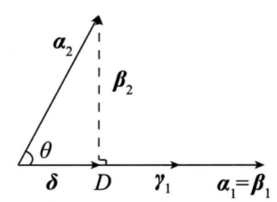

# 线性代数

## 第一章 行列式

### 第 1 节 章节总览

——每一章都有应用！

#### 1.概念

不同行不同列元素乘积的代数和——共n!项

#### 2.性质

1. 经转置行列式的值不变，即|A^T^|=|A|
2. 某行有公因数k,可把k提到行列式外.若某行元素全为0,则行列式的值为0
3. 两行互换行列式变号.特别地，两行相等，行列式值为0;两行成比例，行列式值为0
4. **某行**所有元素都是两个数的和，则可写成**两个**行列式之和（所以，一般来说$|A+B|≠|A|+|B|$，A + B相当于所有行元素都是两个数之和）
5. 某行的k倍加至另一行，行列式的值不变

####  3.展开式

1. $|A| = a_{i1}A_{i1}+ a_{i2}A_{i2}+ ... + a_{in}A_{in}$ (按 $i$ 行展开)
2. $|A| = a_{1j}A_{1j}+ a_{2j}A_{2j}+ \cdots + a_{nj}A_{nj}$ (按 $j$ 列展开)
3. $Aij$是代数余子式，$Mij$是余子式。

#### 4.计算

**数字型**：$\begin{cases} 三角化法\\公式法\\递推法\\归纳法\end{cases}$$\overset{常用技巧}\longrightarrow$ $\begin{cases} 直接按行(列)展开\\把第一行(列)的k_i倍加到第i行(列)\\把每行(列)都加到第1行(列)\\逐行(列)相加\end{cases}$

**抽象型**：$\begin{cases} 用行列式性质\\用矩阵性质\\E恒等变形\\用特征值 |A|=\prod\lambda_i,相似\end{cases}$

行列式乘法公式：$|AB|=|A|·|B|$

重要公式：$AA^*=|A|E$

#### 5.证|A| = 0

* Ax=0有非零解
* 反证法
* r(A)<n
* 0是特征值
* |A|=-|A| 

#### 6.应用

* $Ax=0$有非零解

* 伴随矩阵求逆法
* 线性相关(无关)判定
* 可逆的证明
* 克拉默法则
* 特征值计算
* 二次型正定判定

对于二、三阶行列式有**对角线法则**
$$
\begin{aligned}
& \left|\begin{array}{ll}
a & b \\
c & d
\end{array}\right|=a d-b c \\
& \left|\begin{array}{lll}
a_1 & a_2 & a_3 \\
b_1 & b_2 & b_3 \\
c_1 & c_2 & c_3
\end{array}\right|=a_1 b_2 c_3+a_2 b_3 c_1+a_3 b_1 c_2-a_3 b_2 c_1-a_2 b_1 c_3-a_1 b_3 c_2
\end{aligned}
$$

注意 这样的计算方法对四阶及四阶以上行列式不适用.

### 第 2 节 基本内容与重要结论

**主要公式**

1. 上(下) 三角行列式的值等于主对角线元素的乘积
$$
\left|\begin{array}{cccc}
a_{11} & a_{12} & \cdots & a_{1 n} \\
& a_{22} & \cdots & a_{2 n} \\
& & \ddots & \vdots \\
& & &a_{n n}
\end{array}\right|=\left|\begin{array}{ccc}
a_{11} & & \\
a_{21} & a_{22} & \\
\vdots & \vdots & \ddots \\
a_{n 1} & a_{n 2} & \cdots & a_{n n} \\

\end{array}\right|=a_{11} a_{22} \cdots a_{n n} .
$$
2. 关于副对角线的行列式
$$
\begin{aligned}
\left|\begin{array}{ccccc}
a_{11} & a_{12} & \cdots & a_{1, n-1} & a_{1 n} \\
a_{21} & a_{22} & \cdots & a_{2, n-1} & 0 \\
\vdots & \vdots & & \vdots & \vdots \\
a_{n 1} & 0 & \cdots & 0 & 0
\end{array}\right| & =\left|\begin{array}{cccc}
0 & \cdots & 0 & a_{1 n} \\
0 & \cdots & a_{2, n-1} & a_{2 n} \\
\vdots & & \vdots & \vdots \\
a_{n 1} & \cdots & a_{n, n-1} & a_{n n}
\end{array}\right| \\
& =(-1)^{\frac{n(n-1)}{2}} a_{1 n} a_{2, n-1} \cdots a_{n 1}
\end{aligned}
$$
3. 两个特殊的拉普拉斯展开式
$$
\begin{aligned}
& \left|\begin{array}{ll}
\boldsymbol{A} & * \\
\boldsymbol{O} & \boldsymbol{B}
\end{array}\right|=\left|\begin{array}{cc}
\boldsymbol{A} & \boldsymbol{O} \\
* & \boldsymbol{B}
\end{array}\right|=|\boldsymbol{A}| \cdot|\boldsymbol{B}|, \\
& \left|\begin{array}{ll}
\boldsymbol{O} & \boldsymbol{A} \\
\boldsymbol{B} & *
\end{array}\right|=\left|\begin{array}{cc}
* & \boldsymbol{A} \\
\boldsymbol{B} & \boldsymbol{O}
\end{array}\right|=(-1)^{m n}|\boldsymbol{A}| \cdot|\boldsymbol{B}|,
\end{aligned}
$$
$m, n$ 分别是矩阵 $\boldsymbol{A}, \boldsymbol{B}$ 的阶数.
4. 范德蒙行列式
$$
\left|\begin{array}{cccc}
1 & 1 & \cdots & 1 \\
x_1 & x_2 & \cdots & x_n \\
x_1^2 & x_2^2 & \cdots & x_n^2 \\
\vdots & \vdots & & \vdots \\
x_1^{n-1} & x_2^{n-1} & \cdots & x_n^{n-1}
\end{array}\right|=\prod_{1 \leqslant j<i \leqslant n}\left(x_i-x_j\right) .
$$
5. 特征多项式

设 $\boldsymbol{A}=\left[a_{i j}\right]$ 是 3 阶矩阵，则 $\boldsymbol{A}$ 的特征多项式
$$
|\lambda \boldsymbol{E}-\boldsymbol{A}|=\lambda^3-\left(a_{11}+a_{22}+a_{33}\right) \lambda^2+s_2 \lambda-|\boldsymbol{A}|,
$$

其中 $s_2=\left|\begin{array}{ll}a_{11} & a_{12} \\ a_{21} & a_{22}\end{array}\right|+\left|\begin{array}{ll}a_{11} & a_{13} \\ a_{31} & a_{33}\end{array}\right|+\left|\begin{array}{ll}a_{22} & a_{23} \\ a_{32} & a_{33}\end{array}\right|$.

**方阵的行列式**

1. 若 $\boldsymbol{A}$ 是 $n$ 阶矩阵, $\boldsymbol{A}^{\mathrm{T}}$ 是 $\boldsymbol{A}$ 的转置矩阵, 则 $\left|\boldsymbol{A}^{\mathrm{T}}\right|=|\boldsymbol{A}|$;
2. 若 $\boldsymbol{A}$ 是 $n$ 阶矩阵, 则 $|k \boldsymbol{A}|=k^n|\boldsymbol{A}|$;
3. 若 $\boldsymbol{A}, \boldsymbol{B}$ 都是 $n$ 阶矩阵, 则 $|\boldsymbol{A B}|=|\boldsymbol{A}||\boldsymbol{B}|$;
4. 若 $\boldsymbol{A}$ 是 $n$ 阶矩阵, 则 $\left|\boldsymbol{A}^*\right|=|\boldsymbol{A}|^{n-1}$;
5. 若 $\boldsymbol{A}$ 是 $n$ 阶可逆矩阵, 则 $\left|\boldsymbol{A}^{-1}\right|=|\boldsymbol{A}|^{-1}$;
6. 若 $\boldsymbol{A}$ 是 $n$ 阶矩阵, $\lambda_i(i=1,2, \cdots, n)$ 是 $\boldsymbol{A}$ 的特征值, 则 $|\boldsymbol{A}|=\prod_{i=1}^n \lambda_i$;
7. 若 $n$ 阶矩阵 $\boldsymbol{A}$ 和 $\boldsymbol{B}$ 相似, 则 $|\boldsymbol{A}|=|\boldsymbol{B}|,|\boldsymbol{A}+k \boldsymbol{E}|=|\boldsymbol{B}+k \boldsymbol{E}|$.

**克拉默法则**
若 $n$ 个方程 $n$ 个未知数的线性方程组
$$
\left\{\begin{array}{c}
a_{11} x_1+a_{12} x_2+\cdots+a_{1 n} x_n=b_1, \\
a_{21} x_1+a_{22} x_2+\cdots+a_{2 n} x_n=b_2, \\
\vdots \\
\vdots \\
\vdots \\
a_{n 1} x_1+a_{n 2} x_2+\cdots+a_{n n} x_n=b_n
\end{array}\right.
$$

的系数行列式
$$
D=\left|\begin{array}{cccc}
a_{11} & a_{12} & \cdots & a_{1 n} \\
a_{21} & a_{22} & \cdots & a_{2 n} \\
\vdots & \vdots & & \vdots \\
a_{n 1} & a_{n 2} & \cdots & a_{n n}
\end{array}\right| \neq 0,
$$

则方程组有唯一解
$$
x_1=\frac{D_1}{D}, x_2=\frac{D_2}{D}, \cdots, x_n=\frac{D_n}{D},
$$

其中
$$
D_j=\sum_{i=1}^n b_i A_{i j}=\left|\begin{array}{ccccccc}
a_{11} & \cdots & a_{1, j-1} & b_1 & a_{1, j+1} & \cdots & a_{1 n} \\
a_{21} & \cdots & a_{2, j-1} & b_2 & a_{2, j+1} & \cdots & a_{2 n} \\
\vdots & & \vdots & \vdots & \vdots & & \vdots \\
a_{n 1} & \cdots & a_{n, j-1} & b_n & a_{n, j+1} & \cdots & a_{n n}
\end{array}\right|(j=1,2, \cdots, n) .
$$

**推论1** 若齐次线性方程组
$$
\left\{\begin{array}{c}
a_{11} x_1+a_{12} x_2+\cdots+a_{1 n} x_n=0, \\
a_{21} x_1+a_{22} x_2+\cdots+a_{2 n} x_n=0, \\
\vdots \quad \vdots \quad \vdots \\
a_{n 1} x_1+a_{n 2} x_2+\cdots+a_{n n} x_n=0
\end{array}\right.
$$

的系数行列式不为 0 , 则方程组只有零解.
**推论2** 若齐次线性方程组
$$
\left\{\begin{array}{c}
a_{11} x_1+a_{12} x_2+\cdots+a_{1 n} x_n=0, \\
a_{21} x_1+a_{22} x_2+\cdots+a_{2 n} x_n=0, \\
\vdots \quad \vdots \quad \vdots \\
a_{n 1} x_1+a_{n 2} x_2+\cdots+a_{n n} x_n=0
\end{array}\right.
$$

有非零解, 则系数行列式 $|\boldsymbol{A}|=0$.

**矩阵秩的概念**

在 $m \times n$ 矩阵 $\boldsymbol{A}$ 中, 任取 $k$ 行与 $k$ 列 $(k \leqslant m, k \leqslant n)$ ，位于这些行与列的交叉点上的 $k^{2}$ 个元素按其在原来矩阵 $\boldsymbol{A}$ 中的次序可构成一个 $k$ 阶行列式，称其为矩阵 $\boldsymbol{A}$ 的一个 $k$ 阶**子式**。

矩阵 $\boldsymbol{A}$ 的非零子式的最高阶数称为矩阵 $\boldsymbol{A}$ 的**秩**, 记为 $r(\boldsymbol{A})$. 零矩阵的秩规定为 0 。

例如, 矩阵 $\boldsymbol{A}=\left[\begin{array}{ccccc}1 & 3 & 6 & -1 & 1 \\ 0 & 2 & 4 & 0 & 3 \\ 0 & 0 & 0 & 1 & 2\end{array}\right]$ 中有 3 阶子式 $\left|\begin{array}{ccc}1 & 3 & -1 \\ 0 & 2 & 0 \\ 0 & 0 & 1\end{array}\right| \neq 0$,
而 $\boldsymbol{A}$ 中又没有 4 阶子式, 故 $\boldsymbol{A}$ 中不为零的子式最高是三阶, 所以秩 $r(\boldsymbol{A})=3$.关于矩阵的秩要理解清楚：
$r(\boldsymbol{A})=r \Leftrightarrow \boldsymbol{A}$ 中<u>有</u> $r$ 阶子式不为 0 , <u>任何</u> $r+1$ 阶子式（若存在）必<u>全</u>为 0.
$r(\boldsymbol{A})<r \Leftrightarrow \boldsymbol{A}$ 中<u>每</u>一个 $r$ 阶子式<u>全</u>为 0 。
$r(\boldsymbol{A}) \geqslant r \Leftrightarrow \boldsymbol{A}$ 中<u>有</u> $r$ 阶子式不为 0.
特别地, $r(\boldsymbol{A})=0 \Leftrightarrow \boldsymbol{A}=\boldsymbol{O}$.
$$
\boldsymbol{A} \neq \boldsymbol{O} \Leftrightarrow r(\boldsymbol{A}) \geqslant 1
$$

若 $\boldsymbol{A}$ 是 $n$ 阶矩阵， 

$$
r(\boldsymbol{A})=n \Leftrightarrow|\boldsymbol{A}| \neq 0 \Leftrightarrow \boldsymbol{A} \quad 可逆\\
r(\boldsymbol{A})<n \Leftrightarrow|\boldsymbol{A}|=0 \Leftrightarrow \boldsymbol{A} \quad { 不可逆. }
$$

若 $\boldsymbol{A}$ 是 $m \times n$ 矩阵, 则 $r(\boldsymbol{A}) \leqslant \min (m, n)$.

## 第二章 矩阵

——基础，防混淆！

### 第 1 节 章节总览

#### 1.概念 

$\quad m \times n$ 个数排成的 $m$ 行 $n$ 列的表格

#### 2.运算

$\begin{cases} \boldsymbol{A}+\boldsymbol{B}, k \boldsymbol{A}\\ \boldsymbol{A B}\\ \boldsymbol{A^T}\end{cases} $   $\overset{常用技巧}\longrightarrow$    $\begin{cases} 方阵的幂\\分块矩阵\end{cases}$

#### 3.初等变换

**初等矩阵**

* 初等矩阵$\boldsymbol{P}$左乘$\boldsymbol{A}$所得$\boldsymbol{PA}$就是对$\boldsymbol{A}$作了一次与$\boldsymbol{P}$同样的行变换

* $\boldsymbol{E}_{i}^{-1}(k)=\boldsymbol{E}_{i}\left(\frac{1}{k}\right), \boldsymbol{E}_{i, j}^{-1}=\boldsymbol{E}_{i, j}, \boldsymbol{E}_{i, j}^{-1}(k)=\boldsymbol{E}_{i, j}(-k)$

**等价**

* $\boldsymbol{A} \rightarrow \cdots \rightarrow \boldsymbol{B} \Leftrightarrow \boldsymbol{P A Q}=\boldsymbol{B}$，其中 $\boldsymbol{P}, \boldsymbol{Q}$  可逆

#### 4.逆矩阵

**求解方法**

1. 用定义

2. $[\begin{array}{l:l}\boldsymbol{A} & \boldsymbol{E}]\end{array} \xrightarrow{\text { 行变换 }} [\begin{array}{l:l}\boldsymbol{A} & \boldsymbol{E}\end{array}].$
3. 用伴随 $\displaystyle \boldsymbol{A}^{-1}=\frac{1}{|\boldsymbol{A}|}{ {\boldsymbol{A}}}^{*}$
4. 用分块 $\left[\begin{array}{ll}\boldsymbol{A} & \boldsymbol{O} \\ \boldsymbol{O} & \boldsymbol{B}\end{array}\right]^{-1}=\left[\begin{array}{cc}\boldsymbol{A}^{-1} & \boldsymbol{O} \\ \boldsymbol{O} & \boldsymbol{B}^{-1}\end{array}\right],\left[\begin{array}{ll}\boldsymbol{O} & \boldsymbol{A} \\ \boldsymbol{B} & \boldsymbol{O}\end{array}\right]^{-1}=\left[\begin{array}{cc}\boldsymbol{O} & \boldsymbol{B}^{-1} \\ \boldsymbol{A}^{-1} & \boldsymbol{O}\end{array}\right]$

**证明方法**

1. $|\boldsymbol{A}| \neq 0$
2. $r(\boldsymbol{A})=n$
3. 特征值
4. 反证法

#### 5.秩

**计算** 

* 初等变换法 
* 定义法

**公式** 

* 参看本章主要公式

#### 6.特殊矩阵

1. 伴随矩阵 $\boldsymbol{A}^{*}=\left[\begin{array}{cccc}A_{11} & A_{21} & \cdots & A_{n 1} \\ A_{12} & A_{22} & \cdots & A_{n 2} \\ \vdots & \vdots & & \vdots \\ A_{1 n} & A_{2 n} & \cdots & A_{n n}\end{array}\right], \boldsymbol{A A}^{*}=\boldsymbol{A}^{*} \boldsymbol{A}=|\boldsymbol{A}| \boldsymbol{E}$
2. 对称矩阵 $\boldsymbol{A}^{\mathrm{T}}=\boldsymbol{A} \Leftrightarrow a_{i j}=a_{j i}$
3. 反对称矩阵 $\boldsymbol{A}^{\mathrm{T}}=-\boldsymbol{A} \Leftrightarrow a_{i i}=0, a_{i j}=-a_{j i}$
4. 正交矩阵 $\boldsymbol{A A}^{\mathrm{T}}=\boldsymbol{A}^{\mathrm{T}} \boldsymbol{A}=\boldsymbol{E} \quad \Leftrightarrow \quad \boldsymbol{A}^{-1}=\boldsymbol{A}^{\mathrm{T}}$
5. 对角矩阵 $\left[\begin{array}{llll}a_{1} & & & \\ & a_{2} & & \\ & & \ddots & \\ & & & a_{n}\end{array}\right],\left[\begin{array}{lll}a_{1} & & \\ & a_{2} & \\ & & a_{3}\end{array}\right]\left[\begin{array}{lll}b_{1} & & \\ & b_{2} & \\ & & b_{3}\end{array}\right]=\left[\begin{array}{lll}a_{1} b_{1} & & \\ & a_{2} b_{2} & \\ & & a_{3} b_{3}\end{array}\right]$,
   $\boldsymbol{\Lambda}_{1} \boldsymbol{\Lambda}_{2}=\boldsymbol{\Lambda}_{2} \boldsymbol{\Lambda}_{1},\left[\begin{array}{lll}a_{1} & & \\ & a_{2} & \\ & & a_{3}\end{array}\right]^{n}=\left[\begin{array}{lll}a_{1}^{n} & & \\ & a_{2}^{n} & \\ & & a_{3}^{n}\end{array}\right],\left[\begin{array}{lll}a_{1} & & \\ & a_{2} & \\ & & a_{3}\end{array}\right]^{-1}=\left[\begin{array}{lll}\frac{1}{a_{1}} & & \\ & \frac{1}{a_{2}} & \\ & & \frac{1}{a_{3}}\end{array}\right]$,
   其中 $a_{1} a_{2} a_{3} \neq 0$

### 第 2 节 基本内容与重要结论

**伴随矩阵**

* 对二阶矩阵**主对角线元素对换，副对角线元素变号（主对换，副变号）**，即可求出**伴随矩阵**。

**主要公式**

1. 转置

$ \left(\boldsymbol{A}^{\mathrm{T}}\right)^{\mathrm{T}}=\boldsymbol{A} ;(\boldsymbol{A}+\boldsymbol{B})^{\mathrm{T}}=\boldsymbol{A}^{\mathrm{T}}+\boldsymbol{B}^{\mathrm{T}} ; $ 

$ (k \boldsymbol{A})^{\mathrm{T}}=k \boldsymbol{A}^{\mathrm{T}} ;(\boldsymbol{A} \boldsymbol{B})^{\mathrm{T}}=\boldsymbol{B}^{\mathrm{T}} \boldsymbol{A}^{\mathrm{T}} .$

2. 可逆

$\left(\boldsymbol{A}^{-1}\right)^{-1}=\boldsymbol{A} ;(k \boldsymbol{A})^{-1}=\frac{1}{k} \boldsymbol{A}^{-1} \quad(k \neq 0) ; $

$(\boldsymbol{A B})^{-1}=\boldsymbol{B}^{-1} \boldsymbol{A}^{-1} ;\left(\boldsymbol{A}^n\right)^{-1}=\left(\boldsymbol{A}^{-1}\right)^n ;$ 
$\displaystyle\left(\boldsymbol{A}^{-1}\right)^{\mathrm{T}}=\left(\boldsymbol{A}^{\mathrm{T}}\right)^{-1} ;\left|\boldsymbol{A}^{-1}\right|=\frac{1}{|\boldsymbol{A}|} ; $
$\displaystyle \boldsymbol{A}^{-1}=\frac{1}{|\boldsymbol{A}|} \boldsymbol{A}^* .$

3. 伴随

$\begin{aligned}
& \boldsymbol{A A}^*=\boldsymbol{A}^* \boldsymbol{A}=|\boldsymbol{A}| \boldsymbol{E} ; \\
& \boldsymbol{A}^*=|\boldsymbol{A}| \boldsymbol{A}^{-1} ;\left|\boldsymbol{A}^*\right|=|\boldsymbol{A}|^{n-1} ; \\
& \left(\boldsymbol{A}^*\right)^{-1}=\left(\boldsymbol{A}^{-1}\right)^*=\frac{1}{|\boldsymbol{A}|}{\boldsymbol{A} ;} \\
& \left(\boldsymbol{A}^*\right)^{\mathrm{T}}=\left(\boldsymbol{A}^{\mathrm{T}}\right)^* ;(k \boldsymbol{A})^*=k^{n-1} \boldsymbol{A}^* ;\left(\boldsymbol{A}^*\right)^*=|\boldsymbol{A}|^{n-2} \boldsymbol{A} ; \\
& r\left(\boldsymbol{A}^*\right)= \begin{cases}n, & \text { if }& r(\boldsymbol{A})=n, \\
1, & \text { if }& r(\boldsymbol{A})=n-1, \\
0, & \text { if }& r(\boldsymbol{A})<n-1 .\end{cases}
\end{aligned}$

4. 秩

$r(\boldsymbol{A})=r\left(\boldsymbol{A}^{\mathrm{T}}\right) ; r\left(\boldsymbol{A}^{\mathrm{T}} \boldsymbol{A}\right)=r(\boldsymbol{A}) ;$

当 $k \neq 0$ 时, $r(k \boldsymbol{A})=r(\boldsymbol{A})$;

$r(\boldsymbol{A}+\boldsymbol{B}) \leqslant r(\boldsymbol{A})+r(\boldsymbol{B}) ; $

$
r(\boldsymbol{A B}) \leqslant \min (r(\boldsymbol{A}), r(\boldsymbol{B})) ;
$

若 $\boldsymbol{A}$ 可逆, 则 $r(\boldsymbol{A B})=r(\boldsymbol{B}), r(\boldsymbol{B A})=r(\boldsymbol{B})$ ；

若 $\boldsymbol{A}$ 列满秩, 则 $r(\boldsymbol{A B})=r(\boldsymbol{B}) ;$

若 $\boldsymbol{A}$ 是 $m \times n$ 矩阵, $\boldsymbol{B}$ 是 $n \times s$ 矩阵, $\boldsymbol{A B}=\boldsymbol{O}$, 则 $r(\boldsymbol{A})+r(\boldsymbol{B}) \leqslant n$;

$r\left[\begin{array}{ll}
\boldsymbol{A} & \boldsymbol{O} \\
\boldsymbol{O} & \boldsymbol{B}
\end{array}\right]=r(\boldsymbol{A})+r(\boldsymbol{B}) ;$

若 $\boldsymbol{A} \sim \boldsymbol{B}$, 则 $r(\boldsymbol{A})=r(\boldsymbol{B}), r(\boldsymbol{A}+k \boldsymbol{E})=r(\boldsymbol{B}+k \boldsymbol{E})$.

5. 分块矩阵

对矩阵适当地分块处理，有如下运算法则：
$$
\begin{aligned}
& {\left[\begin{array}{ll}
\boldsymbol{A}_1 & \boldsymbol{A}_2 \\
\boldsymbol{A}_3 & \boldsymbol{A}_4
\end{array}\right]+\left[\begin{array}{ll}
\boldsymbol{B}_1 & \boldsymbol{B}_2 \\
\boldsymbol{B}_3 & \boldsymbol{B}_4
\end{array}\right]=\left[\begin{array}{ll}
\boldsymbol{A}_1+\boldsymbol{B}_1 & \boldsymbol{A}_2+\boldsymbol{B}_2 \\
\boldsymbol{A}_3+\boldsymbol{B}_3 & \boldsymbol{A}_4+\boldsymbol{B}_4
\end{array}\right] ;} \\
& {\left[\begin{array}{ll}
\boldsymbol{A} & \boldsymbol{B} \\
\boldsymbol{C} & \boldsymbol{D}
\end{array}\right]\left[\begin{array}{cc}
\boldsymbol{X} & \boldsymbol{Y} \\
\boldsymbol{Z} & \boldsymbol{W}
\end{array}\right]=\left[\begin{array}{ll}
\boldsymbol{A X}+\boldsymbol{B} \boldsymbol{Z} & \boldsymbol{A} \boldsymbol{Y}+\boldsymbol{B} \boldsymbol{W} \\
\boldsymbol{C X}+\boldsymbol{D} \boldsymbol{Z} & \boldsymbol{C} \boldsymbol{Y}+\boldsymbol{D} \boldsymbol{W}
\end{array}\right]} \\
& {\left[\begin{array}{ll}
\boldsymbol{A} & \boldsymbol{B} \\
\boldsymbol{C} & \boldsymbol{D}
\end{array}\right]^{\mathrm{T}}=\left[\begin{array}{ll}
\boldsymbol{A}^{\mathrm{T}} & \boldsymbol{C}^{\mathrm{T}} \\
\boldsymbol{B}^{\mathrm{T}} & \boldsymbol{D}^{\mathrm{T}}
\end{array}\right] ;}
\end{aligned}
$$

若 $\boldsymbol{B}, \boldsymbol{C}$ 分别是 $m$ 阶与 $s$ 阶矩阵, 则 $\left[\begin{array}{ll}\boldsymbol{B} & \boldsymbol{O} \\ \boldsymbol{O} & \boldsymbol{C}\end{array}\right]^n=\left[\begin{array}{cc}\boldsymbol{B}^n & \boldsymbol{O} \\ \boldsymbol{O} & \boldsymbol{C}^n\end{array}\right]$;

若 $\boldsymbol{B}, \boldsymbol{C}$ 分别是 $m$ 阶与 $n$ 阶可逆矩阵, 则
$$
\left[\begin{array}{ll}
\boldsymbol{B} & \boldsymbol{O} \\
\boldsymbol{O} & \boldsymbol{C}
\end{array}\right]^{-1}=\left[\begin{array}{cc}
\boldsymbol{B}^{-1} & \boldsymbol{O} \\
\boldsymbol{O} & \boldsymbol{C}^{-1}
\end{array}\right],\left[\begin{array}{ll}
\boldsymbol{O} & \boldsymbol{B} \\
\boldsymbol{C} & \boldsymbol{O}
\end{array}\right]^{-1}=\left[\begin{array}{cc}
\boldsymbol{O} & \boldsymbol{C}^{-1} \\
\boldsymbol{B}^{-1} & \boldsymbol{O}
\end{array}\right]
$$

​	若 $\boldsymbol{A}$ 是 $m \times n$ 矩阵, $\boldsymbol{B}$ 是 $n \times s$ 矩阵且 $\boldsymbol{A B}=\boldsymbol{O}$, 对 $\boldsymbol{B}$ 和 $\boldsymbol{O}$ 矩阵按列分块有
$$
\begin{aligned}
\boldsymbol{A B}=\boldsymbol{A}\left[\boldsymbol{b}_1, \boldsymbol{b}_2, \cdots, \boldsymbol{b}_s\right] & =\left[\boldsymbol{A} \boldsymbol{b}_1, \boldsymbol{A} \boldsymbol{b}_2, \cdots, \boldsymbol{A} \boldsymbol{b}_s\right]=[\mathbf{0}, \mathbf{0}, \cdots, \mathbf{0}], \\
\boldsymbol{A} \boldsymbol{b}_i & =\mathbf{0} \quad(i=1,2, \cdots, s),
\end{aligned}
$$

即 $\boldsymbol{B}$ 的列向量是齐次方程组 $\boldsymbol{A x}=\mathbf{0}$ 的解。
	若 $\boldsymbol{A B}=\boldsymbol{C}$, 其中 $\boldsymbol{A}$ 是 $m \times n$ 矩阵, $\boldsymbol{B}$ 是 $n \times s$ 矩阵, 则对 $\boldsymbol{B}, \boldsymbol{C}$ 按行分块有
$$
\left[\begin{array}{cccc}
a_{11} & a_{12} & \cdots & a_{1 n} \\
a_{21} & a_{22} & \cdots & a_{2 n} \\
\vdots & \vdots & & \vdots \\
a_{m 1} & a_{m 2} & \cdots & a_{m n}
\end{array}\right]\left[\begin{array}{c}
\boldsymbol{\beta}_1 \\
\boldsymbol{\beta}_2 \\
\vdots \\
\boldsymbol{\beta}_n
\end{array}\right]=\left[\begin{array}{c}
\boldsymbol{\alpha}_1 \\
\boldsymbol{\alpha}_2 \\
\vdots \\
\boldsymbol{\alpha}_m
\end{array}\right],
$$

$$
\left\{\begin{array}{c}
a_{11} \boldsymbol{\beta}_1+a_{12} \boldsymbol{\beta}_2+\cdots+a_{1 n} \boldsymbol{\beta}_n=\boldsymbol{\alpha}_1 \\
a_{21} \boldsymbol{\beta}_1+a_{22} \boldsymbol{\beta}_2+\cdots+a_{2 n} \boldsymbol{\beta}_n=\boldsymbol{\alpha}_2, \\
\vdots \\
\vdots \\
\vdots \\
a_{m 1} \boldsymbol{\beta}_1+a_{m 2} \boldsymbol{\beta}_2+\cdots+a_{m n} \boldsymbol{\beta}_n=\boldsymbol{\alpha}_m,
\end{array}\right.
$$

可见==矩阵 $\boldsymbol{A B}$ 的行向量 $\boldsymbol{\alpha}_1, \boldsymbol{\alpha}_2, \cdots, \boldsymbol{\alpha}_m$ 可由 $\boldsymbol{B}$ 的行向量 $\boldsymbol{\beta}_1, \boldsymbol{\beta}_2, \cdots, \boldsymbol{\beta}_n$ 线性表出==。

类似地, 对矩阵 $\boldsymbol{A}, \boldsymbol{C}$ 按列分块, 有
$$
\left[\boldsymbol{\gamma}_1, \boldsymbol{\gamma}_2, \cdots, \boldsymbol{\gamma}_n\right]\left[\begin{array}{cccc}
b_{11} & b_{12} & \cdots & b_{1 s} \\
b_{21} & b_{22} & \cdots & b_{2 s} \\
\vdots & \vdots & & \vdots \\
b_{n 1} & b_{n 2} & \cdots & b_{n s}
\end{array}\right]=\left[\boldsymbol{\delta}_1, \boldsymbol{\delta}_2, \cdots, \boldsymbol{\delta}_s\right],
$$

由此得
$$
\left\{\begin{array}{c}
b_{11} \boldsymbol{\gamma}_1+b_{21} \boldsymbol{\gamma}_2+\cdots+b_{n 1} \boldsymbol{\gamma}_n=\boldsymbol{\delta}_1, \\
b_{12} \boldsymbol{\gamma}_1+b_{22} \boldsymbol{\gamma}_2+\cdots+b_{n 2} \boldsymbol{\gamma}_n=\boldsymbol{\delta}_2, \\
\vdots \\
\vdots \\
b_{1 s} \boldsymbol{\gamma}_1+b_{2 s} \boldsymbol{\gamma}_2+\cdots+b_{n s} \boldsymbol{\gamma}_n=\boldsymbol{\delta}_s,
\end{array}\right.
$$

即==矩阵 $\boldsymbol{A B}$ 的列向量可由 $\boldsymbol{A}$ 的列向量线性表出.==

## 第三章 n维向量

——难点，加油！

### 第 1 节 章节总览

#### 1.运算↓

* 加法、数乘、内积 → Schmidt正交化（注："↓"指和下一小节线性表示有关）

#### 2.线性表示

* **概念**

如果 $\boldsymbol{\beta}=k_1 \boldsymbol{\alpha}_1+\cdots+k_s \boldsymbol{\alpha}_s$,称 $\boldsymbol{\beta}$ 可由 $\boldsymbol{\alpha}_1, \ldots, \boldsymbol{\alpha}_s$ 线性表出

* **判定**

  * 充要条件：

    ①方程组 $x_1 \boldsymbol{\alpha}_1+x_2 \boldsymbol{\alpha}_2+\cdots+x_s \alpha_s=\beta$ 有解

    ②$r\left(\boldsymbol{\alpha}_1, \cdots, \boldsymbol{\alpha}_s\right)=r\left(\boldsymbol{\alpha}_1, \cdots, \boldsymbol{\alpha}_s, \boldsymbol{\beta}\right)$

  * 充分条件：

    ①$\boldsymbol{\alpha}_1, \cdots, \boldsymbol{\alpha}_s$ 无关， $\boldsymbol{\alpha}_1, \cdots, \boldsymbol{\alpha}_s, \boldsymbol{\beta}$ 相关

* **等价**

若 $\boldsymbol{\alpha}_1, \cdots, \boldsymbol{\alpha}_s$ 与 $\boldsymbol{\beta}_1, \cdots, \boldsymbol{\beta}_t$ 可互相线性表出

#### 3.线性相关

* **概念**

若存在不全为 0 的 $k_1, \cdots, k_s$ 使 $k_1 \boldsymbol{\alpha}_1+\cdots+k_s \boldsymbol{\alpha}_s=0$

**判定**

1. **充要条件**

   ① $\left[\boldsymbol{\alpha}_1, \boldsymbol{\alpha}_2, \cdots, \boldsymbol{\alpha}_s\right] \boldsymbol{x}=\mathbf{0}$ 有非零解

   ②$r\left(\boldsymbol{\alpha}_1, \boldsymbol{\alpha}_2, \cdots, \boldsymbol{\alpha}_s\right)<s$

​	③某 $\boldsymbol{\alpha}_i$ 可由 $\boldsymbol{\alpha}_1, \cdots, \boldsymbol{\alpha}_{i-1}, \boldsymbol{\alpha}_{i+1}, \cdots, \boldsymbol{\alpha}_s$ 线性表出

2. **充分条件**

​	① $n+1$ 个 $n$ 维向量

​	②多数向量能用少数向量表示

#### 4.线性无关↓

* **概念**

如果 $k_1 \boldsymbol{\alpha}_1+\cdots+k_s \boldsymbol{\alpha}_s=0$, 则必有 $k_1=0, \cdots, k_s=0$

* **判定**

  * 充要条件：

    ①$\left[\boldsymbol{\alpha}_1, \cdots, \boldsymbol{\alpha}_s\right]_{\boldsymbol{x}=0}$ 只有零解

    ②$r\left(\boldsymbol{\alpha}_1, \cdots, \boldsymbol{\alpha}_s\right)=s$

    ③$\forall i, \boldsymbol{\alpha}_i$ 不能由其余的向量表示

  * 充分条件：

    阶梯形向量组

#### 5.极大线性无关组↓

* 概念：
* 求法

#### 6.向量组的秩

* 向量组的秩：极大线性无关向量组所含向量的个数
* 矩阵的秩：

#### 7.向量空间^*^

* **概念**

解空间

* **基**

坐标

过渡矩阵

规范正交基

### 第 2 节 基本内容与重要结论

## 第四章 线性方程组

——重点，别马虎大意！

### 第 1 节 章节总览

#### 1.矩阵形式

* $Ax = b$
* $Ax = 0$
* 一般型$ \xrightarrow[行变换]{初等} $阶梯型$\begin{cases} 有解判定 → r(A) = r(\bar A)(\bar A为增广矩阵)&→&解的结构\\&&\quad↑(导出组) \\有非零解 → r(A)<n&→&基础解系 \end{cases}$ $\left.\begin{matrix} &  & \\ &  & \\ &  & \end{matrix}\right\}$通解

#### 2.向量形式

* $x_1 \boldsymbol{\alpha}_1+\cdots+x_n \boldsymbol{\alpha}_n=\boldsymbol{\beta} \stackrel{\text { 方程组有解 }}{\Longleftrightarrow} \boldsymbol{\beta}$ 可由 $\boldsymbol{\alpha}_1, \cdots, \boldsymbol{\alpha}_n$ 表出
* $x_1 \boldsymbol{\alpha}_1+\cdots+x_n \boldsymbol{\alpha}_n=\mathbf{0} \stackrel{\text { 有非零解 }}{\Longleftrightarrow} \boldsymbol{\alpha}_1, \cdots, \boldsymbol{\alpha}_n$ 线性相关

#### 3.解的性质

* 若 $\boldsymbol{\alpha}_1, \boldsymbol{\alpha}_2$ 是 $A \boldsymbol{x}=\boldsymbol{b}$ 的解, 则 $\boldsymbol{\alpha}_1-\boldsymbol{\alpha}_2$ 是 $ \boldsymbol{Ax}=\mathbf{0}$ 的解
* 若 $\boldsymbol{\eta}_1, \boldsymbol{\eta}_2$ 是 $A \boldsymbol{x}=\mathbf{0}$ 的解, 则 $k_1 \boldsymbol{\eta}_1+k_2 \boldsymbol{\eta}_2$ 是 $\boldsymbol{A x}=\mathbf{0}$ 的解
* 若 $\boldsymbol{\alpha}$ 是 $A \boldsymbol{x}=\boldsymbol{b}$ 的解， $\boldsymbol{\eta}$ 是 $A \boldsymbol{x}=\mathbf{0}$ 的解，则 $\boldsymbol{\alpha}+\boldsymbol{\eta}$ 是 $A \boldsymbol{x}=\boldsymbol{b}$ 的解

#### 4.解的结构

* 特解、通解
* 自由变量

如有方程组就加减消元、讨论参数，求解.

如没有方程组大概需求秩，用解的结构分析推理来求解.
$$
\begin{aligned}
* \boldsymbol{A} \boldsymbol{x}=\boldsymbol{b} & \Leftrightarrow\left[\boldsymbol{\alpha}_1, \boldsymbol{\alpha}_2, \cdots, \boldsymbol{\alpha}_n\right]\left[\begin{array}{c}
x_1 \\
x_2 \\
\vdots \\
x_n
\end{array}\right]=\boldsymbol{\beta} \\
& \Leftrightarrow x_1 \boldsymbol{\alpha}_1+x_2 \boldsymbol{\alpha}_2+\cdots+x_n \boldsymbol{\alpha}_n=\boldsymbol{\beta}
\end{aligned}
$$
$\boldsymbol{A x}=\boldsymbol{b}$ 有解 $\Leftrightarrow \boldsymbol{\beta}$ 可由 $\boldsymbol{\alpha}_1, \boldsymbol{\alpha}_2, \cdots, \boldsymbol{\alpha}_n$ 线性表示
$$
\Leftrightarrow r\left(\boldsymbol{\alpha}_1, \boldsymbol{\alpha}_2, \cdots, \boldsymbol{\alpha}_n\right)=r\left(\boldsymbol{\alpha}_1, \boldsymbol{\alpha}_2, \cdots, \boldsymbol{\alpha}_n, \boldsymbol{\beta}\right)
$$

### 第 2 节 基本内容与重要结论

【例：解的结构-解方程$Ax=b$】

解方程组
$$
\left\{\begin{aligned}
x_1-x_2+2 x_3+x_4 & =1, \\
2 x_1-x_2+x_3+2 x_4 & =3, \\
x_1-x_3+x_4 & =2,
\end{aligned}\right.
$$

并求满足 $x_1=-x_2$ 的所有解.

---

解：对增广矩阵作初等行变换
$$
\overline{\boldsymbol{A}}=\left[\begin{array}{cccc:c}
1 & -1 & 2 & 1 & 1 \\
2 & -1 & 1 & 2 & 3 \\
1 & 0 & -1 & 1 & 2
\end{array}\right] \rightarrow\left[\begin{array}{cccc:c}
1 & -1 & 2 & 1 & 1 \\
0 & 1 & -3 & 0 & 1 \\
0 & 0 & 0 & 0 & 0
\end{array}\right] \rightarrow\left[\begin{array}{llll:l}
1 & 0 & -1 & 1 & 2 \\
& 1 & -3 & 0 & 1 \\
& & & 0 & 0
\end{array}\right]
$$
$r(\boldsymbol{A})=r(\overline{\boldsymbol{A}})=2<4$ ，方程组有无穷多解.
（1）由同解方程组
$$
\left\{\begin{array}{l}
x_1=x_3-x_4+2, \\
x_2=3 x_3+1,
\end{array}\right.
$$

令 $x_3=k_1, x_4=k_2 \Rightarrow x_2=3 k_1+1, x_1=k_1-k_2+2$, 方程组的通解为 

$\boldsymbol{x}=\left[\begin{array}{c}k_1-k_2+2 \\ 3 k_1+1 \\ k_1 \\ k_2\end{array}\right]=k_1\left[\begin{array}{l}1 \\ 3 \\ 1 \\ 0\end{array}\right]+k_2\left[\begin{array}{c}-1 \\ 0 \\ 0 \\ 1\end{array}\right]+\left[\begin{array}{l}2 \\ 1 \\ 0 \\ 0\end{array}\right], k_1, k_2$ 为任意常数.

或（2）解的结构
$$
\overline{\boldsymbol{A}} \rightarrow\left[\begin{array}{llll:l}
1 & 0 & -1 & 1 & 2 \\
& 1 & -3 & 0 & 1 \\
& & & 0 & 0
\end{array}\right], n-r(\boldsymbol{A})=4-2=2,
$$

主元: $x_1, x_2$; 自由变量: $x_3, x_4$.
特解: $\boldsymbol{\alpha}=(2,1,0,0)^{\mathrm{T}}$.（自由变量直接取 0,0，方便计算）
$\boldsymbol{A x}=\mathbf{0}$ 的基础解系为：（基础解系分量要保证**线性无关和计算方便**，所以分别取1,0和0,1，基础解系只考虑系数矩阵部分，增广矩阵部分分量看作0）
$$
\boldsymbol{\eta}_1=(1,3,1,0)^{\mathrm{T}}, \boldsymbol{\eta}_2=(-1,0,0,1)^{\mathrm{T}} .
$$

方程组的通解为 $\boldsymbol{x}=\boldsymbol{\alpha}+k_1 \boldsymbol{\eta}_1+k_2 \boldsymbol{\eta}_2, k_1, k_2$ 为任意常数.
由通解, 若 $x_1=-x_2$, 则：

由
$$
\begin{bmatrix} x_1\\x_2\\x_3\\x_4\end{bmatrix}=\begin{bmatrix} 2\\1\\0\\0\end{bmatrix}+k_1\begin{bmatrix} 1\\3\\1\\0\end{bmatrix}+k_2\begin{bmatrix} -1\\0\\0\\1\end{bmatrix}
$$
知：
$$
k_1-k_2+2=-\left(3 k_1+1\right) \Rightarrow k_2=4 k_1+3,
$$

于是
$$
\boldsymbol{x}=\left[\begin{array}{l}
2 \\
1 \\
0 \\
0
\end{array}\right]+k_1\left[\begin{array}{l}
1 \\
3 \\
1 \\
0
\end{array}\right]+\left(4 k_1+3\right)\left[\begin{array}{c}
-1 \\
0 \\
0 \\
1
\end{array}\right]=\left[\begin{array}{c}
-1 \\
1 \\
0 \\
3
\end{array}\right]+k_1\left[\begin{array}{c}
-3 \\
3 \\
1 \\
4
\end{array}\right], k_1 \text { 为任意常数, }
$$

为方程组满足 $x_1=-x_2$ 的所有解.
【注】用 $k_1, k_2$ 与 $(0,0),(1,0),(0,1)$ 两种求通解方法一定要熟练, 正确.

## 第五章 特征值与特征向量

——重点，综合性强！

### 第 1 节 章节总览

#### 1.定义

* $\boldsymbol{A} \boldsymbol{\alpha}=\lambda \boldsymbol{\alpha},\boldsymbol{\alpha} \neq \mathbf{0}$

#### 2.求解方法

* 特征值
  * 定义法
  * $|\lambda \boldsymbol{E}-\boldsymbol{A}|=0$
  * 相似
* 特征向量
  * 定义法
  * 基础解系法 $(\lambda \boldsymbol{E}-\boldsymbol{A}) \boldsymbol{x}=\mathbf{0}$
  * 相似

#### 3.性质

* 不同特征值的特征向量线性无关
* $k$ 重特征值至多有 $k$ 个线性无关的特征向量
* $\displaystyle |A|=\prod\lambda_i, \sum a_{ii}=\sum \lambda_i$

#### 4.相似

* 定义：$\boldsymbol{P^{-1}AP=B}\longrightarrow$性质（必要条件）$\begin{cases}r(A)=r(B)\\|A|=|B|\\ |\lambda \boldsymbol{E}-\boldsymbol{A}| = |\lambda \boldsymbol{E}-\boldsymbol{B}|\\  \sum a_{ii}=\sum b_{ii}\end{cases}$

* 可对角化：

  * 充要条件：

    $\Longleftrightarrow\left[\begin{array}{l}\boldsymbol{A} \text { 有 } n \text { 个线性无关的特征向量 } \\ \text { 如果 } \lambda \text { 是 } k \text { 重特征值,那么 } \lambda \text { 必有 } k \text { 个线性无关的特征向量 } \\ r\left(\lambda_{i} \boldsymbol{E}-\boldsymbol{A}\right)=n-n_{i}, \lambda_{i} \text { 为 } n_{i} \text { 重特征值 }\end{array}\right.$

  * 充分条件：

    $\Longleftarrow\left[\begin{array}{l}\boldsymbol{A} \text { 有 } n \text { 个不同的特征值 } \\ \boldsymbol{A} \text { 是实对称矩阵 }\end{array}\right.$

#### 5.实对称矩阵隐含的信息

* 必与对角矩阵相似
* 可用正交矩阵对角化
* 特征值必是实数
* 不同特征值的特征向量必**正交**。
* $k$ 重特征值必有 $k$ 个线性无关的**特征向量**。

**注**: 由 $\boldsymbol{A} \sim \boldsymbol{B}\left\{\begin{array}{l}\stackrel{(1)}{\Rightarrow} \boldsymbol{A}+k \boldsymbol{E} \sim \boldsymbol{B}+k \boldsymbol{E}, \text { 进而 }|\boldsymbol{A}+k \boldsymbol{E}|=|\boldsymbol{B}+k \boldsymbol{E}|, r(\boldsymbol{A}+k \boldsymbol{E})=r(\boldsymbol{B}+k \boldsymbol{E}) . \\ \stackrel{(2)}\Rightarrow \boldsymbol{A}^{n} \sim \boldsymbol{B}^{n}, \text { 进而 } \boldsymbol{A}^{n}=\boldsymbol{P} \boldsymbol{B}^{n} \boldsymbol{P}^{-1} .\end{array}\right.$
由 $\boldsymbol{P}_{1}^{-1} \boldsymbol{A} \boldsymbol{P}_{1}=\boldsymbol{B}, \boldsymbol{P}_{2}^{-1} \boldsymbol{B} \boldsymbol{P}_{2}=\boldsymbol{C} \quad \Rightarrow \quad \boldsymbol{P}^{-1} \boldsymbol{A}=\boldsymbol{C}$, 其中 $\boldsymbol{P}=\boldsymbol{P}_{1} \boldsymbol{P}_{2}$.

|   $\boldsymbol{A}$    | $k \boldsymbol{A}+\boldsymbol{E}$ | $\boldsymbol{A}+k \boldsymbol{E}$ | $\boldsymbol{A}^{-1}$ |        $\boldsymbol{A}^{*}$        | $\boldsymbol{A}^{n}$  | $\boldsymbol{P}^{-1} \boldsymbol{A} \boldsymbol{P}$ |  $f(\boldsymbol{A})$  |
| :-------------------: | :-------------------------------: | :-------------------------------: | :-------------------: | :--------------------------------: | :-------------------: | :-------------------------------------------------: | :-------------------: |
|       $\lambda$       |           $k \lambda+1$           |            $\lambda+k$            |  $\frac{1}{\lambda}$  | $\frac{|\boldsymbol{A}|}{\lambda}$ |     $\lambda^{n}$     |                      $\lambda$                      |     $f(\lambda)$      |
| $\boldsymbol{\alpha}$ |       $\boldsymbol{\alpha}$       |       $\boldsymbol{\alpha}$       | $\boldsymbol{\alpha}$ |       $\boldsymbol{\alpha}$        | $\boldsymbol{\alpha}$ |      $\boldsymbol{P}^{-1} \boldsymbol{\alpha}$      | $\boldsymbol{\alpha}$ |

### 第 2 节 基本内容与重要结论

**定理**： 若 $n$ 阶矩阵 $\boldsymbol{A}$ 有 $n$ 个不同的特征值 $\lambda_1, \lambda_2, \cdots, \lambda_n$, 则 $\boldsymbol{A}$ 可相似对角化，且
$$
\boldsymbol{A} \sim\left[\begin{array}{llll}
\lambda_1 & & & \\
& \lambda_2 & & \\
& & \ddots & \\
& & & \lambda_n
\end{array}\right]
$$

**定理**： n 阶矩阵 $\boldsymbol{A}$ 可相似对角化的充分必要条件是对于 $\boldsymbol{A}$ 的每个特征值，其线性无关的特征向量的个数恰好等于该特征值的**重数**。即：

 $\boldsymbol{A} \sim \boldsymbol{\Lambda} \Leftrightarrow \lambda_i$ 是 $\boldsymbol{A}$ 的 $n_i$ 重特征值，则 $\lambda_i$ 有 $n_i$ 个线性无关的特征向量
$\Leftrightarrow$ 秩 $r\left(\lambda_i \boldsymbol{E}-\boldsymbol{A}\right)=n-n_i, \lambda_i$ 为 $n_i$ 重特征值。
**定理**：实对称矩阵 $\boldsymbol{A}$ 的不同特征值 $\lambda_1, \lambda_2$ 所对应的特征向量 $\boldsymbol{\alpha}_1, \boldsymbol{\alpha}_2$ 必**正交**.

**定理**： 实对称矩阵 $\boldsymbol{A}$ 的特征值都是实数。
**定理**： $n$ 阶实对称阵 $\boldsymbol{A}$ 必可对角化，且总存在正交阵 $Q$ ，使得
$$
\boldsymbol{Q}^{-1} \boldsymbol{A} \boldsymbol{Q}=\boldsymbol{Q}^{\mathrm{T}} \boldsymbol{A} \boldsymbol{Q}=\left[\begin{array}{llll}
\lambda_1 & & & \\
& \lambda_2 & & \\
& & \ddots & \\
& & & \lambda_n
\end{array}\right],
$$

其中 $\lambda_1, \lambda_2, \cdots, \lambda_n$ 是 $\boldsymbol{A}$ 的特征值.

**Schmidt 正交化方法**

如果向量组 $\boldsymbol{\alpha}_1, \boldsymbol{\alpha}_2, \boldsymbol{\alpha}_3$ 线性无关，令
$$
\begin{aligned}
& \boldsymbol{\beta}_1=\boldsymbol{\alpha}_1 \\
& \boldsymbol{\beta}_2=\boldsymbol{\alpha}_2-\frac{\left(\boldsymbol{\alpha}_2, \boldsymbol{\beta}_1\right)}{\left(\boldsymbol{\beta}_1, \boldsymbol{\beta}_1\right)} \boldsymbol{\beta}_1 \\
& \boldsymbol{\beta}_3=\boldsymbol{\alpha}_3-\frac{\left(\boldsymbol{\alpha}_3, \boldsymbol{\beta}_1\right)}{\left(\boldsymbol{\beta}_1, \boldsymbol{\beta}_1\right)} \boldsymbol{\beta}_1-\frac{\left(\boldsymbol{\alpha}_3, \boldsymbol{\beta}_2\right)}{\left(\boldsymbol{\beta}_2, \boldsymbol{\beta}_2\right)} \boldsymbol{\beta}_2
\end{aligned}
$$
那么 $\boldsymbol{\beta}_1, \boldsymbol{\beta}_2, \boldsymbol{\beta}_3$ 两两正交, 称为**正交向量组**. 将其单位化, 有
$$
\boldsymbol{\gamma}_1=\frac{\boldsymbol{\beta}_1}{\left\|\boldsymbol{\beta}_1\right\|}, \boldsymbol{\gamma}_2=\frac{\boldsymbol{\beta}_2}{\left\|\boldsymbol{\beta}_2\right\|}, \boldsymbol{\gamma}_3=\frac{\boldsymbol{\beta}_3}{\left\|\boldsymbol{\beta}_3\right\|},
$$

则 $\boldsymbol{\alpha}_1, \boldsymbol{\alpha}_2, \boldsymbol{\alpha}_3$ 到 $\boldsymbol{\gamma}_1, \boldsymbol{\gamma}_2, \boldsymbol{\gamma}_3$ 这一过程称为 **Schmidt 正交化**.
例如 $\boldsymbol{\alpha}_1=(0,1,2)^{\mathrm{T}}, \boldsymbol{\alpha}_2=(1,0,1)^{\mathrm{T}}, \boldsymbol{\alpha}_3=(1,1,0)^{\mathrm{T}}$, 则有
$$
\begin{aligned}
& \boldsymbol{\beta}_1=\left[\begin{array}{l}
0 \\
1 \\
2
\end{array}\right], \\
& \boldsymbol{\beta}_2=\left[\begin{array}{l}
1 \\
0 \\
1
\end{array}\right]-\frac{2}{5}\left[\begin{array}{l}
0 \\
1 \\
2
\end{array}\right]=\frac{1}{5}\left[\begin{array}{c}
5 \\
-2 \\
1
\end{array}\right], \\
& \boldsymbol{\beta}_3=\left[\begin{array}{l}
1 \\
1 \\
0
\end{array}\right]-\frac{1}{5}\left[\begin{array}{l}
0 \\
1 \\
2
\end{array}\right]-\frac{3}{30}\left[\begin{array}{c}
5 \\
-2 \\
1
\end{array}\right]=\frac{1}{10}\left[\begin{array}{c}
5 \\
10 \\
-5
\end{array}\right]=\frac{1}{2}\left[\begin{array}{c}
1 \\
2 \\
-1
\end{array}\right],
\end{aligned}
$$

将其单位化, 有
$$
\boldsymbol{\gamma}_1=\frac{1}{\sqrt{5}}\left[\begin{array}{l}
0 \\
1 \\
2
\end{array}\right], \boldsymbol{\gamma}_2=\frac{1}{\sqrt{30}}\left[\begin{array}{c}
5 \\
-2 \\
1
\end{array}\right], \boldsymbol{\gamma}_3=\frac{1}{\sqrt{6}}\left[\begin{array}{c}
1 \\
2 \\
-1
\end{array}\right] .
$$
**Schmidt正交化的几何表示：**

$$
\begin{aligned}
&\boldsymbol{\beta}_2=\boldsymbol{\alpha}_2-\boldsymbol{\delta} \\
& \boldsymbol{\delta}=\left\|\boldsymbol{\alpha}_2\right\| \cos \theta \boldsymbol{\gamma}_1\\
& \boldsymbol{\gamma}_1=\frac{\boldsymbol{\alpha}_1}{\left\|\boldsymbol{\alpha}_1\right\|}=\frac{\boldsymbol{\beta}_1}{\left\|\boldsymbol{\beta}_1\right\|} \\
& \therefore \boldsymbol{\beta}_2=\boldsymbol{\alpha}_2-\left\|\boldsymbol{\alpha}_2\right\| \cos \theta \boldsymbol{\gamma}_1 \\
& =\boldsymbol{\alpha}_2-\frac{\left\|\boldsymbol{\alpha}_1\right\|\left\|\boldsymbol{\alpha}_2\right\| \cos \theta}{\left\|\boldsymbol{\alpha}_1\right\| \cdot\left\|\boldsymbol{\alpha}_1\right\|} \boldsymbol{\beta}_1
\end{aligned}
$$
【例：求特征值和特征向量】

求矩阵 $\boldsymbol{A}=\left[\begin{array}{lll}2 & 1 & 3 \\ 4 & 2 & 6 \\ 6 & 3 & 9\end{array}\right]$ 的特征值与特征向量.

------

解：由矩阵 $\boldsymbol{A}$ 的特征多项式
$$
\begin{aligned}
|\lambda \boldsymbol{E}-\boldsymbol{A}| & =\left|\begin{array}{ccc}
\lambda-2 & -1 & -3 \\
-4 & \lambda-2 & -6 \\
-6 & -3 & \lambda-9
\end{array}\right|=\left|\begin{array}{ccc}
\lambda-2 & -1 & 0 \\
-4 & \lambda-2 & -3 \lambda \\
-6 & -3 & \lambda
\end{array}\right| \\
& =\left|\begin{array}{ccc}
\lambda-2 & -1 & 0 \\
-22 & \lambda-11 & 0 \\
-6 & -3 & \lambda
\end{array}\right|=\lambda\left(\lambda^2-13 \lambda\right),
\end{aligned}
$$

得到矩阵 $\boldsymbol{A}$ 的特征值是 $\lambda_1=13, \lambda_2=\lambda_3=0$.
对 $\lambda=13$, 由 $(13 \boldsymbol{E}-\boldsymbol{A}) \boldsymbol{x}=\mathbf{0}$, 即：（求解技巧一般是先把首行凑成 1 为开头）
$$
\left[\begin{array}{ccc}
11 & -1 & -3 \\
-4 & 11 & -6 \\
-6 & -3 & 4
\end{array}\right] \rightarrow\left[\begin{array}{ccc}
1 & 7 & -5 \\
-4 & 11 & -6 \\
-6 & -3 & 4
\end{array}\right] \rightarrow\left[\begin{array}{ccc}
1 & 7 & -5 \\
0 & 3 & -2 \\
0 & 0 & 0
\end{array}\right]
$$

得基础解系 $\boldsymbol{\alpha}_1=(1,2,3)^{\mathrm{T}}$.

因此属于特征值 $\lambda=13$ 的特征向量是 $k_1 \boldsymbol{\alpha}_1\left(k_1 \neq 0\right)$.

对 $\lambda=0$, 由 $(0 \boldsymbol{E}-\boldsymbol{A}) \boldsymbol{x}=\mathbf{0}$, 即
$$
\left[\begin{array}{lll}
-2 & -1 & -3 \\
-4 & -2 & -6 \\
-6 & -3 & -9
\end{array}\right] \rightarrow\left[\begin{array}{lll}
2 & 1 & 3 \\
0 & 0 & 0 \\
0 & 0 & 0
\end{array}\right],
$$

得基础解系 $\boldsymbol{\alpha}_2=(1,-2,0)^{\mathrm{T}}, \boldsymbol{\alpha}_3=(0,-3,1)^{\mathrm{T}}$.（为了线性无关和计算方便，分别对$x_1,x_3$赋值1,0和0,1）

因此属于特征值 $\lambda=0$ 的特征向量是 $k_2 \boldsymbol{\alpha}_2+k_3 \boldsymbol{\alpha}_3\left(k_2, k_3\right.$ **不全为 0**$)$.

> 【**评注**】设 $\boldsymbol{A}=\left[a_{i j}\right]$ 是三阶矩阵, 则
> $$
> \begin{aligned}
> |\lambda \boldsymbol{E}-\boldsymbol{A}| & =\left|\begin{array}{ccc}
> \lambda-a_{11} & -a_{12} & -a_{13} \\
> -a_{21} & \lambda-a_{22} & -a_{23} \\
> -a_{31} & -a_{32} & \lambda-a_{33}
> \end{array}\right| \\
> & =\lambda^3-\sum a_{i i} \lambda^2+S_2 \lambda-|\boldsymbol{A}|,
> \end{aligned}
> $$
>
> 其中 $S_2=\left|\begin{array}{ll}a_{11} & a_{12} \\ a_{21} & a_{22}\end{array}\right|+\left|\begin{array}{ll}a_{11} & a_{13} \\ a_{31} & a_{33}\end{array}\right|+\left|\begin{array}{ll}a_{22} & a_{23} \\ a_{32} & a_{33}\end{array}\right|$.
> 若秩 $r(\boldsymbol{A})=1$, 则
> $$
> |\lambda \boldsymbol{E}-\boldsymbol{A}|=\lambda^3-\sum a_{i i} \lambda^2=\left(\lambda-\sum a_{i i}\right) \lambda^2,
> $$
>
> 矩阵 $\boldsymbol{A}$ 的特征值是 $\lambda_1=\sum a_{i i}, \lambda_2=\lambda_3=0$.
> 一般地, $\boldsymbol{A}$ 是 $n$ 阶矩阵, $r(\boldsymbol{A})=1$, 则 $|\lambda \boldsymbol{E}-\boldsymbol{A}|=\lambda^n-\sum a_{i i} \lambda^{n-1}$,
> $$
> \lambda_1=a_{11}+a_{22}+\cdots+a_{m n}, \lambda_2=\cdots=\lambda_n=0 .
> $$

【例：矩阵的正交单位化】

设 $\boldsymbol{A}=\left[\begin{array}{ccc}3 & -2 & -4 \\ -2 & a & -2 \\ -4 & -2 & 3\end{array}\right]$ 的特征值有重根.
(I) 求 $a$ 的值.

(II) 求正交矩阵 $Q$, 使 $Q^{\mathrm{T}} A Q=\boldsymbol{\Lambda}$.

---

解（I）由 $\boldsymbol{A}$ 的特征多项式
$$
\begin{aligned}
|\lambda \boldsymbol{E}-\boldsymbol{A}| & =\left|\begin{array}{ccc}
\lambda-3 & 2 & 4 \\
2 & \lambda-a & 2 \\
4 & 2 & \lambda-3
\end{array}\right|=\left|\begin{array}{ccc}
\lambda-7 & 0 & 7-\lambda \\
2 & \lambda-a & 2 \\
4 & 2 & \lambda-3
\end{array}\right| \\
& =\left|\begin{array}{ccc}
\lambda-7 & 0 & 0 \\
2 & \lambda-a & 4 \\
4 & 2 & \lambda+1
\end{array}\right|=(\lambda-7)\left[\lambda^2+(1-a) \lambda-a-8\right],
\end{aligned}
$$

如 $\lambda=7$ 是重根, 则
$$
7^2+(1-a) \cdot 7-a-8=0,
$$

得 $a=6$.
如 $\lambda=7$ 是单根, 则
$$
(1-a)^2+4(a+8)=0,
$$

此时 $a$ 无实根, 所以 $a=6$.
(II) 当 $a=6$ 时, $|\lambda \boldsymbol{E}-\boldsymbol{A}|=(\lambda-7)\left(\lambda^2-5 \lambda-14\right)$, 得矩阵 $\boldsymbol{A}$ 的特征值为 $\lambda_1=\lambda_2=7, \lambda_3=-2$.

对 $\lambda=7$, 由 $(7 \boldsymbol{E}-\boldsymbol{A}) \boldsymbol{x}=\mathbf{0}$, 即
$$
\left[\begin{array}{lll}
4 & 2 & 4 \\
2 & 1 & 2 \\
4 & 2 & 4
\end{array}\right] \rightarrow\left[\begin{array}{lll}
2 & 1 & 2 \\
0 & 0 & 0 \\
0 & 0 & 0
\end{array}\right],
$$

得特征向量 $\boldsymbol{\alpha}_1=(-1,2,0)^{\mathrm{T}}, \boldsymbol{\alpha}_2=(-1,0,1)^{\mathrm{T}}$.（注：选$\boldsymbol{\alpha'}_2=(0,-2,1)^{\mathrm{T}}$亦可，最后正交单位化后是一样的）
对 $\lambda=-2$, 由 $(-2 \boldsymbol{E}-\boldsymbol{A}) \boldsymbol{x}=\mathbf{0}$, 即
$$
\left[\begin{array}{ccc}
-5 & 2 & 4 \\
2 & -8 & 2 \\
4 & 2 & -5
\end{array}\right] \rightarrow\left[\begin{array}{ccc}
1 & -4 & 1 \\
0 & 2 & -1 \\
0 & 0 & 0
\end{array}\right],
$$

得特征向量 $\boldsymbol{\alpha}_3=(2,1,2)^{\mathrm{T}}$.
由于 $\boldsymbol{\alpha}_1, \boldsymbol{\alpha}_2$ 是同一个特征值的特征向量, 不正交, 故应 Schmidt 正交化. 令
$$
\begin{gathered}
\boldsymbol{\beta}_1=\boldsymbol{\alpha}_1=\left[\begin{array}{c}
-1 \\
2 \\
0
\end{array}\right], \\
\boldsymbol{\beta}_2=\boldsymbol{\alpha}_2-\frac{\left(\boldsymbol{\alpha}_2, \boldsymbol{\beta}_1\right)}{\left(\boldsymbol{\beta}_1, \boldsymbol{\beta}_1\right)} \boldsymbol{\beta}_1=\left[\begin{array}{c}
-1 \\
0 \\
1
\end{array}\right]-\frac{1}{5}\left[\begin{array}{c}
-1 \\
2 \\
0
\end{array}\right]=\frac{1}{5}\left[\begin{array}{c}
-4 \\
-2 \\
5
\end{array}\right],
\end{gathered}
$$

单位化, 有
$$
\boldsymbol{\gamma}_1=\frac{1}{\sqrt{5}}\left[\begin{array}{c}
-1 \\
2 \\
0
\end{array}\right], \boldsymbol{\gamma}_2=\frac{1}{3 \sqrt{5}}\left[\begin{array}{c}
-4 \\
-2 \\
5
\end{array}\right] .
$$

再对 $\boldsymbol{\alpha}_3$ 单位化，有
$$
\gamma_3=\frac{1}{3}\left[\begin{array}{l}
2 \\
1 \\
2
\end{array}\right]
$$

那么, 令
$$
Q=\left[\boldsymbol{\gamma}_1, \boldsymbol{\gamma}_2, \boldsymbol{\gamma}_3\right]=\left[\begin{array}{ccc}
-\frac{1}{\sqrt{5}} & -\frac{4}{3 \sqrt{5}} & \frac{2}{3} \\
\frac{2}{\sqrt{5}} & -\frac{2}{3 \sqrt{5}} & \frac{1}{3} \\
0 & \frac{\sqrt{5}}{3} & \frac{2}{3}
\end{array}\right],
$$

则 $Q$ 为正交矩阵, 且
$$
\boldsymbol{Q}^{-1} \boldsymbol{A} \boldsymbol{Q}=\boldsymbol{Q}^{\mathrm{T}} \boldsymbol{A} \boldsymbol{Q}=\boldsymbol{\Lambda}=\left[\begin{array}{lll}
7 & & \\
& 7 & \\
& & -2
\end{array}\right]
$$

> 【评注】搞清用正交矩阵把实对称矩阵 $\boldsymbol{A}$ 化为对角矩阵的步骤。这一类题目在考场上往往要先处理一些未知的参数, 然后
> (1) 求矩阵 $\boldsymbol{A}$ 的特征值.
> (2) 求矩阵 $\boldsymbol{A}$ 的特征向量.
> (3) 单位化, 当特征值有重根时, 可能还要 Schmidt 正交化.
> (4) 构造正交矩阵 $\boldsymbol{P}$, 得 $\boldsymbol{P}^{-1} \boldsymbol{A}=\boldsymbol{\Lambda}$ ( $\boldsymbol{P}$ 与 $\boldsymbol{\Lambda}$ 次序要协调一致).

## 第六章 二次型

——重点，注意和特征值、特征向量的联系

### 第 1 节 章节总览

#### 1.矩阵表示

* $\boldsymbol{x^TAx}$
* 二次型的秩

#### 2.标准型

* 惯性定理
  * 正、负惯性指数
* 合同：$\boldsymbol{C^TAC}$=$\boldsymbol{B}$，其中$\boldsymbol{C}$可逆
* 化标准型↑：
  * 配方法：一次一个字母配方
  * 正交变换法：特征值→相似

#### 3.正定

* 定义：$\forall x≠0$，恒有$\boldsymbol{x^TAx}$>0
* 充要条件：
  * 特征值全大于零
  * 正惯性指数 $p=n$
  * 顺序主子式全大于零
  * $\boldsymbol{A}$=$\boldsymbol{C^TEC}$，其中$\boldsymbol{C}$可逆
* 必要条件：
  * $a_{ii}$>0
  * $|A|$>0

​	注：二次型的**标准形不唯一**，可以用不同的坐标变换化二次型为标准形.

​	二次型的**规范形唯一**，可以用正交变换先把二次型化为标准形，然后再做“伸缩”化为规范形，亦可用**配方法直接得规范形**.

### 第 2 节 基本内容与重要结论

**定义**：含有 $n$ 个变量 $x_1, x_2, \cdots, x_n$ 的二次齐次函数
$$
\begin{aligned}
f\left(x_1, x_2, \cdots, x_n\right)= & a_{11} x_1^2+a_{22} x_2^2+\cdots+a_{n n} x_n^2 \\
& +2 a_{12} x_1 x_2+2 a_{13} x_1 x_3+\cdots+2 a_{1 n} x_1 x_n \\
& +2 a_{23} x_2 x_3+\cdots+2 a_{2 n} x_2 x_n \\
& +\cdots+2 a_{n-1, n} x_{n-1} x_n
\end{aligned}
$$

称为 $n$ 元**二次型**. 若规定 $a_{i j}=a_{j i}, \forall i, j=1,2, \cdots, n$, 则二次型有矩阵表示
$$
f\left(x_1, x_2, \cdots, x_n\right)=\boldsymbol{x}^{\mathrm{T}} \boldsymbol{A x},
$$

其中 $\boldsymbol{x}=\left(x_1, x_2, \cdots, x_n\right)^{\mathrm{T}}, \boldsymbol{A}=\left[a_{i j}\right]$ 且 $\boldsymbol{A}^{\mathrm{T}}=\boldsymbol{A}$ 是对称矩阵, 称 $\boldsymbol{A}$ 为二次型的矩阵. 秩 $r(\boldsymbol{A})$ 称为**二次型的秩**, 记为 $r(f)$.

例如，二元二次型 $f\left(x_1, x_2\right)=x_1^2+5 x_2^2+6 x_1 x_2$ ，有
$$
\begin{aligned}
f\left(x_1, x_2\right) & =x_1^2+3 x_1 x_2+3 x_1 x_2+5 x_2^2 \\
& =x_1\left(x_1+3 x_2\right)+x_2\left(3 x_1+5 x_2\right) \\
& =\left[x_1, x_2\right]\left[\begin{array}{l}
x_1+3 x_2 \\
3 x_1+5 x_2
\end{array}\right] \\
& =\left[x_1, x_2\right]\left[\begin{array}{ll}
1 & 3 \\
3 & 5
\end{array}\right]\left[\begin{array}{l}
x_1 \\
x_2
\end{array}\right]=\boldsymbol{x}^{\mathrm{T}} \boldsymbol{A} \boldsymbol{x}
\end{aligned}
$$

为二次型的矩阵表示。
**定义**：如果二次型中只含有变量的平方项，所有混合项 $x_i x_j(i \neq$ $j)$ 的系数全是零, 即
$$
\boldsymbol{x}^{\mathrm{T}} \boldsymbol{A} \boldsymbol{x}=d_1 x_1^2+d_2 x_2^2+\cdots+d_n x_n^2,
$$

这样的二次型称为**标准形**。
在标准形中, 若平方项的系数 $d_j$ 为 $1,-1$ 或 0 , 即
$$
\boldsymbol{x}^{\mathrm{T}} \boldsymbol{A} \boldsymbol{x}=x_1^2+x_2^2+\cdots+x_p^2-x_{p+1}^2-\cdots-x_{p+q}^2,
$$

则称其为二次型的**规范形**。
**定义**： 在二次型 $\boldsymbol{x}^{\mathrm{T}} \boldsymbol{A} \boldsymbol{x}$ 的标准形中，正平方项的个数 $p$ 称为二次型的**正惯性指数**，负平方项的个数 $q$ 称为二次型的**负惯性指数**。

**定义**： 如果
$$
\left\{\begin{array}{l}
x_1=c_{11} y_1+c_{12} y_2+c_{13} y_3, \\
x_2=c_{21} y_1+c_{22} y_2+c_{23} y_3, \tag{6.a}\\ 
x_3=c_{31} y_1+c_{32} y_2+c_{33} y_3
\end{array}\right.
$$

满足
$$
|\boldsymbol{C}|=\left|\begin{array}{lll}
c_{11} & c_{12} & c_{13} \\
c_{21} & c_{22} & c_{23} \\
c_{31} & c_{32} & c_{33}
\end{array}\right| \neq 0,
$$
称 (6.a) 为由 $\boldsymbol{x}=\left(x_1, x_2, x_3\right)^{\mathrm{T}}$ 到 $\boldsymbol{y}=\left(y_1, y_2, y_3\right)^{\mathrm{T}}$ 的**坐标变换**.

【**注**】坐标变换（6.a）用矩阵表示，即
$$
\left[\begin{array}{l}
x_1 \\
x_2 \\
x_3
\end{array}\right]=\left[\begin{array}{lll}
c_{11} & c_{12} & c_{13} \\
c_{21} & c_{22} & c_{23} \\
c_{31} & c_{32} & c_{33}
\end{array}\right]\left[\begin{array}{l}
y_1 \\
y_2 \\
y_3
\end{array}\right] \text {, 或 } \quad \boldsymbol{x}=\boldsymbol{C y},
$$

其中 $\boldsymbol{C}$ 是可逆矩阵.
**定义**： 两个 $n$ 阶矩阵 $\boldsymbol{A}$ 和 $\boldsymbol{B}$, 如果存在可逆矩阵 $\boldsymbol{C}$, 使得 •
$$
\boldsymbol{C}^{\mathrm{T}} \boldsymbol{A}=\boldsymbol{B},
$$

就称矩阵 $\boldsymbol{A}$ 和 $\boldsymbol{B}$ 合同, 记作 $\boldsymbol{A} \simeq \boldsymbol{B}$. 并称由 $\boldsymbol{A}$ 到 $\boldsymbol{B}$ 的变换为**合同变换**, 称 $\boldsymbol{C}$为合同变换的矩阵。

​	如 $\boldsymbol{A} \simeq \boldsymbol{B}, \boldsymbol{B} \simeq \boldsymbol{C}$ ，则 $\boldsymbol{A} \simeq \boldsymbol{C}$ 。
​	因 $\boldsymbol{P}_1^{\mathrm{T}} \boldsymbol{A} \boldsymbol{P}_1=\boldsymbol{B}, \boldsymbol{P}_2^{\mathrm{T}} \boldsymbol{B} \boldsymbol{P}_2=\boldsymbol{C}, \boldsymbol{P}_1, \boldsymbol{P}_2$ 可逆。
​	于是 $\boldsymbol{P}_2^{\mathrm{T}}\left(\boldsymbol{P}_1^{\mathrm{T}} \boldsymbol{A} \boldsymbol{P}_1\right) \boldsymbol{P}_2=\boldsymbol{C}$ ，有 $\boldsymbol{P}=\boldsymbol{P}_1 \boldsymbol{P}_2$ 可逆且 $\boldsymbol{P}^{\mathrm{T}} \boldsymbol{A} \boldsymbol{P}=\boldsymbol{C}$ 。

​	**定义**： 对二次型 $\boldsymbol{x}^{\mathrm{T}} \boldsymbol{A} \boldsymbol{x}$, 如果对任何 $\boldsymbol{x} \neq \mathbf{0}$, 恒有 $\boldsymbol{x}^{\mathrm{T}} \boldsymbol{A} \boldsymbol{x}>0$, 则称二次型 $\boldsymbol{x}^{\mathrm{T}} \boldsymbol{A} \boldsymbol{x}$ 是**正定二次型**, 并称实对称矩阵 $\boldsymbol{A}$ 是**正定矩阵**.

例如，二次型 $f\left(x_1, x_2, x_3\right)=x_1^2+5 x_2^2-4 x_3^2+2 x_1 x_2$ ，平方项 $x_3^2$ 的系数是 -4 , 如果取 $\boldsymbol{x}=(0,0,1)^{\mathrm{T}} \neq \mathbf{0}$, 则有
$$
f(0,0,1)=-4<0,
$$

说明这个二次型不是正定的. 二次型的矩阵
$$
\boldsymbol{A}=\left[\begin{array}{ccc}
1 & 1 & 0 \\
1 & 5 & 0 \\
0 & 0 & -4
\end{array}\right]
$$

也不是正定矩阵.
	类似地, 请考查 $f\left(x_1, x_2, x_3\right)=x_1^2+5 x_3^2+2 x_1 x_3$, 若取 $\boldsymbol{x}=(0,1,0)^{\mathrm{T}}$ $\neq \mathbf{0}$, 有 $f(0,1,0)=0$, 由此知 

$\boldsymbol{A}$ 正定的必要条件是 $a_{i i}>0(i=1,2,3)$.
$$
\left[\begin{array}{ccc}
1 & 2 & 0 \\
2 & -3 & 5 \\
0 & 5 & 6
\end{array}\right],\left[\begin{array}{lll}
1 & 2 & 1 \\
2 & 5 & 2 \\
1 & 2 & 0
\end{array}\right],\left[\begin{array}{lll}
1 & 2 & 1 \\
2 & 3 & 2 \\
1 & 2 & 5
\end{array}\right],\left[\begin{array}{ccc}
1 & -1 & 1 \\
-1 & 2 & 1 \\
1 & 1 & 6
\end{array}\right]
$$

 如何判断上式是否正定？

**主要定理**

**定理**： 变量 $\boldsymbol{x}=\left(x_1, x_2, \cdots, x_n\right)^{\mathrm{T}}$ 的 $n$ 元二次型 $\boldsymbol{x}^{\mathrm{T}} \boldsymbol{A} \boldsymbol{x}$ 经坐标变换 $\boldsymbol{x}=\boldsymbol{C y}$ 后，化为变量 

$\boldsymbol{y}=\left(y_1, y_2, \cdots, y_n\right)^{\mathrm{T}}$ 的 $n$ 元二次型 $\boldsymbol{y}^{\mathrm{T}} \boldsymbol{B} \boldsymbol{y}$ ，其中 $\boldsymbol{B}=\boldsymbol{C}^{\mathrm{T}} \boldsymbol{A} \boldsymbol{C}$ 。

​	注意， $n$ 元二次型 $f\left(x_1, x_2, \cdots, x_n\right)=\boldsymbol{x}^{\mathrm{T}} \boldsymbol{A} \boldsymbol{x}$ 经坐标变换 $\boldsymbol{x}=\boldsymbol{C y}$ ，有
$$
\boldsymbol{x}^{\mathrm{T}} \boldsymbol{A x}=(\boldsymbol{C y})^{\mathrm{T}} \boldsymbol{A}(\boldsymbol{C y})=\boldsymbol{y}^{\mathrm{T}} \boldsymbol{C}^{\mathrm{T}} \boldsymbol{A} \boldsymbol{C} \boldsymbol{y}=\boldsymbol{y}^{\mathrm{T}} \boldsymbol{B} \boldsymbol{y},
$$

其中 $\boldsymbol{B}=\boldsymbol{C}^{\mathrm{T}} \boldsymbol{A}$.
	因为 $\quad \boldsymbol{B}^{\mathrm{T}}=\left(\boldsymbol{C}^{\mathrm{T}} \boldsymbol{A} \boldsymbol{C}\right)^{\mathrm{T}}=\boldsymbol{C}^{\mathrm{T}} \boldsymbol{A}^{\mathrm{T}}\left(\boldsymbol{C}^{\mathrm{T}}\right)^{\mathrm{T}}=\boldsymbol{C}^{\mathrm{T}} \boldsymbol{A} \boldsymbol{C}=\boldsymbol{B}$,

说明 $\boldsymbol{y}^{\mathrm{T}} \boldsymbol{B} \boldsymbol{y}$ 是二次型的矩阵表示. 即以 $x_1, x_2, \cdots, x_n$​ 为自变量的二次型经坐标变换 $\boldsymbol{x}=\boldsymbol{C y}$ 化为以 $y_{1}, y_{2}, \cdots, y_{n}$ 为自变量的二次型. 二次型矩阵由 $\boldsymbol{A}$ 转换为 $\boldsymbol{B}$ ，经坐标变换二次型矩阵是合同的。

​	特别地, 若 $\boldsymbol{x}=\boldsymbol{C y}$ 是正交变换, 即 $\boldsymbol{C}$ 是正交矩阵, 则有

$$
\boldsymbol{B}=\boldsymbol{C}^{\mathrm{T}} \boldsymbol{A C}=\boldsymbol{C}^{-1} \boldsymbol{A} \boldsymbol{C},
$$

即经过正交变换，二次型矩阵不仅合同而且相似。
**定理** ：任意的 $n$ 元二次型 $\boldsymbol{x}^{\mathrm{T}} \boldsymbol{A} \boldsymbol{x}$ 都可以通过坐标变换化成标准形
$$
d_{1} y_{1}^{2}+d_{2} y_{2}^{2}+\cdots+d_{n} y_{n}^{2},
$$

其中 $d_{i}(i=1,2, \cdots, n)$ 是实数.
**定理**： 任一 $n$ 阶实对称矩阵 $\boldsymbol{A}$,总可以合同于一个对角矩阵, 即
$$
\boldsymbol{C}^{\mathrm{T}} \boldsymbol{A} \boldsymbol{C}=\left[\begin{array}{llll}
d_{1} & & &  \tag{6.6}\\
& d_{2} & & \\
& & \ddots & \\
& & & d_{n}
\end{array}\right]
$$

**定理 (惯性定理)** ：对于一个二次型, 不论选取怎样的坐标变换使它化为仅含平方项的标准形, 其中正平方项的个数 $p$ 、负平方项的个数 $q$ 都是由所给二次型唯一确定的。

若二次型 $\boldsymbol{x}^{\mathrm{T}} \boldsymbol{A} \boldsymbol{x}$ 经坐标变换 $\boldsymbol{x}=\boldsymbol{C y}$ 化为二次型 $\boldsymbol{y}^{\mathrm{T}} \boldsymbol{B} \boldsymbol{y}$ 

$\Leftrightarrow \boldsymbol{C}^{\mathrm{T}} \boldsymbol{A} \boldsymbol{C}=\boldsymbol{B}$
$\Leftrightarrow p_{\mathbf{A}}=p_{B}, q_{A}=q_{B}$
$\Leftrightarrow \boldsymbol{x}^{\mathrm{T}} \boldsymbol{A} \boldsymbol{x}$ 与 $\boldsymbol{y}^{\mathrm{T}} \boldsymbol{B} \boldsymbol{y}$ 有相同的规范形。
**定理**：对任一个 $n$ 元二次型 $\boldsymbol{x}^{\mathrm{T}} \boldsymbol{A} \boldsymbol{x}$, 其中 $\boldsymbol{A}$ 是 $n$ 阶实对称矩阵, 必存在正交变换 $\boldsymbol{x}=Q \boldsymbol{y}$ ( $Q$ 是正交矩阵), 使得 $\boldsymbol{x}^{\mathrm{T}} \boldsymbol{A x}$ 化成标准形
$$
\lambda_{1} y_{1}^{2}+\lambda_{2} y_{2}^{2}+\cdots+\lambda_{n} y_{n}^{2},
$$

这里 $\lambda_{1}, \lambda_{2}, \cdots, \lambda_{n}$ 是 $\boldsymbol{A}$ 的 $n$ 个特征值.

>  【评注】 $\boldsymbol{A}$ 为 3 阶实对称矩阵, $\exists$ 正交矩阵 $\boldsymbol{Q}$, 使 $Q^{-1} \boldsymbol{A} \boldsymbol{Q}=\boldsymbol{\Lambda}$.对 $\boldsymbol{x}^{\mathrm{T}} \boldsymbol{A x}$, 令 $\boldsymbol{x}=\boldsymbol{Q y}$, 则
> $$
> \begin{aligned}
> \boldsymbol{x}^{\mathrm{T}} \boldsymbol{A} \boldsymbol{x} & =(\boldsymbol{Q} \boldsymbol{y})^{\mathrm{T}} \boldsymbol{A}(\boldsymbol{Q} \boldsymbol{y})=\boldsymbol{y}^{\mathrm{T}} \boldsymbol{Q}^{\mathrm{T}} \boldsymbol{A} \boldsymbol{Q} \boldsymbol{y} \\
> & =\boldsymbol{y}^{\mathrm{T}} \boldsymbol{Q}^{-1} \boldsymbol{A} \boldsymbol{Q} \boldsymbol{y}=\boldsymbol{y}^{\mathrm{T}} \boldsymbol{\Lambda} \boldsymbol{y} \\
> & =\lambda_{1} y_{1}^{2}+\lambda_{2} y_{2}^{2}+\lambda_{3} y_{3}^{2} .
> \end{aligned}
> $$

**定理**： $n$ 元二次型 $\boldsymbol{x}^{\mathrm{T}} \boldsymbol{A} \boldsymbol{x}$ 正定的充分必要条件有：
(1) $\boldsymbol{A}$ 的正惯性指数是 $n$ 。
(2) $\boldsymbol{A}$ 与 $\boldsymbol{E}$ 合同, 即存在可逆矩阵 $\boldsymbol{C}$, 使 $\boldsymbol{C}^{\mathrm{T}} \boldsymbol{A C}=\boldsymbol{E}$.
(3) $\boldsymbol{A}$ 的所有特征值 $\lambda(i=1,2, \cdots, n)$ 均为正数.
(4) $\boldsymbol{A}$ 的各阶顺序主子式均大于零.

**推论**： $\boldsymbol{x}^{\mathrm{T}} \boldsymbol{A} \boldsymbol{x}$ 正定的必要条件是：
(1) $a_{i i}>0(i=1,2, \cdots, n)$.
(2) $|\boldsymbol{A}|>0$.

